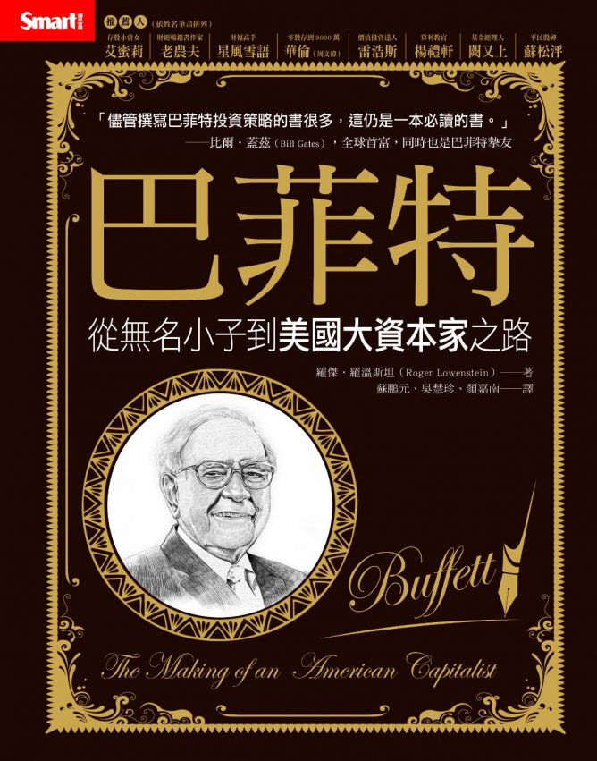
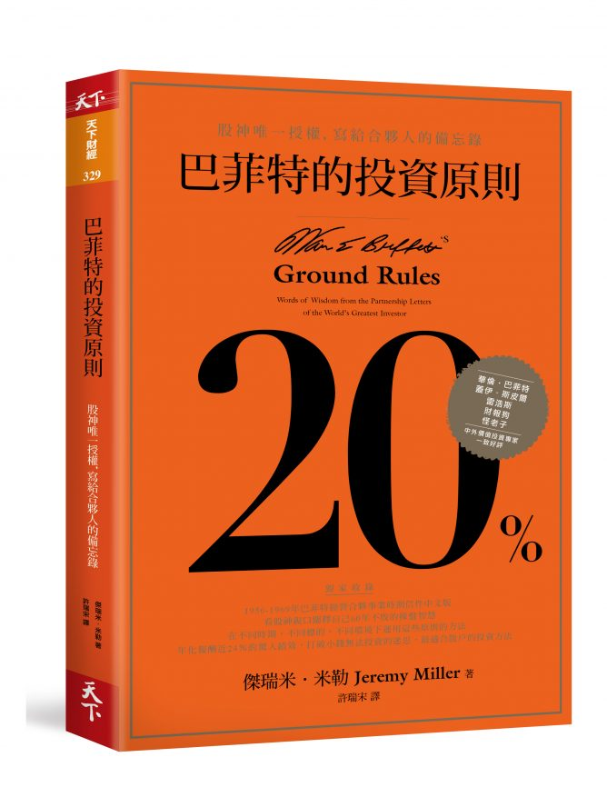
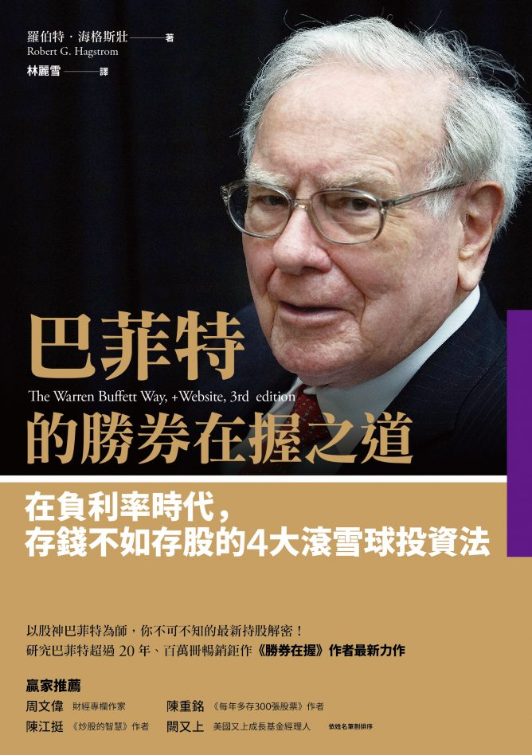
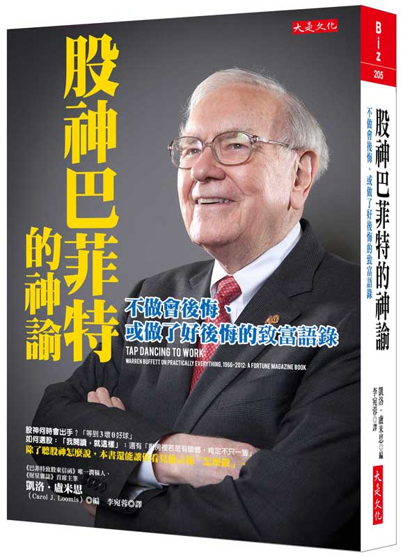
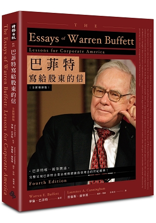

# 五本書掌握股神投資精髓！

市面上有關股神巴菲特的書汗牛充棟，多到想向巴菲特學習的人都不知道該如何選書，想要找出有關巴菲特的好書簡直像選好股一樣困難。

選好股要有篩選的條件，找好書也一樣，綜合了許多選書經驗，我認為要挑選出和巴菲特有關的真正好書要有符合以下的條件：

- 獲得巴菲特本人的授權或者推薦

- 作者最好認識巴菲特本人，能夠近身的觀察巴菲特的成就。

- 作者本身最好是波克夏長期持有的股東

依照上述的條件，本次投資必修課專欄替讀者選出了五本書：

## 1.巴菲特：從無名小子到美國大資本家之路

本書是最早的巴菲特傳記之一，作者羅傑・羅溫斯坦是波克夏長期的股東，也是著名的記者和作家。

他用多年的時間搜集資料和整理，並且仔細地分析巴菲特溫和卻強悍的性格，早期的投資操作變化和具體應對行為。

對於想要學習價值投資的人來說，本書比《雪球 巴菲特傳》更具備參考性，是研究巴菲特的必讀傳記之一。

## 2.巴菲特的投資原則-股神唯一授權寫給合夥人的備忘錄

這本書是巴菲特本人推薦書之一，作者傑瑞米・米勒整理了巴菲特從1956年到1969年成立巴菲特合夥事業時期的股東信精華，分別以`基本投資觀念，選股投資策略，心理偏誤`三大主題來敘述。

合夥事業時期的巴菲特主要是採用師父葛拉漢的選股原則，本書列出了巴菲特當時的操作案例如『聖邦地圖公司』、『登普斯特機械公司』這些標的的操作以及巴菲特當時針對這些公司的價值評估細節，可以說是非常精華的一本好書。

## 3.巴菲特的勝券在握之道-在負利率時代，存錢不如存股的四大滾雪球投資法

本書是巴菲特系列最著名的著作，作者羅伯特・海格斯壯從1984年開始研讀波克夏年報，並且從中整理出巴菲特在波克夏時期的投資原則，這個時期的主要風格開始偏向費雪的成長股投資原則。

本書嚴格說來不算巴菲特推薦，但是巴菲特對作者說過只要能讓他審書，就同意作者引用波克夏的年報的相關資料。

而書中所整理的資料相當精準，除了操作個案分析之外，書末還附錄了波克夏1977年到2012年的主要持股和買進成本以及持股市值。

本書可以和前一本書搭配閱讀，讀者可以比對巴菲特在合夥事業時期和波克夏時期投資心態的相同處和選股上的相異處，藉此了解巴菲特的變與不變。

本書作者本身除了研究巴菲特的哲學之外，同時也`專研查理蒙格的投資哲學思考`，並且找出這些哲學對巴菲特的影響，可以說是一個用力專研『巴菲特-蒙格』投資體系的一個作者。

著作`《投資最重要的事》`：霍華馬克思為此書寫序：`打敗大盤的華倫巴菲特`

`《非常潛力股》的作者之子`：肯恩費雪也為此寫序：`我的父親與巴菲特`

## 4.股神巴菲特的神諭：跳踢踏舞去上班！

本書的英文原名是採用巴菲特的名言《Ｔap Dancing to work 跳踢踏舞去上班》，作者凱洛・盧米思是財富雜誌（Fortune）的資深總編輯，她個人從1978年開始幫助巴菲特替波克夏股東信潤稿至今，同時也是波克夏40年的長期股東。

巴菲特曾經想指定她協助寫書，最後盧米思把過去〈財富雜誌〉做過巴菲特的多年訪談集結成此書，從中可以看到巴菲特經歷這幾年來的蛻變。

本書也摘錄了巴菲特親筆撰寫的著名文章，例如1977年寫的：《通膨如何詐欺投資人》和1999年提出著名的巴菲特體重計（公式=市值/GＮP）的演講稿《投入股市的第一堂課》這些文章。

巴菲特本人還在波克夏股東會上大力推銷本書。

## 5.巴菲特寫給股東的信

本書是彙整波克夏年報，巴菲特寫給波克夏股東的信，所以作者為巴菲特，編者為康寧漢。

會有這本書是編者康寧翰在卡多索法學院（Benjamin N. Cardozo School of Law）舉辦了一場和巴菲特有關的研討論，一開始這本書的原形還像是論文一樣，但是非常受歡迎。

康寧漢本身就是波克夏年資20年以上的股東，這場研討活動巴菲特和查理蒙格也很捧場參加，1997年本書第一次出版之後巴菲特還親自出席新書座談會。

本書的內容將公司治理、投資、會計等不同的主題分類討論，最新版本還增加了波克夏50週年的回顧資料，本書是最受歡迎的巴菲特經典書籍之一，可以說是絕對必讀。
