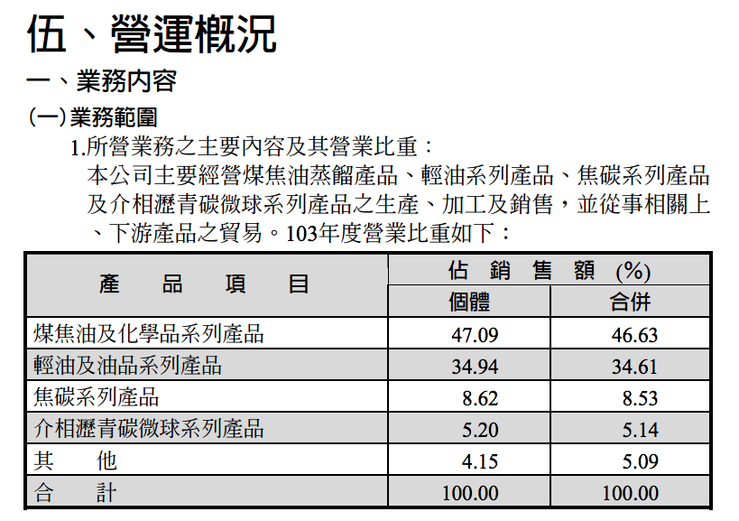
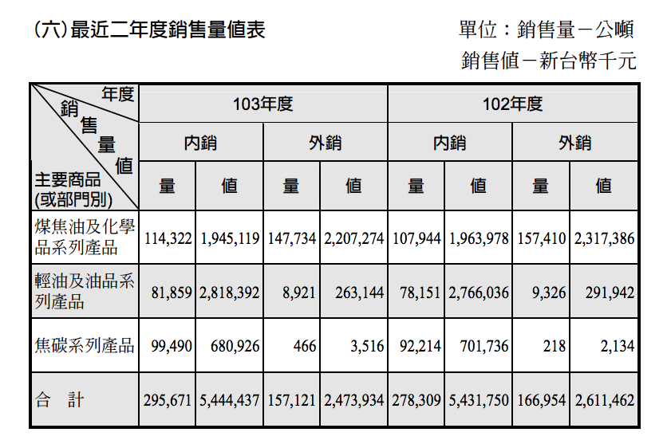
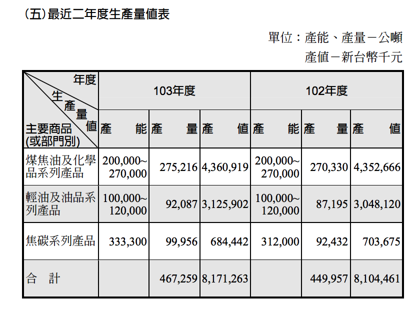
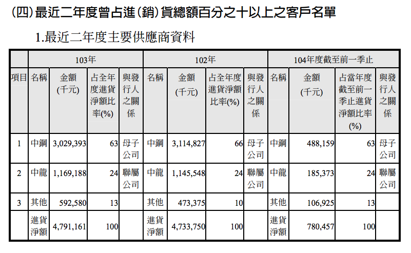
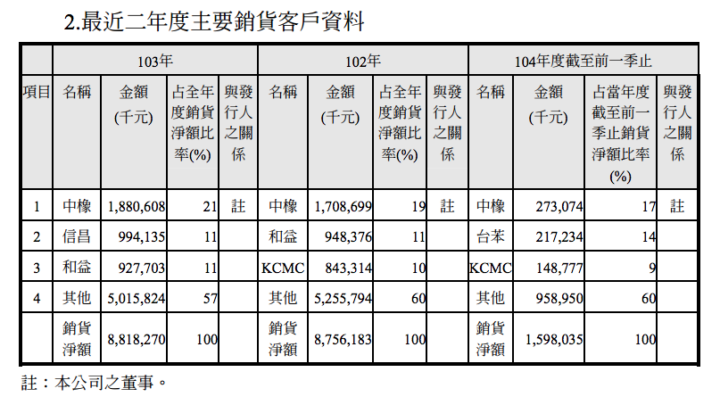
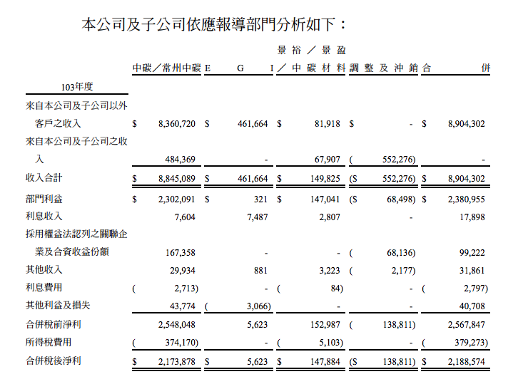
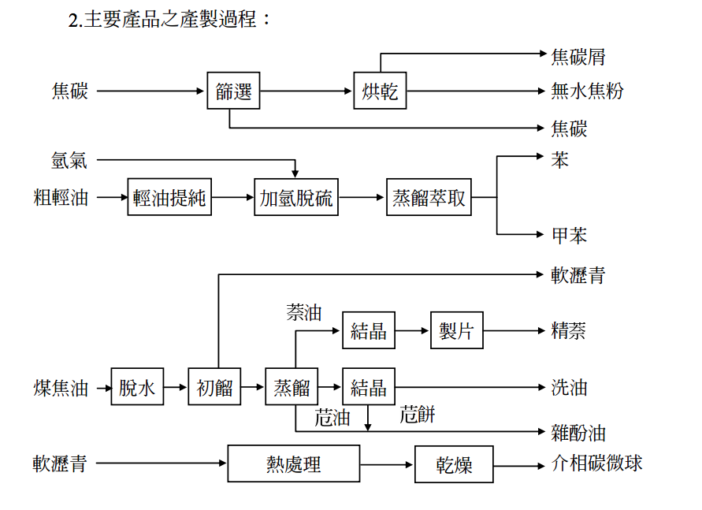
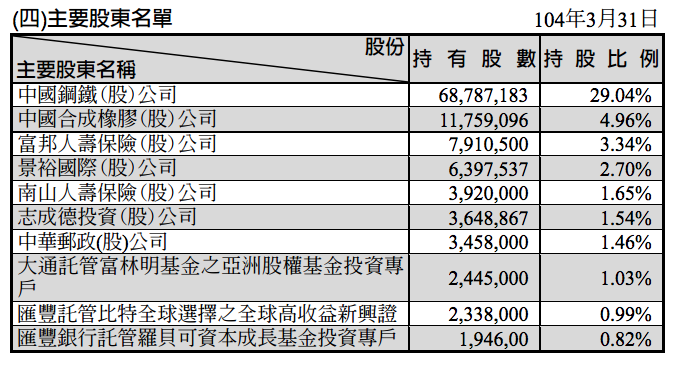
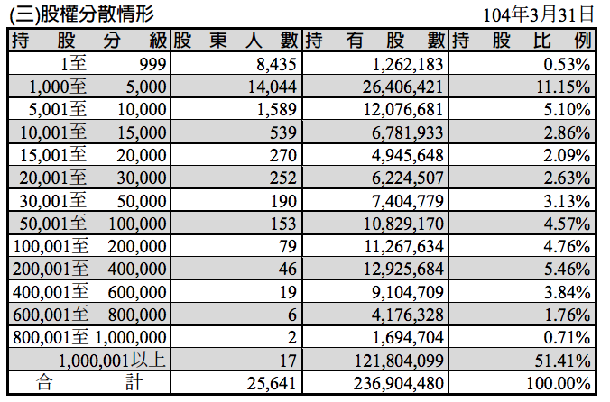
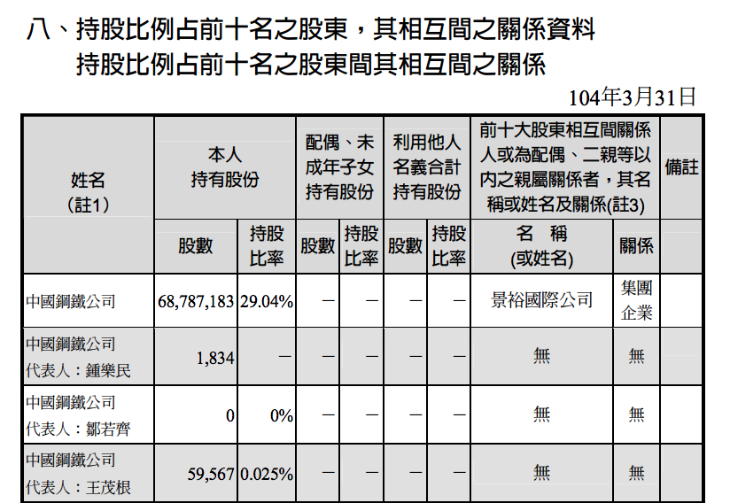

# 學巴菲特看年報：質化分析七大重點一次看完！


巴菲特最喜歡的資料來源就是公司的年報，許多價值投資者也向巴菲特學習看年報這個功夫。但是一本年報那麼厚，有哪些部分是一定要看的？
我替大家整理了七大重點：

```
重點一：產品比例

重點二：外銷內銷

重點三：產能、產量、產值

重點四：主要供應商和進貨客戶 

重點五：部門損益

重點六：產業資訊

重點七：大股東持股
```

接下來以中碳1723 的103年年報為例，逐一檢視這七大重點：

## 重點一：產品比例




我們可以從中碳103年年報的P73頁『伍、營運概況』看到相關資料，從中可以看到中碳產品營收比重最高的是煤焦油系列產品，佔46.63%。輕油系列產品次之，佔34.61％，這兩者為最主要的產品，並且五年來佔產品比重不斷提高。

##重點二：外銷內銷



Ｐ.80頁可以看到中碳這兩年的產品銷售值表，把內銷和外銷的數字加起來計算，可以算出中碳內銷比重68.8%，外銷比重31.2%，是以內銷為主的公司。只要整理五年來的相關資料，就能夠看出平均銷售單價ＡＳＰ，中碳這五年ＡＳＰ持續向上，表現相當不錯。
##重點三：產能、產量、產值



年報Ｐ.80頁也可以看到產能，產量，產值的資料，只要整理後就能知道產能利用率的相關資訊。

##重點四：主要供應商和進貨客戶




Ｐ79頁可以看到原料供應商資料，中碳是中鋼的子公司，當初就是為了處理中鋼的焦煤所設立的公司，理所當然供應原料最多的就是中鋼，中鋼會以管線直接拉到中碳，中龍則是用槽車運送。由於中碳目前的產能已經能夠處理中鋼所有的供貨，所以103年也開始進口輕油來提升產能。




同一頁可以看到進貨商的資料，單一進貨最大的公司是中橡，佔比例21%。中橡同時也是中碳的董事。

##重點五：部門損益



年報P190頁可以看到部門損益，有些公司的部門有虧有盈，仔細分拆部門損益可以從中找到更多的資訊。
##重點六：產業資訊



中碳年報P74頁提供了產業資訊，包含市場競爭，鋼鐵產業的擴充，公司本身的技術和研發狀況，產品製造過程，業務計畫，市場產銷概況、市場佔有率，市場供需，競爭利基點……等。
仔細閱讀這部分，通常收穫會不少。如果同時看其他競爭對手公司的年報，兩者相比對能夠得到更多的資訊。

##重點七：大股東持股



年報P68頁提供了主要股東名單，中碳的主要股東是中鋼，持股占29.04%。另一個大股東是中橡，佔4.96%。



同一頁提供了股權分散表，可以從中看到股東人數和持有股數。中碳的千張以上大股東有17人，站持股的51.41%




Ｐ63頁則提供了持股前十名之股東相互間資料關係。
以上七大重點，能夠讓您掌握大量的重要資訊，當你了解這些資訊以後，對一家公司能更有概念。
『警語』本文之中所提到的個股只是為了實際舉例，不代表任何推薦或投資建議，您的投資損益本人不負任何責任。
