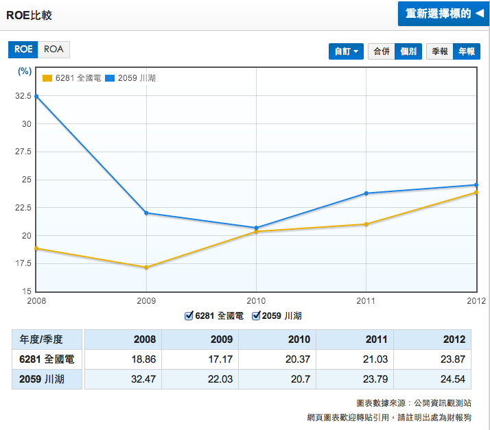
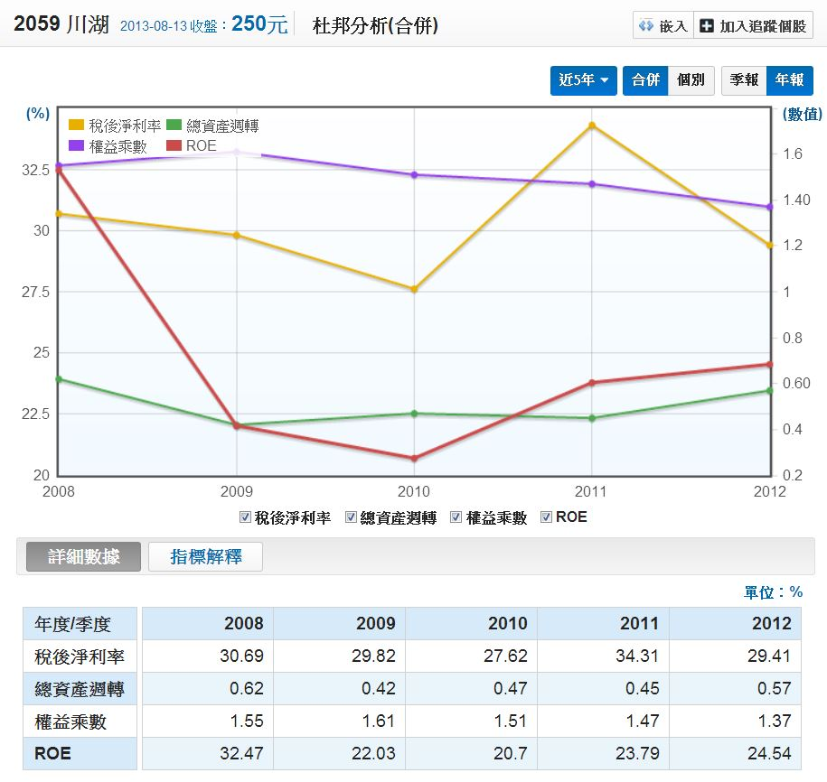
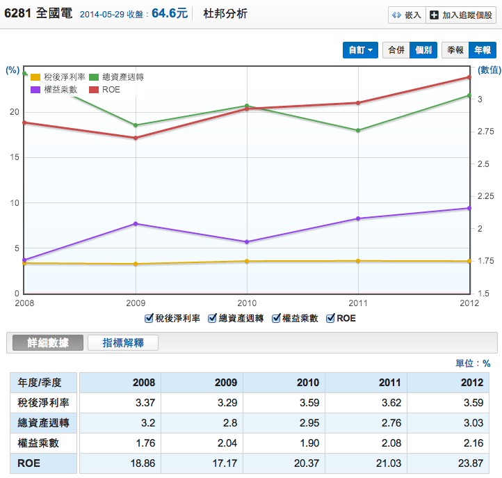

# 再談ROE杜邦方程式：一知半解會吃大虧

最近在演講的時候會遇到有人提問`「淨值減損，ROE就會提高，這樣看ROE就會不準」`。
實際上，這就是不懂ROE杜邦方程式的人會有的想法，當淨值減少、負債比就會提高，杜邦方程式會看到淨利率不變、權益乘數提升。

相當遺憾的是演講當天說了大量的內容，卻很難改掉一些人的錯誤認知(也許很多人沒聽進去?)，這種錯誤認知通常有三大點： 

1.     以為看ROE就是價值投資—-`ROE是分析的起點而非買賣指標`。
2.     ROE杜邦方程式是財務報表的精華濃縮版。
3.     ROE杜邦分程式區分公司類型。 

###第一點：以為看ROE就是價值投資？

這當真是最大的誤解，有些人看ROE高就買進，ROE下滑就賣出，完全不去思考背後的原因。
今天如果因為景氣正在衰退期，使公司獲利暫時低於平常景氣的狀況，那ROE就會比較低，可是這也是出現安全邊際的時候，是買股票的好時機。

價值投資不是看ROE的投資法，`而是有安全邊際的投資法`。

###第二點：ROE杜邦方程式是`財務報表的精華濃縮版`。

ROE可以拆解成杜邦方成式，杜邦方程式優秀的地方，就在於它是`財務報表的精華濃縮版`。

ROE = 淨利率X總資產週轉率X權益乘數

`淨利率 = 稅後淨利/營收`，`是損益表中最重要的數字，代表獲利能力`。

`總資產週轉率 = 營收/總資產`，連結損益表和資產負債表，代表管理階層運用總資產創造營收的能力，也就是`代表管理能力`。

`權益乘數 = 總資產/股東權益`，資產=負債+股東權益，權益乘數的差額就在負債，因此這個倍數等於`財務槓桿`的運用程度。

財務報表優先看重要的數字，杜邦方程式衡量了管理階層運用總資產創造營收、維持利潤、使用槓桿的能力。

管理階層在資產負債表的左方，股東在右方，股東投資的重點就是看公司管理階層能帶來多少獲利，又用哪種方式來提高獲利，因此ROE杜邦方程式提供了「快速掃瞄」的方向，找到方向就能再進行細部分析。

如果`獲利能力`是重點，就強化分析`損益表`，比較營收、獲利金額、獲利率的變化。

如果`管理能力`是重點，就強化分析`資產比例和營運天數`。

如果`財務槓桿`是重點，就強化分`析負債內容`，看是`好債還是壞債`。

只有杜邦方程式能夠快速優雅的分析出重點，是極度精簡、符合理論又有用的分析工具。

###第三點：ROE杜邦分程式區分公司類型。

川湖和全國電子2012年的ROE分別是24.5%和23.8%，只看ROE數字的人知道這兩間公司差別在哪邊嗎？根本看不出來！

`淨利率：29.41%`，表示每100元營收，可以賺29.41元。 
`總資產週轉率：0.57次`，表示總資產如果是100元，營收就是57元。 
`權益乘數：1.37倍`，表示負債比26.8%，總資產100元裡面只有26.8%是負債。 
是屬於`高獲利能力、低週轉率、低財務槓桿的類型`。 
權益乘數換算負債比的算法如下： 

權益乘數1.37=總資產/股東權益，假設股東權益=100，總資產就=137。

資產=負債+股東權益 
137=負債+100， 
所以負債=37。 

`全國電子`用ROE杜邦分析可以看出：

`淨利率：3.59%`，表示每100元營收，只能賺3.59元。 
`總資產週轉率：3.03次`，表示總資產如果是100元，營收就是300元。 
`權益乘數：2.16倍`，表示負債比53.68%，總資產100元裡面有53.68%是負債。 

是屬於`低獲利能力，高週轉率，中高財務槓桿的類型`
透過ROE杜邦方程式就可以知道川湖和全國電子的不同： 

川湖屬於高獲利能力，影響ROE的關鍵在於`淨利率`。 

全國電子屬於高周轉率，影響ROE的關鍵就是`週轉率`。 

只看ROE數字的人就無法區分這些差異。

投資是一種社會科學，不明究理的人會以為ROE杜邦方程式只是公式，然後對著公式胡亂解釋一通，把馮京當馬涼。

社會科學要瞭解背後的原因，而不是單純的數學計算。

價值投資更不是一知半解、過度簡化的投資法，而是深入分析，擁有安全邊際的投資法。

