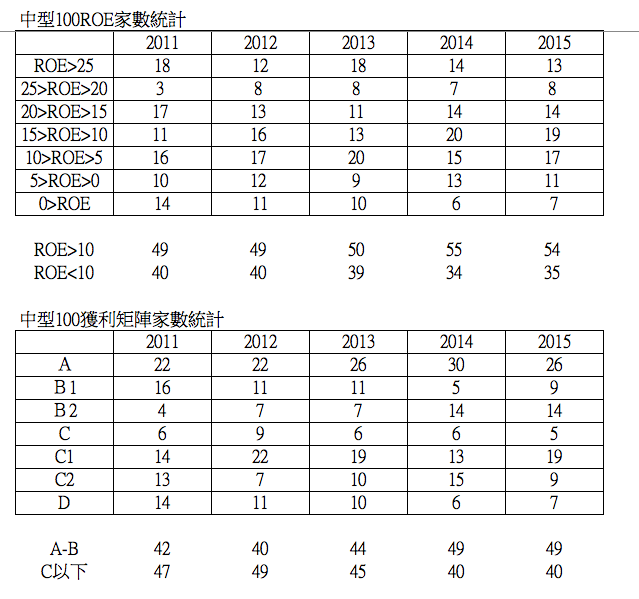
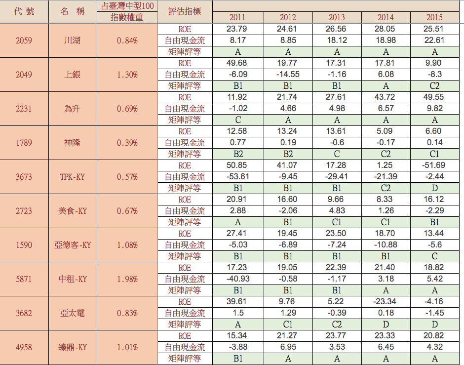
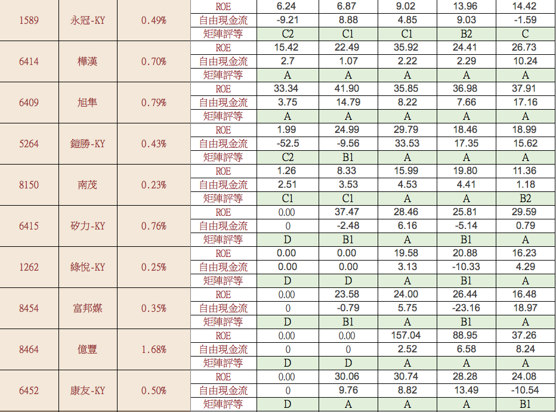
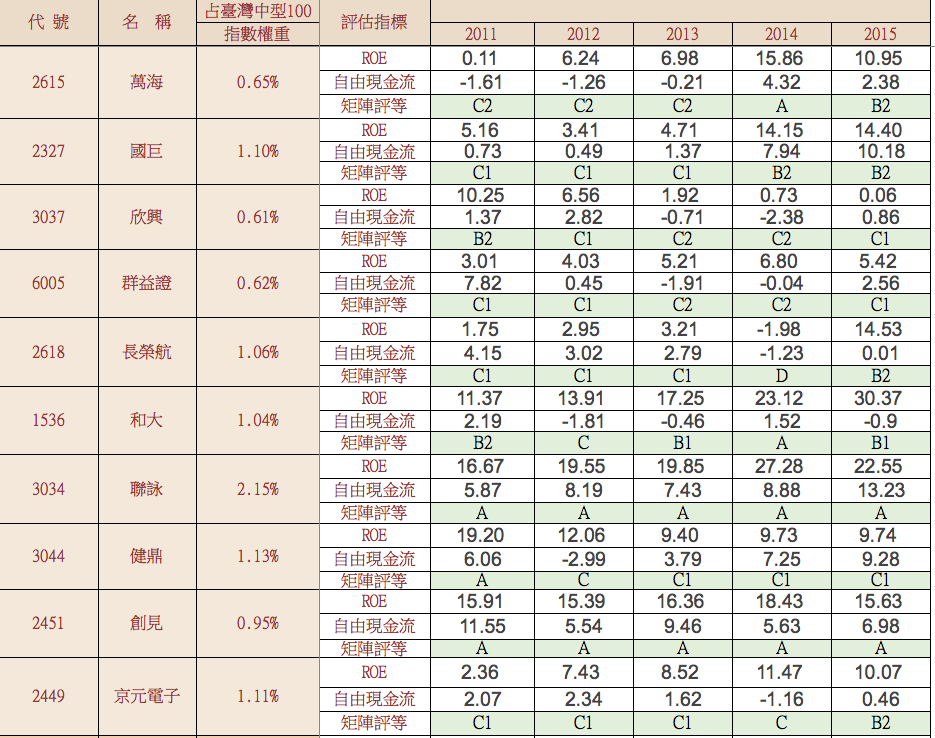
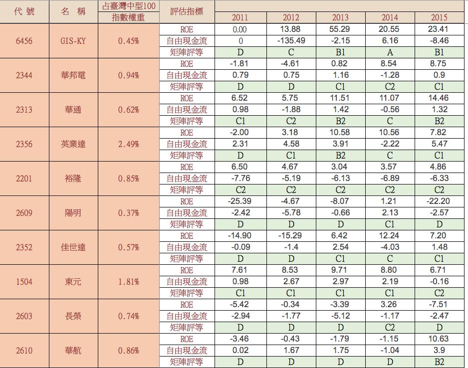
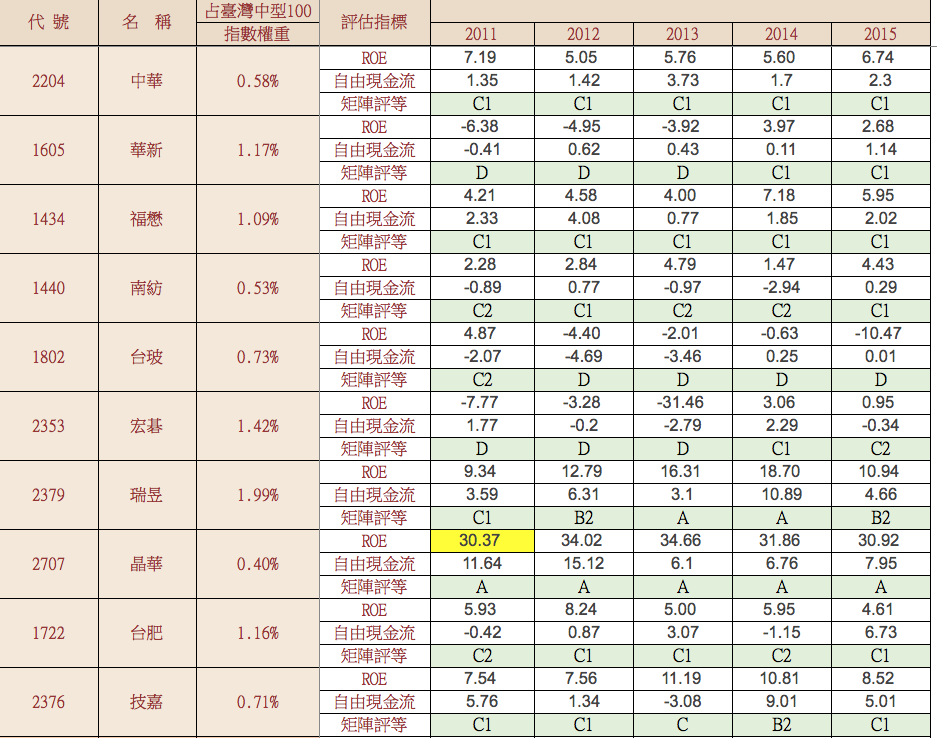
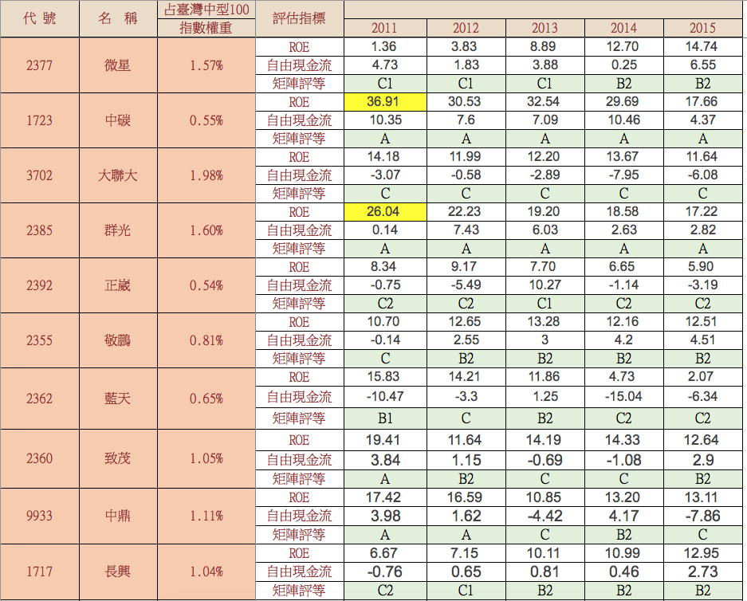
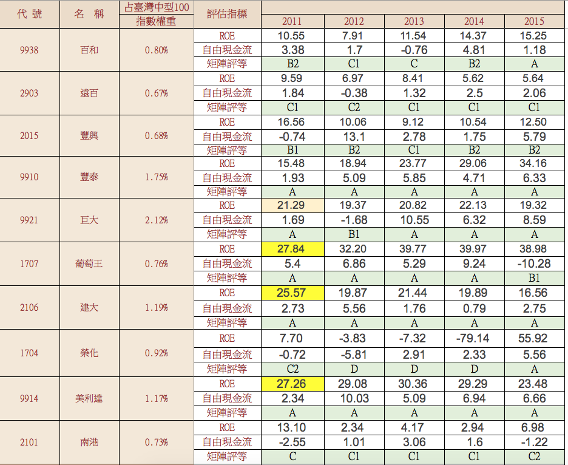
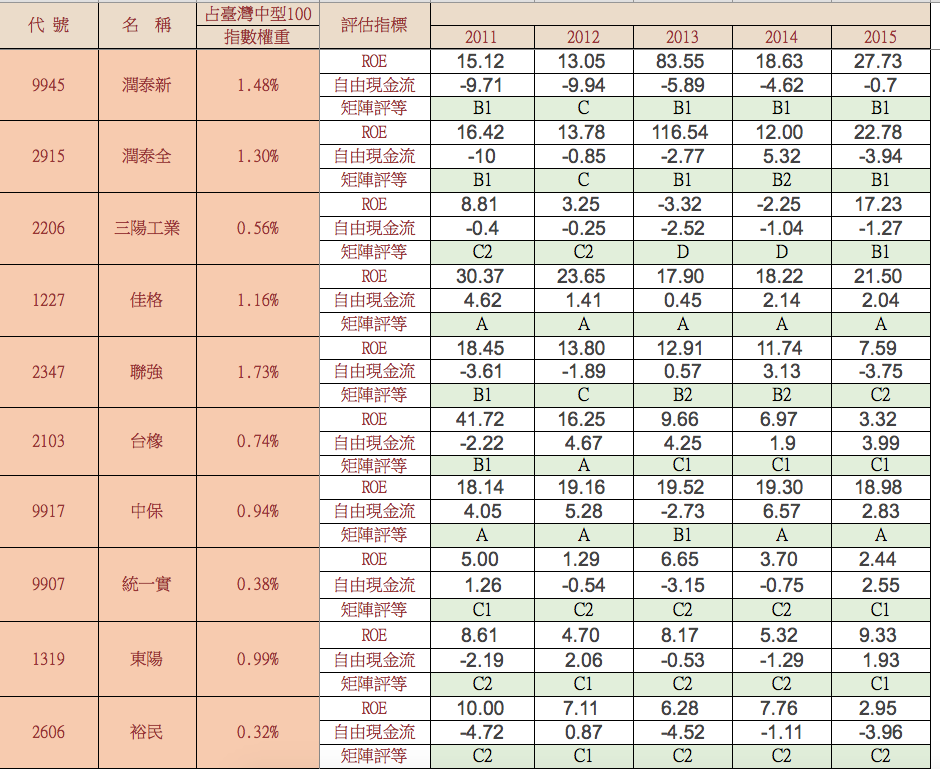
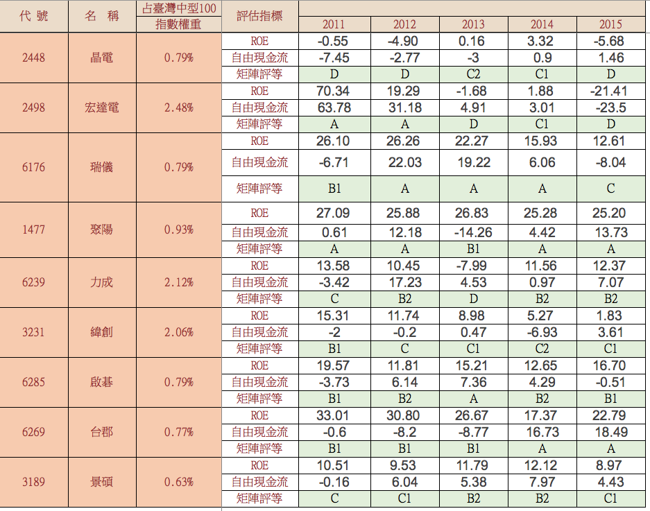

# 中型100（排除金融）獲利能力矩陣分析！


前篇文章提了台灣五十成分股的矩陣分析，本篇文章則分析中型100成分股矩陣分析。

我們使用『單一年度』的數字做矩陣評等，評等如下：

```sh
Ａ 等級：ROE>15，有自由現金流
B1等級：ROE>15，沒自由現金流
B2等級：15>ROE>10，有自由現金流
C等級：15>ROE>10，沒自由現金流
C1等級：10>ROE>0，有自由現金流
C2等級：10>ROE>0，沒自由現金流
D 等級：ROE為負
```


中型100成分股排除金融和部分營建股之後剩下89檔。我們從中統計這五年的 ROE區間和獲利矩陣家數，2015年ＲＯＥ>10累積家數為54家，矩陣Ａ＋Ｂ級的家數為49家。



學員邱先生在課後自行整理的中型100 ＥＴＦ矩陣分析，他大方的分享詳細數字給網友們，以下不分指數權重，單純提供獲利能力矩陣的評等分析。













