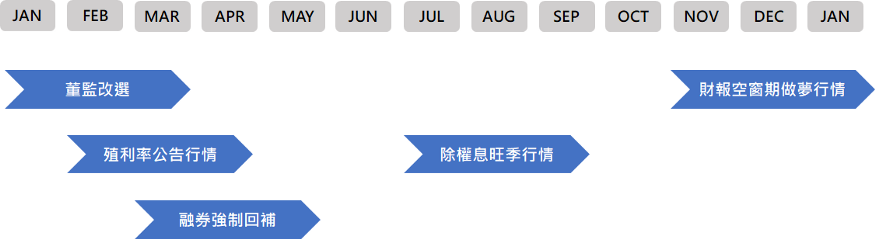
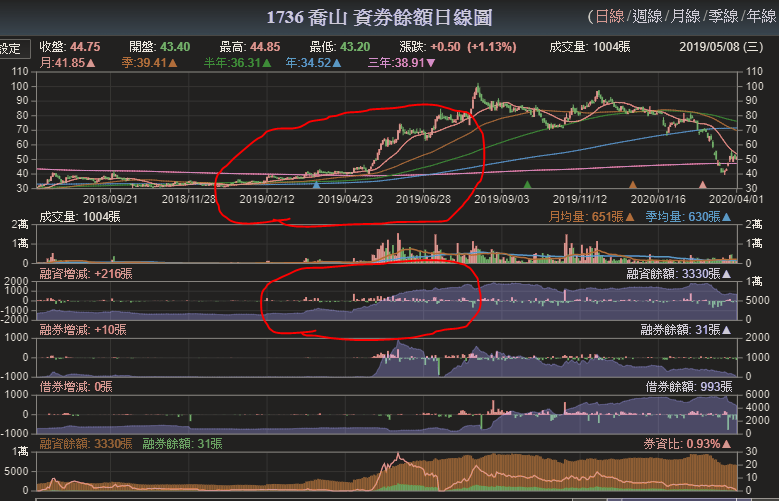
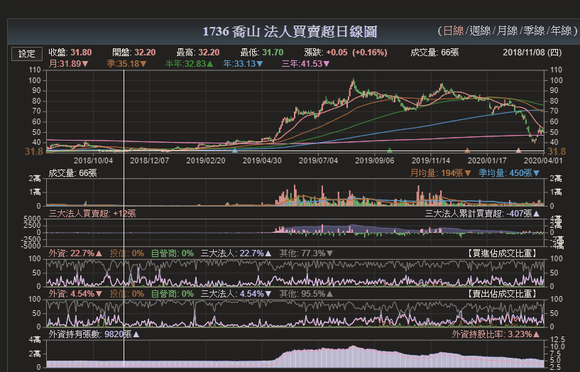

## 老王-短線操作 (season 1+2)

出處  https://medium.com/han-shih/%E8%82%A1%E7%A5%A8%E6%8A%95%E8%B3%87%E7%AD%86%E8%A8%98-%E7%90%86%E8%B2%A1%E9%81%94%E4%BA%BA%E7%A7%80-b020477772dd

# **除權息**

保守投資人傾向 "每年填權息機率高的個股"
例如，過去5年間，兩個月內填權息機率100% 的標的當定存股。

> 但建議等除權息後，找低點切入賺價差 。
> (也可以省稅，像我這種奈米戶、課稅級距低的小米蟲倒是影響不大)
> 注意! 長期投資者可以不考慮這部分，簡單領股息~

## 參加除權息的條件

- 法人買超 (外資投信為主)
- 千張大戶持股增加 (每周六，集保中心查詢)
- 股價穩定 (未大漲也不破底，出現 >5% 的 K 棒，通常已炒作，較不安定)

若除權息後通常 1~2 周內填權息 (判斷個股是否強勢)，可以考慮介入。
例如，部分金融股除權息後通常還有低點，是較安全的切入點。

## 不參加除權息的另類玩法

- 高股利提前進場賭一把
    (1)賣公司資產
    (2)賣轉投資利益。例如，子公司
    (3)預期獲利創新高
    前兩種原因要小心，殺雞取卵。看到爆量長黑 K，馬上閃人
    (等新聞通常都太慢，除非有把握可以提前掌握資訊)
- 高殖利率提早發動 (至少 >6%，公告股利配發後才進場)
    (1) 營收持續成長
    (2) 法人進場 (不包含自營商，太小咖了)
    這種類型的出場方式就跟一般操作方式相同
- 除權息後低點高勝率進場
    看過去填權息機率，通常會有慣性
    例如，連續 6年 60天內填權息 & 殖利率 >4% OR 連續N年 2周內填權息

> 個人不負責任點評: 建議以後兩者為主即可，如果像我一樣是超級懶鬼，直接參考第三點即可 XD

## 全年行情統整

- 1-3月，董監改選行情
- 2-4月，高殖利率公告行情
- 3-5月，融券強制回補
- 7-9月，除權息旺季行情
- 11-1月，空窗作夢行情(過年)

# **一買就跌，不買就漲 - 散戶心理學**

看融資、融券餘額，基本上人多的地方不要去。建議與大多數人反向操作，以免大家 "有志一同" 地往下賣，來一波多殺多

> 要玩短線的話，必須跑得比別人快，一根黑 K 就要準備先停損。

## 尋找安全股票原則

- 股價往上，融資往下 (趨勢)
- 百張以下散戶持股新低
- 股價破底，但融資漸減 (通常融資會增加)

# **萬點之上找低估股**

基本上要想辦法評估股票的價值，而不是價格；股票沒價值，價格再低也不值得買。必要時搭配 YoY, QoQ, MoM 一起看，避免踩地雷。

## 參考指標

- 股價淨值比 <1
- 本益比區間在下緣(河流圖)
- 穩定股價 & 高殖利率

本益比、股價淨值比 (跟同產業做比較)，高低點的部分可以參考 [河流圖](https://www.cmoney.tw/finance/f00033.aspx?s=1101)

> 切勿看報章雜誌、親友推薦、投顧電視節目等，就直接出手。
> 須搭配其他技術指標做參考 (回測均線，低檔出大量等)，找適合的切入點

# **談停損**

不應該用 "%數" 停損/利，改看壓力支撐，一跌破就要賣。跌到一定程度之後，一樣的金額可以買更多張。關於壓力支撐，依照個人操作習慣 (長短線)，決定要往前參考多少天。

> 通常在尾盤\開盤前下單，盤中變數過大，容易情緒波動影響判斷力 。

但實際情況常常是: 摜破支撐後，往上反彈突破壓力，隨後即快速下殺 (反之亦然)。所以最好在股價突破後，**等個兩三天待趨勢確定**再進行操作。
-> 向下摜破就先跑；向上突破則先觀望，保守路線

## 沒有在 ”第一時間停損”

例如，支撐破底再破底，均線明顯下彎。那麼，應該也是腳麻跑不動了。
此時應該趁反彈出掉，賣得更有 "尊嚴"。例如，參考 RSI 指標背離。
或是較積極者，等待突破下降壓力 (趨勢)線，站上後隨時準備加碼。

# **談停利**

短線操作看 5MA，破 5MA 先賣一半，之後若再次破 5MA，可自行決定是否減碼；破 20MA 則全賣出。
PS. 若是做中長線，可自行替換成周線、季線、年線。依此類推

> **停損要快，停利要慢。**

另外，看型態 (趨勢線\壓力\支撐) 來做為最後賣出的防線。
例如，飆股 - 每天低點都高於前一天高點，就適合用這種方式。

# **談融資**

在股價呈現正常擺盪、上升趨勢時適合使用 (帶量突破紅 K)。

融資跟著股價往上，可能有大戶在裡面
-> 正向 "聰明的" 融資
融資下降，則可能是主力賣出
-> 不適用 "人棄我取" 的反向操作策略
主力出貨後，通常短期內不再進場。股價下跌、融資增加
-> 可能是 "不聰明" 的融資，要小心
融資減少、股價下跌，連散戶也出場
-> 進入整理階段。觀望即可，等新的趨勢出現再考慮進場

融券跟融資好相反，參考上面即可。

## 規則統整

- 價漲+資增+券增 -> 考慮做多方
- 價漲+資減+券減 -> 考慮做空方
- 價跌+資增+券增 -> 考慮做空方
- 價跌+資減+券減 -> 考慮做多方

> **空頭不死，多頭不止。**

# **放空心法**

長黑突破所有線 (5\10\20\60 MA)，且均線糾結。此時即可尋找出手機會。 PS. 基本上就只是將作多的邏輯整個反過來
如果只有其中幾條轉弱，只適合短線放空；若均線糾結，且股價站上均線，則要盡快出場。另外，還可以搭配放大量交易日之 開\收盤價，做為參考之關鍵價位。

> 尾盤拉下影線不一定是翻多訊號，要參考前後幾天的股價趨勢。可能只是大戶要作價，拉高出貨。
> 若是真要翻多，像是外資等，直接會在盤中進場拉抬。

## 注意事項

- 切勿情緒性操作(易被軋)，順勢操作較安全
- 確定回補日，避免沒幾天就強制回補
- 和做多相同，搭配均線看，不用頻繁進出場
- 千萬不要硬拗
- 如果看空股票，買反向商品會比放空正向商品獲利更多

## 實際操作方式

當日沖銷: 券賣(放空) + 資買(回補)
留倉買賣: 券賣(放空) + 券買(回補)

## 回補時機

- 站上 5MA ，但可能在線上頻繁來回，因此需要搭配其他指標
- RSI <20 ，已接近超賣區
- 放大量交易日之高點被突破
    (大量解套，上檔無壓力，準備要衝一波了~

# 軋空行情

> 券資比 = 融券餘額/融資餘額。

軋空 = 高券資比 (看相對值，而不是絕對值，**逐步拉升**才是指標)；
但反向不一定成立。高券資比的可能情況:

- 散戶看不順眼 => 軋空
- 大戶炒股準備出貨 =>不會軋空，邊賣邊空
- 有利空內線 => 本來就該下跌

## 軋空之條件

- 站穩 5MA & 10MA (連續數天) —> 主要

- 法人/大戶券商持續買進 —> 主要

- 基本面成長/有轉機 —> 次要

- 題材面出現，如經營權之爭 —> 次要

- 強制回補日前容易軋空: 股東會前、除權息前 (一年至少兩次)
    PS. 查證交所公告 - "得為融資融券有價證券停券預告表"

- 軋空股的最高點，通常都出現在券資比最低的時候

- 法人連續買進+券資比上升(看融券餘額也行，搭配使用) -> 準備軋空
    法人連續賣出+券資比上升 -> 準備下跌
    PS. 一樣參考前面兩張圖，可明顯得證~

    

# 董監改選行情

通常發生在公司實際價值高於股價，且股票大多在市場上，引起少數人想搶公司股票，取得公司主導權 (通常發生在每年的第一季，甚至會提早)。

## 基本條件

- 股價<30
- 董監持股<20%
- 董監質押(設)>20%
- 股價淨值比<1
- 千張大戶增加

進場可參考季線，因為行情是一整季(和陸股相同)。
但必須在股東會**最後過戶日**前出場 (除非 60MA 守住＆千張大戶續增)

# 獲利捷徑

以下是一些，新手進場時，適合參考的投資建言:

- 對積極操作者而言，成長股優於定存股，簡單地看 60MA 突破即可。
- 搭配油價，可預期航空、運輸、石化(可能包含部分紡織)股的走勢。
    同理，看到某項國際商品在漲價，可以買與它相關的台股，也能避免匯兌風險，簡化投資方式。
- 選擇權買方，當樂透/刮刮樂買 (還是要稍微判斷方向，從指數入門)
- 低點連線形成之壓力\支撐線，站上\跌破做為出\入場依據
- 股價永遠提前反應基本面，明星產業要注意炒作成分 (預期心理居多)
- 寧願漲上來再加碼，順勢而為。也不要低點攤平，小心越攤越平~
- 觀察 QoQ, YoY，可以短線進出 "設備股"
- 前高屢過，前低不破，才是多頭；
    反之，股價 "慣性" 尚未改變前，暫時先觀望
- 0050 看外資跟著買，一個穩；
    但 T50反1 不準，因為可能是外資在套利

## 雞蛋水餃股

- 股價 <10
- 股價淨值比 <1 (算不出獲利的股票適用，否則看本益比較佳)
- 單季毛利率 UP
- 單季營益率 UP
- 單季稅後純益率 UP

## 抄底守則

- 長期交易量低迷，突然帶量突破。是個好切入點
- RSI 指標出現 "背離"

## 基本操作建議

- 短線跌破 5MA 減碼一半，20MA 全出
- 買在低檔已獲利，每天看收盤價即可；買在高檔 (離 20\60MA 較遠)，盤中跌破就要出場，但若收盤守住均線，則可考慮之後再入場
- 若被多空雙巴，畫出高/低檔連線之趨勢線(發散/收斂三角)，作為壓力/支撐的依據。回測低點多次不破，再考慮加碼
    -> 一旦出現跌破\突破趨勢線的區間，可能出現 "等幅測距"
- 優先參考 RSI (逆勢指標，用於猜高低點)，比趨勢線、均線這些順勢指標更能夠快速反應趨勢轉變
    PS. 技術分析較適合使用在成交量大的個股
- RSI 連續三天 >80 OR <20 即為 "鈍化"， 直接續抱。否則為趨勢轉折，需盡快出場 (多觀察一天，避免被巴)。並搭配 5MA 判斷出場點。
- 存股標的之關鍵，財報的自由現金流須經常性為正值。
    以因應不時之需，如資本支出等。
- 若要買兩倍 ETF，必須了解其成分為何。
    例如，A50正2 與其看陸股指數，不如直接看其追蹤的期貨價格。
- 看多: 突破 5~60MA (此前，大部分均線糾結在一塊)，並且外資、投信 (看10日線)連三買；
    看空: 和前者相反，跌破 5~60MA (同樣，在此之前必須所有均線糾結)；並且外資、投信 (看10日線)連三賣

# 資金配置方式

- 先下 50%，看對 +30%，又對 +20% (正金字塔)；
    看錯 +30%，又錯+20%
    PS. 較危險，要確定個股還有機會翻轉。這種方式最適合用於 ***投信作帳股\***，記得看 10MA 進出 -> 法人通常不會做短線
- 先下 80%，看對 -40%，又對 -40%；
    看錯+20%，又錯-100%
    PS. 一樣，通常是追高時，回測支撐再加碼
- 看錯: 摜破均線、支撐、趨勢線等；
    看對，則反之 (站上、突破 ...)
    PS. 若這些線貼太近，則可考慮看別條線。例如，10MA 改為 20MA、箱型區間之上\下趨勢線，等等
- 看 MA 進出
    摜破一條用於減碼，再一條用於出清；MA 支撐守住即可加碼