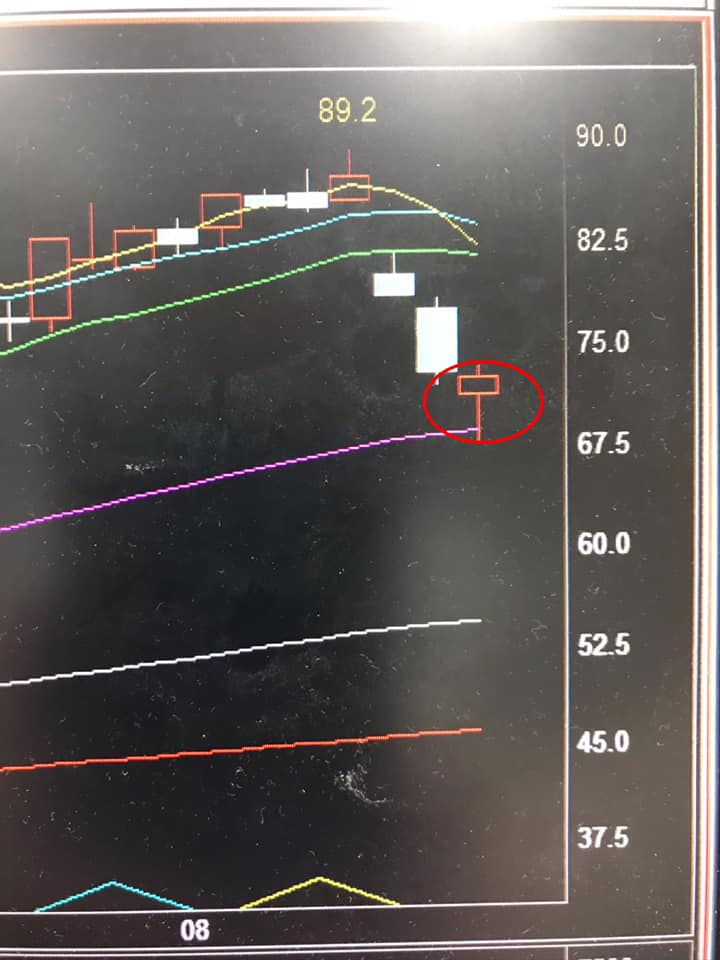
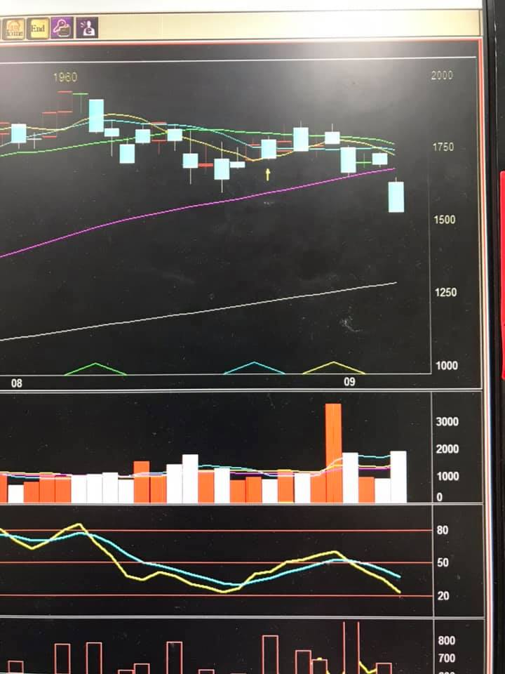

## 心態、技術，到底那個重要呢? by Jimmy Small

心態、技術，到底那個重要呢?

我想新手初階段時會很納悶，一開始我都看不懂怎麼交易，你一直跟我說心態，我就是一直在裡面沖來沖去一直停損，我什麼都看不懂，停損到最後我就破產了，還心態個屁，嗯?難道不是嗎?我初入股市時也研究過kd、macd、威廉還有一堆我現在已經記不起來的名稱指標，甚至一堆日均線、月均線、年均線、還改過他的參數，嗯，你要說這些東西不是技術指標嗎，我也曾經覺得沒有用，但所有的指標都是要你自己去親身研究過才知道到底什麼沒有用，什麼有用，你走過的路不會白費，至少你努力研究過，才能排除掉不必要的指標，有時大道至簡，有的人只要裸k就能賺錢，有的人只看kd也能賺錢，有的人只看均線也能賺錢，看你研究出一個什麼模式出來而已，股市這沒有任何指標是100%穩賺的，只有找出機率大的訊號時，下去交易。這就跟德州樸克一樣，你拿到一對k跟你拿到雜牌3、8，牌面上湊不成順子也湊不成對，那個你勝率比較大?

活在市場上本來就是不斷的吸收經驗，只要你是把股市當事業在經營的，活越久你看得懂的地方就會越多，為啥要不斷的學習，因為以前會賺錢的模式，你拿到現在來用也不一定會賺錢，滿足於當下，你的成長就停止了。

接下來說到心態，為啥又有些人覺得心態大於技術呢，因為當某些人找到一個訊號時，長期下來勝率的交易模式有7成，為啥還是會賠錢呢，因為你有時失心瘋重壓，想一次賺大的重壓導致那筆單看錯大賠，或是說當下覺得自己應該是看對的，但卻走反向，再等一下就回來了，說白一點就是凹單還加碼，結果大賠一次，把之前賺的10天份全賠光，喔，原來心態比技術重要，技術再準也沒辦法穩定勝利，廢話，那請問你有沒有用到技術? 

我覺得會執著在那個比較重要的，這也看得出來你處於那一個階段，沒聽過有些大神說，對的事情反覆做，當你的交易模式出來，停損停利就是要照著走，真正的成熟交易者，是技術、心態、資金控管三者兼具。

嗯，廢話說得差不多了，該潛水一陣子了。

---

## 守紀律真的比技術還重要 by 杜致緯

週末了

分享一個稍早友人跟我討論當沖的故事

她：我接觸股票當沖一個月左右

剛開始都賺錢

但最近都賠錢

而且把之前賺的都賠掉還倒賠

是不是我的計劃有問題呀？

我：妳的交易計劃是什麼？

她：就一開盤馬上買進

有賺錢就跑，賠錢也跑，幾分鐘就結束。

我：那妳賺錢時有跑，賠錢時有跑嗎？

她：沒有…

我：那妳的交易計劃沒有問題呀！

問題是妳沒守紀律呀！

而且妳賠錢時就會一直想要凹回來對吧！

以上這個是真的

而且真的很多人這樣做

我以前也這樣玩過

我曾經在賭那斯達克開盤

而且一次都是6口12口下好下滿

這才叫刺激！

1秒鐘正負幾十萬

我還記得有一次我在開高速公路

然後一邊開車一邊當沖那斯達克

它一噴我就買，停住我就賣

它一殺我就空，停住我就補

台北開到苗栗我已經賺百萬

我完全不知道我為什麼賺錢

只知道我賺錢

我跟神一樣猛

然後隔天繼續

後天繼續

大後天…

我3天賺160萬

2天賠200多萬…

因為我失靈一次就開始猛凹猛打！

一天進出上百次

我的交易計劃沒有問題

我的紀律出了嚴重問題！

我賺到的錢沒技術可言

純粹幸運女神很眷顧我

所以這個交易計劃就是

無腦追突破而已

看到這你可能覺得我在講什麼？

這算哪門子的交易計劃？

你一定有聽過追突破的策略吧！

請問追突破的買法不是在賭嗎？

你一定有聽過抓高轉的策略吧！

請問抓高轉的策略不是在賭嗎？

你一定有聽過回檔進的策略吧！

請問測支撐的買法不是在賭嗎？

如果你已經計劃好進出場的原則

那你就是在做交易

而你失敗的原因就只有兩個

1.計劃很爛需要修正

2.你不守紀律不照計劃走

不然我就問一個最簡單的問題

有誰可以告訴我哪個點位進場

可以保證絕對不會賠錢？

在當沖運動崛起的時代

大部分人把市場當賭場

毫無計劃性的無腦下注

當然也就毫無紀律可言

市場大戶不割你要割誰？

如果你沒心想研究

如何制定交易計劃

如何執行交易計劃

那我建議不要計劃

你就執行原本計劃

賺了就跑賠了也跑

不要賺了就跑超快

賠了就一單凹到底

相信我

現在這大多頭格局

你就執行1分鐘交易計劃

一開盤就買進

一拉上去就走

一分鐘當也走

完全不看損益

守住紀律就好

一定會賺到錢

賺賠都守紀律

你能堅持多久？

ps:

看完看懂我在說什麼的人不會問我是不是在亂教

沒看完或看不懂的也不要問我是不是在亂教

我沒有要亂教你無腦當沖

[#我只是要表達守紀律真的比技術還重要](https://www.facebook.com/hashtag/我只是要表達守紀律真的比技術還重要?__eep__=6&__cft__[0]=AZVZ5_reYaaVhHWVJpIi-DpY3dzT3oDZwJs30GmkOvScIVGsZ2VHOx3Oss8jvaEBzmPpxrOq4mX6djiUv6V-SelNRB0FqITSJNPkoFIF575tQPviCgAjKHkpuWYpEmFgZ1e_ZYB_Mal1ixXKL9PD-ER-&__tn__=*NK-R)

最後分享一個練習守紀律的方法

1.找一檔20多塊的股票

2.想好你進出場的點位

3.一次只能下一張單子

4.仔細觀察盤中的變化

5.打到停利或停損的點位立刻按市價出掉

6.也是最重要的一點

[#下單成交後只可以看盤面不可以看損益](https://www.facebook.com/hashtag/下單成交後只可以看盤面不可以看損益?__eep__=6&__cft__[0]=AZVZ5_reYaaVhHWVJpIi-DpY3dzT3oDZwJs30GmkOvScIVGsZ2VHOx3Oss8jvaEBzmPpxrOq4mX6djiUv6V-SelNRB0FqITSJNPkoFIF575tQPviCgAjKHkpuWYpEmFgZ1e_ZYB_Mal1ixXKL9PD-ER-&__tn__=*NK-R)

這樣你就會守紀律了

## 蔡志偉-一路走來的六個交易心得

深夜無意間看見群友大賠的經驗, 很血淋淋但卻是大部份都經歷過的, 包括我自己, 所以有感而發, 想要分享一些自己正走過的心得.

 1.一步一腳印, 不要想一夜致富/一天分勝負

重注或是凹單, 很多時候都是太執著要在一天內分出勝負, 

進而產生自己無法掌控, 意氣用事的下場都是不好的結果.

市場是細水長流, 每天都在, 今天賠了還有明天, 還有無數個日子,

交易是與自己和市場的長期對抗.

從贏家身上看到的, 是他們面對的賠的時候, 知道賠錢只是一個過程, 只要策略和方法正確, 保有信心, 往後都會回來的.

2.停損砍不下手

通常會砍不下手, 就表示持倉部位超出能力範圍, 是影響心態和判斷很大的因素. 就像打遊戲一樣, 一定都先從Lv1開始練起, 練到Lv3覺得自己很行了, 就直接挑戰Lv10(太快放大部位), 通常就是被秒殺.

每個部位都必須經過一段時間的磨練和適應, 

由於每個人本金不同, 能承受虧損的範圍不同, 不過當你發現你無法承受或是損益起伏很大, 就必須退回到上一個等級重新練習.

停損不是錯, 每筆交易都是獨立事件, 有時候先出來看, 思緒會更清楚.

可能下一筆單做出正確的決策後, 損益持續往正向前進.

3.建立完整的交易紀錄

一開始我的記錄只有損益, 發現沒有什麼幫助

後來加入了進出場理由, 使用何種策略, 還有檢討當筆交易盤中所觀察到值得記錄的點.

因為常常在檢討帳單的時候, 會發現交易的非常隨興, 看到什麼都想做, 明明不是較好的時機, 卻還是為了操作而交易, 無形之中其實賠了很多不該賠的錢.

因此開始完整的一字一句寫下我的交易策略(多方策略/空方策略)

進場做多/做空的理由為何, 怎麼進場, 怎麼出場, 停損停利怎麼抓.

開始嘗試制定交易的SOP, 盡量固定交易策略和手法, 配合部位的控制, 長期下來我就有辦法統計, 進一步分析自己交易的優缺點在哪.

一段時間就檢討一次, 是策略出了問題, 還是賺賠比出了問題,

也慢慢領悟到前輩說的

賺錢=期望值(勝率*風報比)*資金周轉率

短短一條公式內, 都是思考能如何提升賺錢的關鍵

有效的去量化自己的交易, 並先嚴格設定進場條件, 個人認為是蹲馬步階段很不錯的方式.

4.檢討賠錢大賠的對帳單是提升報酬快速的方法

舉例來說, 

10筆交易中, 8筆賺1萬, 2筆賠5萬, 總計賠2萬

如果去掉1筆賠5萬的, 整體績效馬上變成賺3萬

因此如何有效避免出現一筆大虧損很重要.

以我個人來說, 大虧損常常出現在震盪格局卻不斷地下單, 變成追高殺低, 不斷的小停損就飽了.  另一種就是執念, 盤前就認定今天很高機率會怎麼樣, 事與願違後, 變成超出drawdown的容忍值太多.

正如高拋大常言道: 贏家只是比較會控制賠

一定要謹記每次賠錢的經驗, 畢竟都是學費換來的, 交易沒有聖杯, 儘可能把錯誤降低, 離對的一邊就近了

5.大家來金融市場的目的就是賺錢, 不是找樂子(或許大神不一樣XD)

這句話還是時時刻刻提醒正在起步的自己, 越明白自己的優缺點, 就更能知道適合自己的戰場在哪, 進而選擇做自己能力可及的事.

才有辦法從對手身上拿到一些買菜錢(引用阿魯米老師的話)

6.要有可以一起討論交易的朋友

最好是程度相當, 討論起來比較沒有隔閡, 透過別人的交易經驗, 來審視自己不足之處, 甚至當作學習的榜樣與借鏡, 會事半功倍.

最後很感謝版上所有的前輩願意分享一些寶貴的經驗

讓懵懵懂懂的自己, 開始看出交易這條道路的輪廓, 很長很遠沒有盡頭. 也在一次又一次的絕望失意後, 透過前輩的心法重新站起來, 審視自己不足的地方,  也分享給那位群友, 交易這條路很辛苦很漫長, 必須保持熱忱才能走下去, 如果嘗試過覺得真的不適合, 放手其實也很好, 世界之大, 處處都是機會.

## 心魔經驗-【做好我知道的事就夠了】，要變更強，我應該要努力【知道更多】。 by Jim Chang

心魔經驗

大約15年前，那時我是一個還算不錯的現貨多空雙向波段交易者，自己的部位已經有連續N年獲利的經驗，在同年紀中，應該也算相對有錢，只是那時一整年不管怎麼努力，總還是會有1-2個月出現月虧損。可能因為自己交易也做的尚可，所以因緣際會認識了自由人和他的戰友們，那時自由人雖然還沒開始上網分享交易，但他們期貨天天當沖天天賺錢的事跡，刷新了我當時對【穩定度】的認知，也開啟了我涉足期貨契機。

在朋友的指導下，我很快就採取順勢突破策略，第一周，一口小台保證金2萬多，賺了4萬多。第二周，就改2口小台，然後又賺4萬多。第三周改2口大台，又賺6萬多，就這樣不到一個月就下8口大台。當時8口大台，我自認為我是可以輕松應對的，因為我不是單一策略，我還有老本行現貨波段在賺，所以8口大台的震盪還可以接受。 結果，就和多數人一樣，想像的中的自己是無敵的，現實中，從8口大台開始，偶爾就會忍不住停損過慢，或太早停利，也有時因為這樣還多賺了或少賠了，但這些心魔，加總起來肯定還是超吃錢的怪獸，我也常常因此自責，就如同我交易現貨波段，也會出現這樣的問題。

某天，我拿著16口空單，進場後不到幾分鐘賺了150點，然後我就又忍不住出場了。結果那天每口應該要拿550點的，差了400點，128萬，這對當時的我真的很難不在意。看著指數一路向下不回頭，我超難過，我無法原諒自己又一次被心魔打倒，下午我超自責把自己關在房間里，然後我就頓悟了….我打敗心魔了。

是的，我打敗心魔的方法是【頓悟】。但頓悟只是突破的一刻，在那一刻之前，連同現貨波段我也有類似的錯誤，己經5年了，我已經自責同一件事超過5年，我還老是一直犯類似的錯，我自責到不行，然後就想通了。

其實頓悟的那一刻，和前一刻我知道的並沒有不同，只是那一刻我懂了那個【我一直都知道的事】。我不知道其它人如何處理心魔，但我的經驗，之前五年的自責，每次自責中，逼自己去思考，要如何才能做對，最後那個大自責讓我知道【做好我知道的事就夠了】，要變更強，我應該要努力【知道更多】。 — 覺得意志堅強。

## 建議新手先勤勞的貼文分享，探討失敗的原因，找出改善的方法，讓大家好好認識你，有緣的話自然會有人點醒

高手間不傳之祕？通常大神貼了爆賺單，都會引來很多人追問獲利祕訣，依據我的經驗，如果等級差太多，自己怎麼聽都聽不懂，看了再多書、上了再多課也無法理解，只能親身從失敗中去領悟。因為以前管理社團的關係，有緣跟一些大神同群組，還有一些高手可憐我一直做不起來而主動教我，說句實在話，他們分享的方法我還是不知道怎麼運用，甚至還常賠錢。這就奇怪了，是自己笨嗎？還是經驗不足？或是心理素質不好？應該都是，還有資金水位、停利損的容忍度、抱單的長短也不一樣，不如好好改良自己的方法還比較有用。高手間是否有不傳之秘？有的！但自己要先成為高手，人家才會跟你分享，不然就直接請求大師傳授，可能要付費上課或套交情才有辦法學到了。另一個是積極求學的精神，這點我就做得很不好，因為個性內向害羞的關係，幾乎很少出去跟大家交流，閉門造車的結果自然進步緩慢，有野心的人應該四處尋找高手求教，跟大神們混熟一點，自己又肯努力的話就會進步很快。輸家通常是伸手牌，沒有任何貼文，也不分享自己的投資經歷，甚至連基本的股市常識也沒搜尋或爬文，然後一開口就問大神可以透露祕訣嗎？其實我也很想知道，雖然常留言某某大神求帶飛，其實都是開玩笑居多啦！建議新手先勤勞的貼文分享，探討失敗的原因，找出改善的方法，讓大家好好認識你，有緣的話自然會有人點醒。只是江山易改，本性難移，尤其是紀律的部分，最終還是要自己大徹大悟，才有辦法做到。

## E神傳奇

獲利不用跟別人比，找到自己最舒適最沒有壓力的方式，獲利自然會跑出來的，不用急於一時

市場不會管你是新手還是老手，**沒有做好停損，賠錢肯定跟著你走**

身為社團版主，有必要提醒社員，當沖的風險這兩天在審核新進社員的資格時，看到大家的自介，有一半是進入股市不到一年的新手，俗稱小白。多數人都是希望來到社團，可以學習當沖的技巧和觀念，但在懂得如何在市場賺錢之前，你必須先認識風險，因為我不希望你還沒有好好看清股市，就要先和他說再見社團裡有非常多的大贏家，當沖單日的獲利動輒數十萬甚至百萬，對於你我看了一定非常羨慕，這些人絕對有資格成為大家的標竿，也許將來有一天你也可以像他們一樣，但絕對不是現在！你有想像過他們曾經遇過的挫折嗎？你有看到他們為了從失敗爬起來做的努力嗎？你相信有人曾經破產三四次後頓悟才有今天的成績嗎？金融市場之所以迷人，在於只要你有能力，就有無限的機會，無限的財富讓你挖，但如果沒有把持住，也有讓你永不翻身的可能，或許你覺得沒這麼嚴重，但對於每個人的經濟條件不同，如果槓桿操作比率開太大，是有可能發生的！這兩天，有兩個同學私訊跟我說他畢業了，我大概問他們操作了什麼股票，多少部位的張數，其中一個說，他因為羨慕版上大神的獲利，就跟著操作做空航運股，連續兩天被強軋，賠了數十萬，但他根本沒有這麼多錢可以賠。同一檔股票，同一天的走勢，或許你賠錢，但贏家可以避開虧損甚至賺錢，在於他的進場點位比你好，如果做不對方向，他懂得停損，還有贏家的資金部位可以承受的風險跟你不一樣，有可能你被迫停損在沒有尊嚴的價位，但贏家可能早就已經停損，還有籌碼在你停損的價位再進場，這些都是你和贏家的差異。所以有多少能力，做多少事，在股市這是永不變的定律當沖沖的不是你有多少錢，而是額度！很多贏家把額度看作錢，額度越大越有機會賺更多錢，但新手絕對不是！很多券商不用財力證明就有250 -499萬額度，這個額度對於新手太大了，我一直建議新手最理想的額度是50 -100萬就好，從小單一張二張開始練習，逐步放大，當你能做到不賠了或是小賺，再開始放量操作，才能保你留在市場更久當沖交易，盤中有太多的未知變數可能發生，以前沒有過，不代表以後不會發生，之後有機會我再另外發文。還是提醒大家，市場不會管你是新手還是老手，沒有做好停損，賠錢肯定跟著你走社團有個「參考指引」，裡面有一些管理員覺得不錯的文章，新進的社員可以看看，之後還會陸續把過去的好文放進去，有空可以爬文看看

## 季線理論 1

今天分享我自己稱作「季線理論」裡的一個當沖抓轉折做多的技巧，一般多頭勢的股票，若出現回檔，從最高點當天回到季線若在9天內（時間越短越好，超過這個天數就算緩跌，則不計入此方法內），在季線附近會止跌有個反彈，這時候就可以抓轉折找進場點做多，有時會跌破一點，有時會離季線差一點就反彈，可以分批進場，我個人操作當沖以此方法勝率頗高，可以供大家參考，方法沒有絕對有效，任何買賣點一旦不如自己的方向，停損還是首要

## 季線理論 2

社團創立快一個月了，成員數今天突破1000，算是一個小里程碑，來分享一個「季線理論」的第二招，上次提到的是高檔跌到季線反彈是第一招，第二招是當股價在季線上徘徊一段時間，波動幅度不大，但突然一個開盤價直接開在季線之下（這點非常重要），不是跌破，是直接跳空跌破季線，然後這個開盤價很重要，要開在季線之下至少2%以上，例如季線在100元，開盤價直接開在98以下，越低越好，表示空方力量強大，這檔當天就是一個非常好當沖做空的標的

但開在季線之下，不代表會馬上殺，有的會開低後早盤先反彈一點，通常這時候就是最佳的空點，一般我自己抓09:30前沒有拉過平盤附近，今天就註定是空方盤，算是可以做空日內波，今天盤中剛好有抓到這檔，就拿這檔日K線做範本，有時間再抓其他範例說明

## 高價股的迷思

高價股的迷思  （原po文時間2018.07.07）

記得6.7年前股市行情很差，台股的百元股很少，應該不超過30檔，那時並沒有現股當沖，更別說當沖交易稅減半，市場真正在做當沖的，都是以中低價股為主，所謂百元以上的高價股交易量都不大（在當時百元以上就稱為高價股），有的甚至一天只有百餘張的交易量，很多高價股可以說相當冷門，只有法人在交易。

隨著股市行情熱絡，成交量增溫，再搭配當沖降稅減半，當沖交易佔成交比重越來越高，百元以上的股票，突然成了熱門股，變成當沖客的最愛（我從社團大家po的對帳單和討論區發現的），主力當然也知道，在這些股票上的著墨就更深了。

既然有主力在，我想要賺錢當然就不是這麼容易，你想賺他的錢，他可是想啃你的本，主力手法讓你摸不透，散戶永遠只能賺小賠大，偏偏大家還是對這種股票樂此不疲，只因為大家都是同一個想法，只要跳動一兩個tick就可以賺錢，進出最好沖，卻沒有精算交易成本。

即便現在有現股當沖，交易稅減半，也無需資券當沖的融券費，交易成本大降，但還是有近千分之三的交易成本（手續費以五折計），交易十次如果不幸都同價位進出，就有了3%的虧損，你說多不多，因為股價高我覺得多，因為我也不是每次交易都成功，總要把最壞的情況算進來，再者我覺得我贏不了主力，所以一直以來很少交易這些百元以上的股票。

直到這一個多月，我才試著在這些股票上試探自己的能力，雖不敢說操作的很好，但還是秉持著短進短出的操作，撿零錢的概念，中低價股也許我可以單筆下300萬，但這些股票我只能接受一半甚至更低的量，我知道這樣發不了財，但錢可以很安穩的收進口袋，操作的目的就是要賺錢，一定要找到適合自己的方法和可以承受的單筆額度去下單，如果只是貪圖眼前覺得好賺錢而選擇這些股票操作，建議很少量的進出，等練出穩定賺錢的功夫後再放大，獲利才會穩定倍數的增加，但如果一直在高價股討不到便宜的，建議還是從低價股慢慢練習，因為即使做錯了，虧損的金額也降低許多，不會因為高額的虧損影響信心，再另外找方法，總會找到賺錢的路。

## 操作的心態改變

操作心態轉變  （原po文時間 2019.11.22）

再一個多月今年就要結束了，想想今年的操作心態和去年完全不同，作為一個專職的操作者，穩定的獲利是最重要的。

但穩定中如何提升獲利，把量做大是其中方法之一，去年就在不斷的衝量下，年度獲利創高，但量大風險也伴隨著變大，單日的最大虧損也出現，常常大賺也大賠，心情會受到影響！去年單日虧損超過十萬才覺得是大賠，今年只要賠超過三萬就覺得是大賠了！

以我自己設定年度目標是250w，算下來日均是1w，只要小心不犯大錯，基本上是不難的，但什麼叫不犯大錯，就是控制虧損，專職操作是個細水長流的事業，如果沒有認真看待這份工作，可能幾次虧損就畢業出場，因為操作再怎麼厲害的角色，也不可能天天賺錢，但降低虧損是這些人能長久立足在這個市場的原因，也是保命符。

今年不再以衝高獲利為目標，操作的心情自然輕鬆許多，也不用盯整場打，獲利雖然沒有去年的數字漂亮，但達成目標也不會難事，很喜歡現在的模式，希望這種感覺能維持下去，大家也可以試著給自己一個目標，努力朝目標前進！

