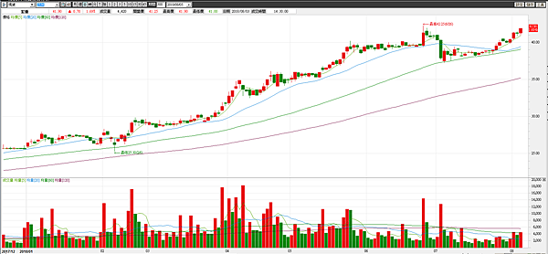
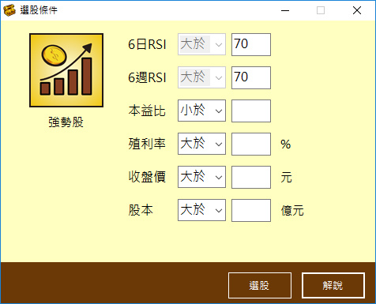
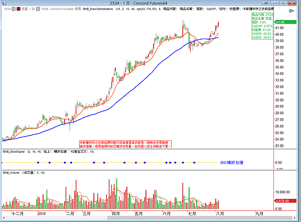

## 孤獨求敗強勢股介紹

內容簡介

強勢股操作，操作股票我會操作強勢股，因為強者恆強、趨勢一但形成不容易改變，做強勢股上漲的機率比較高。而強勢股的定義是啥 ? 就是均線多頭排列，K線在最上方，例如 K線 > 5MA > 20MA > 60MA ，短、中、長期的均線都往上 那麼均線對行情有助漲的功能。我喜歡找45度仰角上漲的股票，容易大漲一段。

例如2534宏盛，短中長期均線多頭排列，天天漲不停。持有這種股票比較快樂。

選股邏輯

1.只找均線多頭排列的股票

2.可以RSI來篩選股票的走勢強弱

 RSI越強，股價走勢越強 ，現在做多要選強的

3.可用本益比、殖利率、股本、收盤價 等其他條件來篩選股票 

進出場建議

只要在均線多頭排列的強況下進場操作，勝算就比較高。你可以等待拉回買進，或任何時候買進，重點是要會停損停利。停損讓每筆交易損失不要超過本金10%，最好在5%以內，而停利，均線本身就具備移動停利的功能，所以你可以選一條均線當作移動停利的方式，均線任你選，我會以10MA當作短線的出場依據、40MA當作長線的出場依據。

圖 : 2534宏盛 10MA與40MA 可當作停利參考依據，均線可以選擇、自行設定餐數。

