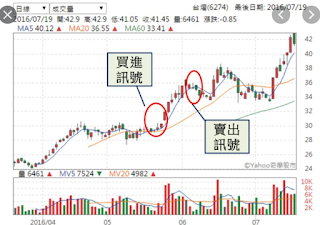

## 廖崧沂辨別真假突破就靠這一招

如果是強勢股，會在前高之上，拉回量縮角度緩；

弱勢股，則是下跌角度陡而且量增，突破前高之後，立刻回落到前高之下，符合「假突破」的模樣。

突破買、拉回買，哪個容易賺錢！  股價長期盤整，突然以帶量實體紅K 突破整理區. 如果資金允許 ... 我簡單定義為「量縮到不能再縮的成交量」. 股價剛進入 ... ,資金與人氣才是驅使股價和成交量的原動力. 強勢股 ... 發現底部爆天量，拉回不破低時就可以先觀察這檔個股 ... 股價上漲一波出現整理平台量縮，不破均線或回測均線. ,「大量突破量縮拉回買進法」望文生義，將會讓你有更緊密的停損區間，能夠讓你「迅速認賠」。 交易儘量接近危險點. 為了控制風險，進場買點應該儘可能接近停損點。 , 價漲量縮如果是漲勢初期，成交量不足，股價也就不易攻堅，頂多只是反彈而已，這種 ... 從「價跌量增」的價量關係，很容易看出有大幅拉回的可能了。,下跌量增是賣壓全被買方接手, 買盤敢買當然有可能是好事, 可能見底但要看量增多少, 假設一個股高檔暴1.0萬張, 拉回量已縮至2000張後, 又下跌量增至4000張, 算不 ... , 量縮拉回靠線找買點戰法量縮拉回靠線找買點戰法，是一個中長線波段操作的趨勢性買入戰法，也稱戰略性抄底戰法該戰法有4個必須具備的關鍵點： ..., 如果是強勢股，會在前高之上，拉回量縮角度緩；弱勢股，則是下跌角度陡而且量增，突破前高之後，立刻回落到前高之下，符合「假突破」的模樣。, 股價上漲後進入盤整、回檔，此時籌碼正進行「換手」 ... 接著就進入換手階段，整體呈現「量縮價穩」 ... 可以使用這樣的「拉回買」方式來進場. 這也是在 ...,§ 強勢股在拉回量縮時，也是買進時機。 § 出現大量的股票，擇機找賣點。 § 強勢股或主流股，儘量波段操作。 § 也可針對特定的 ... ...

每一波又一波的攻勢，會先從「三盤(3根K線)突破轉折+連續量增」開始發動波段，而當突破前高，即是從盤整轉為「發動趨勢」，聽起來好像很不錯、又簡單，但其實每一次的突破或跌破盤整高低點時，往往也是兵家必爭之地，一定會出現爆大量的情況。

往往爆大量之時，就是籌碼交換，只是交換後是散亂出貨，還是變成集中，兩者差別很大。

如果是籌碼集中的爆大量，那後續馬上就會見到「在前高之上、拉回量縮且角度緩」的籌碼穩定現象，這就代表是「真突破」。

但如果是籌碼散亂的爆大量，就會下跌角度陡而且量增，且突破前高之後，立刻回落到前高之下，即俗稱的「假突破」。

 

也因此，判斷走勢的強弱是可以利用前高來作為分水嶺。如果是強勢股，會在前高之上，拉回量縮角度緩；弱勢股，則是下跌角度陡而且量增，突破前高之後，立刻回落到前高之下，符合「假突破」的模樣。

 

以百和(9938)日K線為例。在2019年6月21日出現高點93.8元之後，進入了量縮橫盤的整理格局，至7月9日的三盤突破後，開始連續K線見高上漲，形成波段上漲。

而7月12日在市場引頸盼望下，開在93.6元，盤中立刻攻擊到94.7元，且出現了極大量，但此時此刻，從tick圖(點線圖)看到，忽然之間，沒有再創高價，此時一定要提高警覺，從**量價、從角度**，來判斷強弱。

 

以日K線的角度看，最差也應該要守在93.8元前高之上，但很不幸的，在9點14分的下跌帶量之後，注定了開高走低的假突破命運。

股票走勢真真假假，一定要從量價、角度中去研判真偽！

---

一個波段下來或上漲，要止跌止漲，先借用最新的三根K線來作為觀察。當最新三根K線出現了「正V、倒V」的排列時，就是波段止跌的訊號，就是這麼簡單！也是投資人短線上可以「危機入市」的好時機。

buy call

第三根K線的低點 沒有跌超過 第一根 K 棒的低點

就稱做「三盤不破」

看見此訊號時

便要仔細觀察隔天的 K線 變化

如果隔天 K線突破前兩天的 K線 最高價 且 收紅盤

即可確定 三盤不破黑翻紅 的 買進訊號

buy put

連續三根 K棒 中 第三根的低點

跌破了前二日的 K線 最低價 且 收黑盤

便能確立 三盤不過紅翻黑 的賣出訊號

---

多頭會有「量先價行」的特性，像現在就是買的人越來越少（量能萎縮），價格就越走越慢。

 

金融市場的魅力，就是沒人知道會漲到多遠，大家都懷抱著發財夢，或許一波到頂，又或許是經過漫長整理後，再突然發動攻擊，所以避免無謂的整理且安全下莊，也是得先從量能去觀察。

先前文章都一直不斷在波段「起漲」與「攻擊」上著墨，也就是有量能的推升與均線的助攻，呈現黃金發散的股票是首選，即：

`量能——要5日 > 13日 > 34日均量（MV）`

`價格——要8日 > 21日 > 55日均線（MA）`

如果起漲攻擊是量能潮上揚，那相對的「休息整理」，就只是反過來看而已，也就是量能潮下墜。一個是量增，一個是量縮。

的確，在金融市場盤整的時間佔多數，在這些期間投資人都是要等待，或者改變標的。然而，也不是無法破解，今天就以趨勢量34日均量（MV）來舉例，如何避免不必要的等待。 

任何的投資都是講求時機點，在之前文章談到[「飄」的現象](https://www.businesstoday.com.tw/article/category/80402/post/201907190027/「上漲量縮」就要趕緊逃命？這2檔股票走勢讓%)時，以昇陽半導體(8028)的日K線為例，因為當時就是屬於黃金發散，講了起漲的現象。

而何時會進入整理現象？均量（MV）下彎的時候。今年2月與7月，昇陽半導體各攻擊兩波，很明顯的黃金發散，接著什麼時候進入盤整呢？4月與9月（如下圖）。

在2月與7月攻擊波的量能無法再擴大時，分別在4月與9月都產生了34日均量（MV）趨勢量能下彎的情況。

 

如此想想，在4月避開不必要的「盤整」不是很棒嗎？只要觀察到34日均量（MV）下彎，就暗示投資人「趨勢」結束了，準備要進入盤整，等到7月黃金發散再度出現再介入就好，足足省下3個月時間，可以將資金轉去找尋其他標的，發揮最大效益。

 

相同的觀念，在9月的34日均量（MV）下彎後退出盤整行情，至今也省下了不少時間。有道是，「買的好不如買的巧」，與其無聊度過漫長等待，不如利用趨勢量能來活用資金，創造最佳報酬率。

---

有一種特別有趣的現象稱之為「飄」，隨大量紅K開始展開波段攻擊後，後續行進中的K線，會根根K線、低點不見，高點有過的往上爬。

一般的認知是當K線「連續在創高」時，同步會伴隨著「連續量增」來符合供需原理中買大於賣現象，有積極的買單主動往上買進較高的價格，把高掛的賣單收下，形成「量增價漲」。

但「飄」卻在創高的過程，並不用到太大的量，反倒是量縮，卻繼續創高。

 

其現象，**並沒有脫離買大於賣的供需原理，只是買賣關係稍微變化**。 

**由於「買盤集中」（剛剛有提到，飄的開始是大量紅K開始波段攻擊），所以沒有什麼賣單，反倒是買單沒有減少，得出來的結果就還是買大於賣，因此，量縮依然能夠上漲，俗稱「惜售」。**

這是好的現象，不要誤認為是「量價背離」。

 以昇陽半導體(8028)和緯軟(4953)的日K線為例： 

昇陽半導體在2019年7月2日時，出現”當時”的大量攻擊紅K，成交量7807張，而後續卻好像不用太大的量能，就一路漲，「飄」上至7月10日又發動另一次量增的攻擊。 

7月2日至7月10日大量之後，量縮價漲，即是「飄」，因為買盤集中，賣盤減少，自然還能漲。

緯軟自7月10日與7月11日出現了大量攻擊後，後續量縮但價格依舊有高價，也就只有籌碼集中而且惜售的股票，才會有這種「飄」的現象。因此，股票並不是像許多投資「磚」家（一知半解的專家，像磚一樣經不起考驗）說的，量價背離一定要賣股票，而是要視情況而定。

