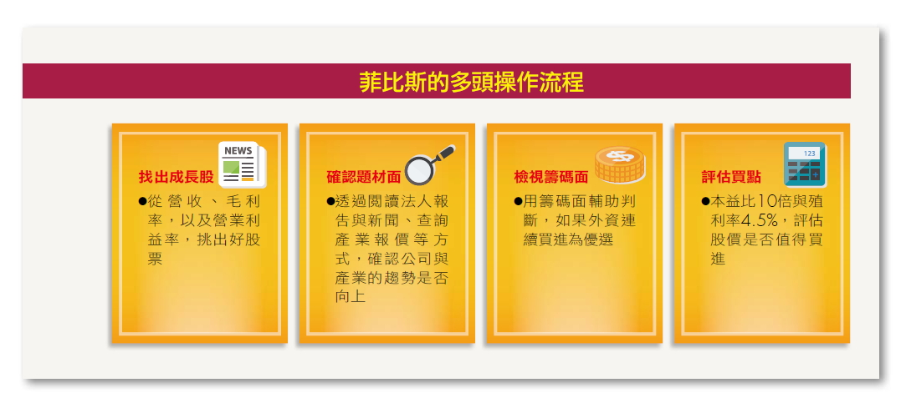
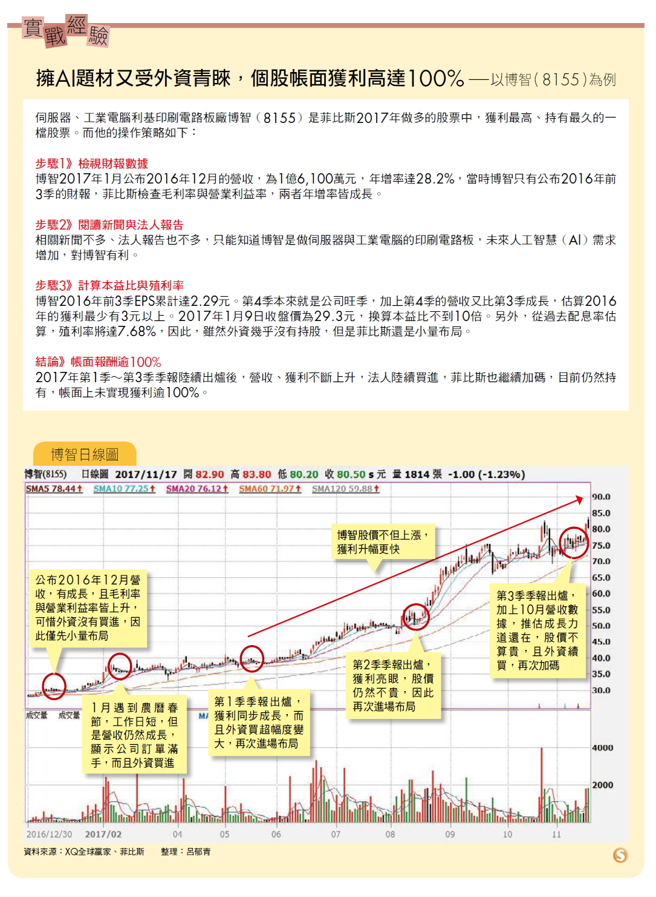

## 比菲斯基本面選股4心法

原本是財經門外漢，靠著自修學習理財，近5年來靠著一籃子股票做多，再加上一籃子股票做空的「多空操作術」，在股市提款5,000萬元的菲比斯認為，散戶不用怨嘆沒有內線，只要勤看財報等基本面數據，也能像他一樣從股市提款。

**從多方面指標挑選標的**
**才能降低買到地雷股機率**

「很多人花錢上技術分析的課程，但是卻賺不到大錢，原因就在於技術線型只是股價漲跌其中一個判斷依據，並不是全部。」菲比斯說。長期來看，股價一定會反映公司的獲利。雖然會漲的公司不一定有扎實的財報數據，但是先確認基本面佳，再用技術面、籌碼面輔助判斷，就能避免買到地雷股。

菲比斯是用什麼指標判斷基本面呢？又是用什麼指標判斷股票是否值得納入做多的一籃子投資組合中呢？以下是菲比斯挑選做多股票的步驟：

**操作心法①觀察營收、毛利率、營業利益率變化**證交所規定，上市櫃公司每月10日前要公布前一個月的營收，因此，菲比斯會在每月10日前後，逐一查閱台股1,600多檔公司的數據，如果是營收由衰退轉為成長，或逐月成長的股票，他就會進一步檢視該公司最新一季財報的毛利率與營業利益率，是否也較去年同期成長。

營收是一家公司最即時的財報數據，可以作為第一步的篩選，但是，如果營收成長是靠殺價競爭或合併而來，就未必能帶動實際獲利的成長。

因此，除了營收成長之外，最好同時看財報中與獲利相關的2大數據—毛利率與營業利益率，如果2個指標都同時成長，就可以優先列入候選名單。

**操作心法②查詢近期新聞或法人報告確認趨勢**
看到營收、毛利率與營業利益率成長，但是，財報畢竟是反映企業營運過去的數字，未來趨勢是否繼續，則要透過質化的分析。

要了解公司未來的營運展望，該怎麼辦呢？菲比斯會查詢近期新聞、閱讀法人的研究報告，如果有相關原物料或成品的報價，則可以同時看價格的變化。例如：投資太陽能公司，就一定要到市調公司集邦科技的網站，確認現在太陽能報價是否也同步向上。

當產業報價向上，而公司營收與財報獲利都成長，就代表公司處於順風期，做多的獲利機會很高。但是，當產業報價開始下跌，就要留意公司未來的趨勢是否向下，因為公司發展會受到整個產業景氣影響，菲比斯說：「要提高投資期望值，就要勤勞研究。」

**操作心法③檢視外資籌碼是否連3個交易日增加**
在台股逾1,600檔的股票中，不乏有基本面很好，但是股價卻不受青睞的公司，菲比斯會再搭配籌碼面，協助判斷股價近期是否會上漲。

籌碼是指誰拿錢出來買，菲比斯最愛看的籌碼指標是「外資」。外資買進1檔股票通常都有延續性，今天買明天再買的可能性很高。一旦外資持續買進，不但代表外資看好這檔股票，更代表外資本身就是推動股價上漲的力道。菲比斯偏好選擇外資連買至少3個交易日的股票，股價未來繼續上漲的可能性較高。

**操作心法④用本益比與殖利率估算股價是否昂貴來找買點**
菲比斯評估一家公司目前股價是否值得投資，有兩個指標：一個是本益比、一個是殖利率。
**1.本益比→低於10倍算便宜**
本益比是最常用來評估股價昂貴與否的指標，法人也都用它來評估股票的目標價。

一般來說，本益比愈低愈好，代表股價愈便宜，買進後可以預期的報酬率空間愈大，但是，只看本益比低就買進，有可能挑到衰退的公司，股價低還有更低，因此，菲比斯提醒，要按照步驟先挑出有獲利且趨勢向上的公司，再來計算公司的本益比。

另外，不同產業，市場給予的本益比也不同。例如：工業電腦類股的本益比約在10倍左右，但是，IC設計類股就享有很高的本益比，而龍頭股通常也比同產業的其他股票，享有更高的本益比。

**不同產業的本益比標準不同**
**計算時要用「預估EPS」**
當股價還沒上漲，但是，獲利已經成長或預估今年會成長，本益比就會降低，就值得買進。可是，要如何判斷本益比多低才算便宜呢？菲比斯給了個粗略的答案「10倍」！

10倍上下的本益比，不管是哪個產業、無論是否為龍頭股，都算是非常的低。菲比斯建議，有興趣的投資人，可以自己估算每檔的本益比，一季一季不斷計算之後，就能自行判斷出來，不同產業本益比的合理區間在哪個範圍了。

要注意的是，由於股價是反映公司未來的趨勢，因此，菲比斯在計算本益比時，會用「預估」的每股盈餘（EPS），最簡單的方法就是用最新一季的EPS直接乘以4，再用最新營收數據進行調整，但是要留意，有些股票有淡旺季分別，在評估時也要跟著調整。如果產業報價成長快速，評估時也可以偏樂觀些。

**2.殖利率→高於4.5%算便宜**
殖利率就是投資人買進一檔股票，可以拿到多少的股利回報率。在計算股票殖利率時，一般只計算「現金股利」。

中大型股票在法人眼中，殖利率4%已經算不錯，超過4.5%即屬於高殖利率股票，股價就算很便宜了，但是，小型股的殖利率可以提高至6%。菲比斯一樣會用「預估」的方式來計算殖利率，先預估個股今年獲利，再看過去3年該公司的股利配發率。假設今年預估的EPS為10元，過去3年的股利配發率為80%，可以合理期待隔年的現金股利是8元，再除以目前的股價，就是預估殖利率。

**月營收公布前先檢視股價**
**若漲勢不再就應賣出持股**
當買進理由消失，例如：營收下降、毛利率下降、營業利益率下降，或產業報價由持續上漲轉為不斷下跌，或外資持續賣超等，菲比斯就會賣出。

另外，有時候股價會領先基本面，當次月營收還沒有公布，或還沒有到每季財報公布日時，股價就已經漲不動了，遇到這種狀況時，菲比斯也會賣出。

