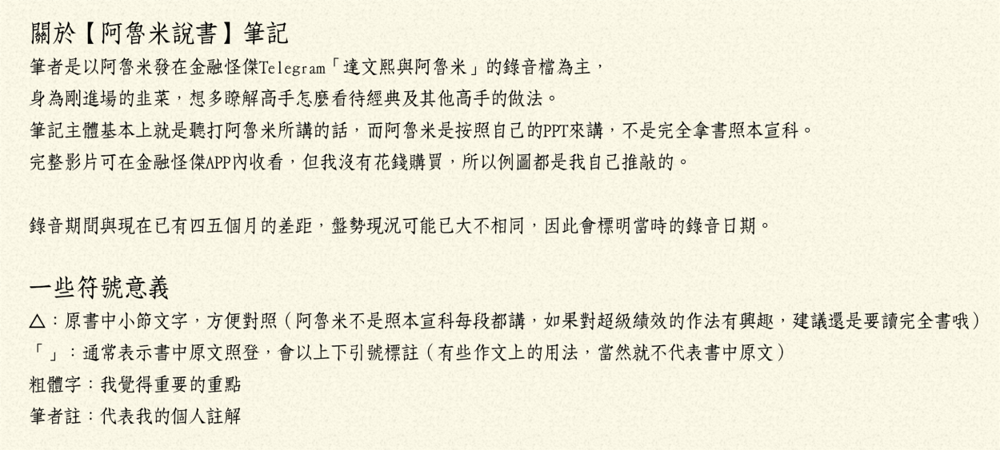
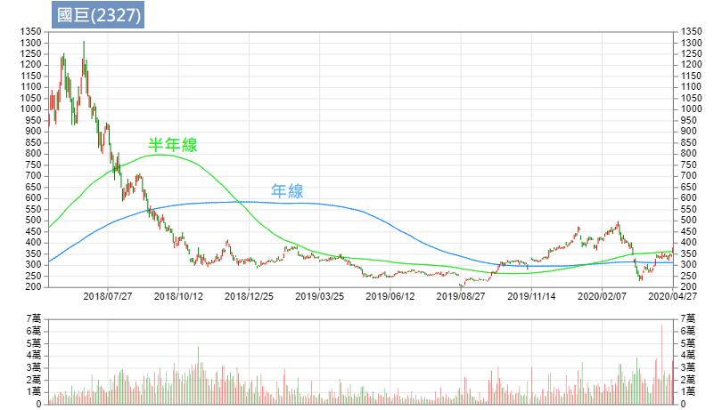

# 【阿魯米說書筆記】超級績效

出處 https://riowu.medium.com/%E9%98%BF%E9%AD%AF%E7%B1%B3%E8%AA%AA%E6%9B%B8%E7%AD%86%E8%A8%98-%E8%B6%85%E7%B4%9A%E7%B8%BE%E6%95%88-ch4-5-31885d46d02b

# 超級績效 (CH1、2)

一本書最重要的格局就是前言/導論，是整本書的精華。

美國投資大賽三屆冠軍的David Ryan撰寫的前言，無疑是這部作品最好的背書。

# CH 1 導論

成功的市場玩家，成功的條件不必與生俱來，但一定要有某些關鍵的特質；亦即成功是可以後天培養的，但是必須培養出關鍵特質。
例如：急性的人可能適合短線；優柔寡斷的人無法適應停損，就必須修練能夠「勇於停損」的關鍵特質。

△ 『堅持夢想，相信自己』投入最大的熱情
做交易的心法都是一通百通，阿魯米也曾在YT提過，每一個人都會跌倒，「當你遇到挫折的時候要滿懷夢想，相信自己一定可以做得到。」

交易是很痛苦的，而我們是為了財務自由、人生自由，才會投入交易。

△ 『保守又衝動的機會主義』
衝動是勇於進場，保守是對風險的衡量，必須評估自己「禁得起多少損失」，而不是想著「我要賺多少錢」。

△ 投資自己
買書、學程式都是很小的成本。

△ 許下承諾
「產生興趣」與「許下承諾」的差別，在於堅持的意志力，興趣只是業餘的，阿魯米寫過：「別拿你的業餘愛好，與我吃飯的本事做比較。」

△ 有準備，才有機會
就算是價值投資，巴菲特每天也花無數小時在閱讀，你有資格說自己在學巴菲特嗎？

△ 熱情的專注力
「當你忘卻金錢，把注意力集中在如何讓自己成為頂尖交易者時，就成功了，至於錢財也會伴隨而來。」
做行情時，將注意力完全擺在做行情上面，不計較是贏是輸，只要切實執行計畫，便是成功了。很多人進場後會被數字影響，注意力放在損益上面，人性的恐懼與貪婪也因而產生；但若能將心思專注在計畫上，就不容易受行情影響，能堅持自己的想法去完成屬於頂尖者的交易，錢財就會伴隨而來。

這同時也是阿魯米的座右銘：不在乎損益，在乎的是你如何成為成功頂尖的交易者。

交易者只關心三件事：買進什麼、何時買進、何時賣出
阿魯米講法略有不同，但也是同樣三件事：買、賣、標的

# CH2 必要知識

△ 不需要仰賴運氣，練習越多就越幸運。交易沒有捷徑。
重點就是不斷練習，例如：你發現一個指標好像很有用，或是從財務分析看出潛在機會，那就重複練習使用它。

股票交易成功與否，跟運氣沒有太大關係。
計畫擬定得越周詳，你的運氣就會越好。

△ 帳戶可以從小開始
不借貸，量力而為。絕對不要借貸、不要借親友的錢，心理負擔的壓力，容易造成你在交易上的錯誤判斷。
有的人常常幻想如果自己像主力一樣錢多，就可以怎樣怎樣。但阿魯米認為，就算現在給你一千萬，你也一樣會輸光。當你到達那個水平，自然會知道該怎麼做。

△ 歷史會重演，這次也沒有什麼不同
作者Mark是技術分析派，自然認為歷史會重演。但是重演的是結果，並不是過程。例如：肺炎疫情造成的崩盤與V轉，跟以往的空頭比較，結構不一樣、發生的原因不一樣、過程也不一樣。就像好萊塢電影劇情大同小異，但細節不同。
所以阿魯米認為並非歷史完全重演，而是它的結局是一樣的。但是過程就要學習了。

△ 你想要的是判斷正確？還是賺錢？
看圖說故事人人都會，當你真金白銀進場之後，那個輸贏才是真的。沒進場時看法都很客觀，但你人在局中就會忘記自己是誰。
例如：沒人知道接下來會漲/跌到哪，我們也許隱約知道會在哪個區間，接下來還會不會漲/跌沒人知道，我們只能做好防範措施，該避險的避險，該放空的放空，尋找高勝率的做法。

△ 練習不能保證完美
完美的練習才能讓你更完美。交易必須容錯，容錯是完美的一環。
交易沒有所謂的完美，因為都是問號、未知，道瓊可以跌千點之後在尾盤拉一千五百點然後收平盤，沒人能保證未來會怎樣。
做交易必須容許錯誤，容許自己看錯行情、容許自己賠錢，必須做好『停損』，當看錯時少賠一點，看對時多賺一點。輸錢是很正常的事，不要看得太重，只有當你能接受合理的輸錢，有一天才能真正賺到錢。

△ 不贊同紙上模擬交易
阿魯米也不建議模擬盤，因為當你有錢在輸贏的時候，感受完全不一樣。例如：在遊樂場開碰碰車和真實上路是完全不同的心情。
要真實進場，才能練習讓內心沉穩，這點是紙上交易無法辦到的。

△ 交易是一門事業
一天就能賺三千六千，你以為真的有這麼容易嗎？你以為對手都這麼傻？
平常購物比價斤斤計較，做交易慘賠卻無動於衷，省小錢卻花大錢？

△ 不要學基金經理人作投資
彼得林區：「第一法則：不要聽從專家意見。」
阿魯米認為專家常常是錯的，例如電視上推薦的標的，人人都知道就會變得擁擠，反倒成了出脫或放空的時機。
散戶的優勢在於靈活性。我們要追求的是絕對報酬，不要像投行只跟大盤比，否則你不如買ETF就好。

Mark認為的強勢股，通常不具備法人選股的條件，因為流通籌碼有限、流通性不佳 ，（阿魯米提醒：人多的地方不要去，太擁擠的地方搶不到糧食）作者挖掘的強勢股，通常是漲了一段之後，才會開始有法人關注跟進。
例如：倉和30元漲到60元時，交易量每天也才幾百張，直到100元後才有法人明顯買超，最後股價超過300元。
我們要從本書學習的就是，如何在60元到80元這段辨識出這支超級強勢股。

△ 想變得傑出，就必須違反傳統
凱因斯：「所謂的『健全』銀行家，並不是指能夠預見、規避危險的人，而是當他被毀滅時，只以某種傳統或正統的方式被毀滅，而且他還有一大堆的追隨者，所以他也就不容易被責難。」
傳統智慧只能創造傳統績效，永遠要對傳統智慧保持質疑，想要成長就必須犧牲安逸，跳出舒適圈。阿魯米也認為，大家都知道的東西，就不容易有多餘利潤。

△ 成功不可避免的代價
想要成為頂尖者，就必須做別人所不願做的事情。
大家都在做的就是微利。你做別人不願意/不知道的，才有很大的利潤在裡面。
專注在自己的交易風格，長線或短線，從單一種開始，練習到一定程度後，再去學習其他格局，慢慢內化成自己的功力，去連結長中短線的方式，逐漸一通百通。
例如做日內短線、不留倉過夜的，每天都是新的，大盤行情怎麼走跟你沒什麼關係，持倉只有5分鐘、10分鐘，這支股票的未來完全跟你無關，就算長線走多也無所謂，你還是可以放空，只要專注在你的風格上即可。
當然，專注於某種風格，勢必會犧牲掉其他風格，按照自己的風格制定計畫去執行，唯有堅持自己的風格才能找到屬於自己的聖杯。

# CH 3 特定進場點分析(SEPA策略)

作者在八零年代入門時的做法，就是撿便宜。如果大盤掉下來，我們去撿便宜這樣OK，但如果大盤並沒有掉下來，只有股票掉下來，你去撿這些便宜貨就會很慘。

除非是因為被大盤拖累，否則如果一支股票莫名其妙跌到原本的三四成，甚至一成，這種股票千萬不要碰，因為通常會下市的就是這種股票。它要轉機或反轉並不容易。

△ SEPA策略(Specific Entry Point Analysis) 特定進場點分析
交易就是進跟出。以股票為主，基本上是多頭思維，也就是買股票（而非放空），既然做多就好辦了，「進」之後就是「出」，中間另有加減碼的過程。

**散戶價值定價錯誤的思維：絕對價值與相對價格**
「絕對價值」：例如巴菲特的價值投資，一間具備護城河的公司有其價值，當價格被低估時，就具有買進的價值。
散戶的錯誤思維卻是「相對價格」：之前80元價格很貴，現在20元相對便宜。
所謂的便宜應該要修正，要看它的價格跟價值比，如果價值高，而目前價格偏低，則應該買進，這種叫價值投資；如果是之前80元，現在剩20元、甚至8元，這種相對價格就不叫價值投資，而是愚昧的投資。

作者研究Richard Love的《超級強勢股》，歸納出三個重點：

1. 買股票有好時機，也有壞時機。
    （阿魯米點評：不管大盤或個股，如果在空頭時買進，不一定會賠錢，但是你會備受煎熬。譬如1萬點買進指數，大盤有可能回到1萬2，但這時是好買點嗎？倒不一定，因為大盤可能會先到8千點.....。當空頭時買進，可能會比較煎熬，所以我們要先確定「時機性」，買股票要有時機，不能像存股越跌越買。
    說到存股，不擇價也不擇時，就是買，完全撇開景氣循環的震盪，最終會有一段時間很慘、也會有一段時間很好。而選定的股票通常有特定的模式，譬如說高殖利率、高配股配息，這種才值得存股。如果你選錯股、抱太久，**你跟股票談感情，它會對你很無情**。）

2. 超級強勢股在發動之前，就能夠被辨識出來。

3. 正確投資超級潛力股，可以讓小帳戶在相對短的時間之內，累積為龐大財富。
    （阿魯米點評：做期貨是利用槓桿，超級強勢股則是利用其波動率，就是很會跑。如果你選一支不會震盪的，想要配股配息而去買金融股，那也不用做當沖、它也不會變成超級潛力股；最強的從20塊經過一年多跑到4、50塊，例如之前的上海商銀算是很強勢，但這種股票不可能讓你短時間累積龐大財富，因為選股屬性就錯了。要找波動性相對較大的，有主力容易炒作的。）

累積財富的方法，大概就兩種：錢要嘛出去、要嘛進來。

1. 出去：節儉、量入為出，這種方式可以累積小錢。
    舉例：年薪1百萬的人可以賺到1百萬，但年薪5百萬的人，可能都存不到1百萬，因為開銷也會變大。
2. 進來：**賺錢的速度快到來不及花**，我可以幫你花^^。這才有辦法累積龐大財富。

△ SEPA的五大要素
透過固定分析模式來選股

1. 趨勢(Trend)：趨勢明顯，明確的股價上升趨勢，最好在初升段就能辨識出來。
    舉例：2016年的玉晶光(3406)在50元上下震盪，當它漲到100元時（初升段）應該被辨識出來。如果到了4、500元才辨識出來就太慢了。
    股票籌碼有限，當你看好一檔股票，市場上的籌碼會被最早去買進的人分食掉，在外流通的籌碼變少，股價就容易拉抬。所以當人家在搶籌碼的時候，我們就要跟著進場去。

2. 基本面(Fundamentals)：強勢股發展階段的驅動力量，大多來自盈餘、收益、毛利這些因素的改善。
    其實基本面是落後的，但有個東西可以看出來，譬如說營收盈餘都是成長的，那就是強勢股最基本的力量。
    有些強勢股你完全不知道它背後的因素，但可以從技術面著手，也可以看出來。

3. 催化事件(Catalyst)：大漲的股票通常背後都有催化事件（不為人知的故事）。
    我們在做一支股票，一定要有題材。例如新冠疫情期間，最先漲不織布公司，再漲耳溫槍、額溫槍IC相關的公司。在台灣還沒爆發疫情前，阿魯米從技術面發現康那香(9919)有異常，雖然當下不清楚背後原因，但股價已經反映了，當背後的故事大家都知道的時候，就是大戶在下車、散戶準備進場的時候。

4. 進場點(Entry points)：一個波段的波段的發動，通常會有好幾次的低風險進場點，所以時效的拿捏很重要。

5. 出場點(Exit points)：同時也是停損點設置。做超級強勢股，獲利著眼於幾十%或幾百%，只要停損有限，賺1次可以賠10次或5次，長期下來，只要稍微拉高勝率接近50%，就可以大賺。

△ SEPA評等程序

1. 股價必須符合「趨勢樣板」(Trend Template)的條件（股池的篩選）
    利用基本面跟趨勢面作為濾網來篩選
    基本面篩選舉例：如果該產業屬夕陽產業，同族群的股票也沒有隨之起舞，單一股票很難有大表現。
    趨勢樣板的條件舉例：中期均線及長期均線為多頭排列

2. 再經由一系列濾網（基本面）做篩選，大概會剩下5%值得研究的個股。

3. 與「領導股輪廓側寫」比對。
    每個族群裡都有龍頭股和領導股，什麼是龍頭股？例如光學的龍頭股是大立光(3008)，但是它股本大，要有倍數成長相對困難。
    我們首先要確定龍頭股是處於多頭的，亦即該族群產業的股票基本上是偏多的。
    什麼是領導股？例如剛提到的玉晶光(3406)就是光學的領導股。為什麼？因為它是老二，可是股本不大，但表現突出（毛利、獲利、盈餘、營收等基本面的表現都在成長），當大家都還沒看出來的時候，其實營收已經逐步增加，重點在於毛利，因為光學的良率很重要，毛利高代表良率改善中，也就是該股票可能成為族群中領導上揚的關注焦點。
    多去理解族群中的細產業。
    如果最強的股票停下來了，那麼該族群的漲勢也就可能會逐漸放緩。

4. 根據「相對優先順序」為篩出的個股評分。

SEPA評等程序主要是希望辨識出：

1. 未來盈餘與銷貨意外事件，以及正向的估計修正
    股票在漲的時候，你從盈餘是找不到的；股票漲上去，你才知道它接到大單。在我們還看不出來的時候，股價會先動，我們要想像推算它未來的盈餘跟銷售是否會成長，這不會突然間就漲上去（前例說的突然接到大單急單這種，不叫超級強勢股，因為它可能只會走一兩個月，要走一個大波段比較難）。
    超級強勢股的盈餘是逐步成長的；或是毛利率、盈餘、營收等，連續四季跟最近一季相比，可以看出是逐步成長中，這種東西就可以作為先決條件之一，拿來驗證這支股票是否為超級強勢股。

2. 機構法人的成交量支撐（顯著的買盤需求）
    強勢股剛開始的時候，第一波段都沒有量，當它漲出去之後才會被市場看見，法人才會慢慢介入，當外資投信買進時就是它主升段，而這行情不會一天就結束。
    而不是法人已經持股很多了、這週買下週就賣那種，有進有出這種不一定是對的。
    法人著墨比較少的，當他們沒有貨的時候，發現這支股票在動，開始進場補貨，你就要跟進。這就是機構法人會製造出來的成交量支撐。

3. 因為供需失調而產生的價格急漲（賣盤相對少於買盤）
    就是剛才提過的在外流通籌碼有限，剛開始時流入的資金比較大量，之後要鎖漲停可能就只需少量資金，因為想賣的人少，輕輕一推就急漲。

△ SEPA就是過濾、過濾再過濾，所有考量因素（公司基本面、股價、成交量活動，乃至大盤市況）都配合時才執行交易。

△ 超級強勢股的發動時機，通常是大盤脫離修正、或是空頭市場轉折的時候。
舉例來說阿魯米的程式選股，篩出來做多的股票有兩三百支、做空的有一兩百支，但當空頭市場降臨，例如新冠疫情爆發時，做多的只剩十來支防疫概念股，這些股票是抗跌的，但當武漢肺炎逐漸獲得控制，市場恢復正常時，這些股票反而不會漲、甚至會大跌，跟大盤呈現逆相關。
空頭市場修正期間，我們要注意什麼？注意那些跌勢最緩和的（也就是相對抗跌），大盤反彈過程最先創新高的這些股票，例如空頭時10天強於大盤20%，這些就是抗跌，也是未來超級強勢股的候選名單；這些股票有種被大盤拖累的感覺，注意哪一支股票先創新高，絕對是背後有原因（雖然我們不知道），但未來值得期許，具有成為超級強勢股的潛力。

△ 超級強勢股的屬性
作者認為要年輕的公司、規模不大的中小型股。
阿魯米自己的研究也是，飆股通常屬於很年輕的，上市不到10年的年輕公司，規模不大的中小型股（中小型股籌碼有限，年輕公司則法人沒貨）。
超過10年的公司也可能有大器晚成的飆股，但老股票籌碼凌亂，除非是轉機股。
股本大的股票，不容易成為超級強勢股。至於國巨(2327)，則是透過不斷減資來集中籌碼，減了兩三次之後才有真正大多頭的發動。所以控制籌碼是飆股的一個重要因素，在沒有炒作的情況下，如何控制籌碼？就是選擇中小型股，股本譬如20億、10億以下。

△ 對特定方法許下承諾
你如果選定了一種方法，必須對自己許下承諾，徹底執行。如此才能了解這個策略的優缺點，日後才能避開缺點、擷取優點，但必須要很熟悉這套方法才有能力分辨優缺。

# CH 4 價值的價格

△ 本益比：濫用與誤解
本益比意指成本（買入股票的價格）與收益（Return / 賺了多少錢）的比較。舉例來說，一間公司股票價格100元，今年賺5元，本益比就是20倍（100/5=20）。
本益比的計算牽涉到公司賺了多少錢，但你不知道它賺多少，所以我們通常用前四季累計來估算一年的獲利，但每個公司有淡旺季、有景氣循環、競爭力有上有下，所以單從本益比很難判斷公司好壞。因為過往的獲利只是一個Record / 紀錄性的東西，而本益比只能假設未來所有條件不變，來判斷現在市場價格是否合理。
其實用本益比來判斷一個國家的大盤倒是有意義，對於個股的意義卻不大。市場上有些存股會用本益比來判斷價格是否合理，加上殖利率的考量，與本書追求的超級強勢股是完全不同的思路。

所謂的本益比，我們要買高還是低的？我們當然想買便宜的、本益比低的，一般人以為這就是價值投資，看到本益比低就買進，但要小心這就是便宜的陷阱，就像打牌時拿到一手爛牌，甩都甩不掉。
為什麼本益比會很低？一般來講，股票本益比低的話，表示它是不具成長性的，市場給予它成長性的評價是不高的。例如本益比5倍的股票，基本上屬於偏低，可是背後的原因就是，公司有問題或是成長性不高，市場認為它不配一個高本益比的估值。
當然也有可用本益比來評價的產業，例如台塑(1301)、南亞(1303)，每一年大概都不會太差，或像中鋼(2002)這類鋼鐵股也是，但是會受制於鋼鐵價格及成本（例如鐵礦砂成本），塑化業也會受制於石油成本，所以績效會受石油價格波動影響，但長期下來用均值來看，長期的本益比還是可以信任的，像這種有長期績效、幾十年不會太大變動的公司，就可以用本益比的方式來評比。

高本益比的公司，背後代表的是高成長，市場給予的定價是不同的。好比有些新創公司本益比非常高，阿魯米在上海時，大陸創業板均值本益比估值大概7、80倍，2015年時到了120倍覺得很高，很多人去放空，結果還有更高，130、140甚至到150倍。所以所謂的本益比在資金行情或是泡沫興起時，連大盤的本益比都是有問題的。什麼是高什麼是低？沒有絕對。舉例來說，Google發行時100元被認為很高，但後來到1000元卻又被認為很合理了。
本書要找的飆股，就是要找這種高本益比的股票，代表很多人會進來買，其實本益比就是屬於人氣的指標。

△ 本益比是否能追上股價？
股價是看未來，前面提到我們用過去四季來推估本益比，明年如果是爆發性的成長，假設今年賺1元，本益比40倍；如果明年賺3元，用現在的價格來看，本益比馬上會降至16、17倍。所以用過去看未來，會存在很大的誤差；即便目前估值很高，未來成長性若能跟上，那麼現在的股價就是值得的。
**股票是看未來，高成長的股票就適合高本益比。**
沒有未來的股票，市場給予的價格自然就是偏低的。

超級強勢股初期的本益比一定是不合理的。為什麼？因為當它往上大漲的時候，我們用以評價的收益仍舊是前四季的累計收益，估算出來的本益比當然非常高，因為我們是拿過去的數值來預估未來，也就是基本面落後於股價。
舉例來說，我們用月營收來推估財報（基本上是季報）並預估股價，月營收其實是走在最前面的，但實務上可以發現，月營收還是落後股價三到六個月以上。也就是當公司接到單、看到利多、擴廠、增加生產設備等，這些都是未來才知道，營收也要三個月、半年或更久才會滾進來，大家才會知道營收暴漲，但是在這個期間，股價已經在反映了。如果連最領先的月營收都落後於股價，那更不用提季報了。

**價值投資並不是用本益比高或低來判定。**而是要有長期紀錄，譬如說一間銀行長期以來每年都賺2、3塊錢，現在因為疫情或歐債危機等**短期現象**而下跌，也就是說，只要持倉夠久，它會恢復到一年賺2、3塊錢，那麼現在的價格就是屬於偏低的。
它有一個護城河，這個護城河就是一個外在因素，而不是公司內部的，公司內部的很少有護城河，譬如說公司掏空、失去大單、毛利沒有起色（例如聯電與台積電）等等，這些競爭力下降的因素也會造成股價下跌，這時去買便宜就不叫價值投資。所謂的護城河比較傾向是外在因素，譬如說有國際事件、中東戰爭、油價大跌等短期因素，未來（也許三個月、半年、甚至一年）短期因素就會消失，這種才適用於價值投資。

△ 法拉利的價格永遠高於現代汽車
法拉利有法拉利的價值、現代有現代的價值，法拉利價格會比現代高，一定有它背後的原因。譬如說手工車VS.量產車，或是車速0-100就差了9秒(純舉例)，或是吸引路人目光等等因素，就像我們看股價高或低，也有背後的因素。
我們要看的是未來，而不是看用過去資料算出來的本益比。一支飆股的初期一定是屬於高本益比的，我們接下來就看它的成長性能不能追上這個高本益比，一旦追上，本益比自然會掉下來。
書中用布希鞋的股價來舉例，剛爆發時本益比超過60倍，之後的成長高達700%！這告訴我們，只要成長性夠高，追上高本益比，一切都會是合理的。
市場會給你定價，所以股價掉下來，如果不是因為環境因素，而是它自己莫名其妙掉下來，這背後一定有某些你不知道的原因；或是莫名其妙漲上去，也一定有原因（有題材），就算是主力要炒，他也會先買好，然後慢慢的放題材。所以**背後一定有故事**。

阿老師再舉例：2018年被動元件大漲，國巨(2327)從300多狂飆到1000多，那時本益比大概40幾，但營收大爆發，最高點阿老師也有買到，但砍停損砍得非常快。當股價掉回300左右時，本益比居然變成只剩下5、6倍，咦?!一間公司去年賺80幾塊，股價才2、300元，這本益比只有3、4倍，你買不買?
一間公司正在成長時，本益比非常高，股價是在一個大漲勢，日後它的業績跟營收、利潤能追上來，那就是合理的；可是當它掉下來的時候，再低的本益比都是不合理的。

△ PEG比率
概念就是剛才提過的，只要成長性能追上本益比，那麼現在的高本益比就是划算的。

△ 測量本益比擴張程度
超級強勢股在發動的時候，平均成長會超過100%，亦即原本本益比的好幾倍，譬如一支股票原本本益比都是20倍左右，後來爬到60幾倍，這種就是超級強勢股，之後我們會去驗證，譬如它的收益也成長100、200，那麼明年本益比就會掉下來。

主要還是看它的成長性，**所謂的飆股就是看它的成長性。**如果沒有題材、沒有成長，這種飆股是飆假的，可能飆一小段就下來了，是一種解套的買盤。

# CH5 順勢交易

股價上漲時，最好可以看到明顯的買盤，尤其是來自大型機構的買盤。
金融盛宴不一定要當第一個到場的客人，但是我們必須確定宴會一定要如期舉行。

台股可以參考外資、投信的買盤，有的算法叫「籌碼集中度」也可運用。外資、投信基本上比較傾向長期持股，一般而言不看自營商，因為自營商避險部位多、比較偏向短線炒作。
外資往往比主力更強大，無論真假外資，不管它背後是誰，它的買進也是外資的一種。
投信大都有研究調查過市場，它們的買盤值得參考。可是現在的投信也有程式交易，所以我們會看到，流動性好的股票只要創了一年新高，通常都有投信買盤進場。

△ 股價邁向成熟的四個階段（阿魯米稱之：股票的景氣循環──生老病死）

1. 整理／築底
2. 上升／上漲：作者認為買進最好的點（剛從底部翻揚是最好的承接盤，買進股票的訊號都在這裡）
3. 出貨／做頭：不會等到頭部成型才開始賣（頭部有些判斷方式，例如交易量變大、震盪變大，作者會選擇在頭部開始震盪區間的初期就開始賣）
4. 投降／下降

如果做頭之後沒有下跌，壓一下又再衝上去，那表示新的底又出來了，是一個新波段的展延，是另外的一個循環週期。

我們常常看到股價呈走階梯上漲的走勢，作者認為，無論一檔股票多有吸引力，都應該避免在築底期進場，阿魯米認同這個概念，因為你不確定會不會破底或是開始往下跑，具有很大的不確定性，我們無法確定盛宴會不會舉行，所以這個地方不要進場。

**第1階段（築底）的特徵：**

1. 缺乏持續性的漲勢
2.  會隨著年線震盪很久（這種震盪常常會超過30%以上。例如說一支股票15-25塊可能就是它的一個大震盪，但它是一個底部的區間，當然你如果做當沖或區間交易可以去買賣，但這並不是強勢股最好的進場點）
3. 發生在第4階段（下跌段）之後的數個月，例如下圖：

從1000多塊掉下來（第4階段）；在250-350之間震盪，之後又破底跌到200，這段就是所謂的第1階段。

4. 第4階段之後的數個月還有一種特徵是，成交量開始收縮，代表該賣的都賣了，沒人在玩了，但**沒人玩的股票才會上漲，因為會賣的都賣了**。
    尤其剛剛大跌後的股票，開始量縮整理之後，會有反彈或是新的一個波段，至於是何者就看公司之後的表現。（例如國巨後來又漲到400多）

200塊的時候沒人玩，3、400塊的時候大家搶著要，股票的生老病死就是這樣一直震盪。

在低檔區的時候，一定要沒有人賣，才不會持續性的下跌（賣壓減弱）。所以第1階段成交量一定要開始收縮。在這裡猜方向其實沒有必要，例如剛才提的國巨，300盤一盤又破底到200。所以**不要在這裡猜低點**。

**第2階段（承接）的特徵：**

1. 價跌量縮、價漲量增
2. 長期均線開始慢慢上揚，短期均線在長期均線之上

3. 漲的線型比跌的線型多（易漲難跌）
    適合承接；無論日線或週線都可見到往上漲時爆大量、往下跌時量縮；股價一格一格慢慢走，階梯式的上揚。

**第3階段（做頭）的特徵：**

1. 價格將從持續性的上漲，轉變為劇烈的震盪
    行情越來越大，而且高檔震盪會出大量，尤其是下跌的時候（因為要出貨）

2. 長期均線慢慢走平（平滑化）或反轉，開始跟短期均線交叉來交叉去（不一定誰在上）

**第4階段（做頭）的特徵：
**1. 股價會被長期均線壓住，例如下圖：

第4階段時，股價被長期均線壓制住，股價基本上都在年線下方運行，當股價**突破年線**，就是我們該注意的時候！表示年線即將往上彎（所以才會突破）。

股價從1000到800，再到600，又到400，所謂的低價買進是有問題的，不要去接刀。等刀子從天上掉下來，掉到地上而且不會抖動的時候，沒人在玩的時候你再去撿它，這才是正確的方式。

作者不是要在最好的價格買進，而是要**在最正確的價格買進**。

