# 【阿魯米說書筆記】超級績效

出處 https://riowu.medium.com/%E9%98%BF%E9%AD%AF%E7%B1%B3%E8%AA%AA%E6%9B%B8%E7%AD%86%E8%A8%98-%E8%B6%85%E7%B4%9A%E7%B8%BE%E6%95%88-ch4-5-31885d46d02b

# 超級績效 (CH1、2)

一本書最重要的格局就是前言/導論，是整本書的精華。

美國投資大賽三屆冠軍的David Ryan撰寫的前言，無疑是這部作品最好的背書。

# CH 1 導論

成功的市場玩家，成功的條件不必與生俱來，但一定要有某些關鍵的特質；亦即成功是可以後天培養的，但是必須培養出關鍵特質。
例如：急性的人可能適合短線；優柔寡斷的人無法適應停損，就必須修練能夠「勇於停損」的關鍵特質。

△ 『堅持夢想，相信自己』投入最大的熱情
做交易的心法都是一通百通，阿魯米也曾在YT提過，每一個人都會跌倒，「當你遇到挫折的時候要滿懷夢想，相信自己一定可以做得到。」

交易是很痛苦的，而我們是為了財務自由、人生自由，才會投入交易。

△ 『保守又衝動的機會主義』
衝動是勇於進場，保守是對風險的衡量，必須評估自己「禁得起多少損失」，而不是想著「我要賺多少錢」。

△ 投資自己
買書、學程式都是很小的成本。

△ 許下承諾
「產生興趣」與「許下承諾」的差別，在於堅持的意志力，興趣只是業餘的，阿魯米寫過：「別拿你的業餘愛好，與我吃飯的本事做比較。」

△ 有準備，才有機會
就算是價值投資，巴菲特每天也花無數小時在閱讀，你有資格說自己在學巴菲特嗎？

△ 熱情的專注力
「當你忘卻金錢，把注意力集中在如何讓自己成為頂尖交易者時，就成功了，至於錢財也會伴隨而來。」
做行情時，將注意力完全擺在做行情上面，不計較是贏是輸，只要切實執行計畫，便是成功了。很多人進場後會被數字影響，注意力放在損益上面，人性的恐懼與貪婪也因而產生；但若能將心思專注在計畫上，就不容易受行情影響，能堅持自己的想法去完成屬於頂尖者的交易，錢財就會伴隨而來。

這同時也是阿魯米的座右銘：不在乎損益，在乎的是你如何成為成功頂尖的交易者。

交易者只關心三件事：買進什麼、何時買進、何時賣出
阿魯米講法略有不同，但也是同樣三件事：買、賣、標的

# CH2 必要知識

△ 不需要仰賴運氣，練習越多就越幸運。交易沒有捷徑。
重點就是不斷練習，例如：你發現一個指標好像很有用，或是從財務分析看出潛在機會，那就重複練習使用它。

股票交易成功與否，跟運氣沒有太大關係。
計畫擬定得越周詳，你的運氣就會越好。

△ 帳戶可以從小開始
不借貸，量力而為。絕對不要借貸、不要借親友的錢，心理負擔的壓力，容易造成你在交易上的錯誤判斷。
有的人常常幻想如果自己像主力一樣錢多，就可以怎樣怎樣。但阿魯米認為，就算現在給你一千萬，你也一樣會輸光。當你到達那個水平，自然會知道該怎麼做。

△ 歷史會重演，這次也沒有什麼不同
作者Mark是技術分析派，自然認為歷史會重演。但是重演的是結果，並不是過程。例如：肺炎疫情造成的崩盤與V轉，跟以往的空頭比較，結構不一樣、發生的原因不一樣、過程也不一樣。就像好萊塢電影劇情大同小異，但細節不同。
所以阿魯米認為並非歷史完全重演，而是它的結局是一樣的。但是過程就要學習了。

△ 你想要的是判斷正確？還是賺錢？
看圖說故事人人都會，當你真金白銀進場之後，那個輸贏才是真的。沒進場時看法都很客觀，但你人在局中就會忘記自己是誰。
例如：沒人知道接下來會漲/跌到哪，我們也許隱約知道會在哪個區間，接下來還會不會漲/跌沒人知道，我們只能做好防範措施，該避險的避險，該放空的放空，尋找高勝率的做法。

△ 練習不能保證完美
完美的練習才能讓你更完美。交易必須容錯，容錯是完美的一環。
交易沒有所謂的完美，因為都是問號、未知，道瓊可以跌千點之後在尾盤拉一千五百點然後收平盤，沒人能保證未來會怎樣。
做交易必須容許錯誤，容許自己看錯行情、容許自己賠錢，必須做好『停損』，當看錯時少賠一點，看對時多賺一點。輸錢是很正常的事，不要看得太重，只有當你能接受合理的輸錢，有一天才能真正賺到錢。

△ 不贊同紙上模擬交易
阿魯米也不建議模擬盤，因為當你有錢在輸贏的時候，感受完全不一樣。例如：在遊樂場開碰碰車和真實上路是完全不同的心情。
要真實進場，才能練習讓內心沉穩，這點是紙上交易無法辦到的。

△ 交易是一門事業
一天就能賺三千六千，你以為真的有這麼容易嗎？你以為對手都這麼傻？
平常購物比價斤斤計較，做交易慘賠卻無動於衷，省小錢卻花大錢？

△ 不要學基金經理人作投資
彼得林區：「第一法則：不要聽從專家意見。」
阿魯米認為專家常常是錯的，例如電視上推薦的標的，人人都知道就會變得擁擠，反倒成了出脫或放空的時機。
散戶的優勢在於靈活性。我們要追求的是絕對報酬，不要像投行只跟大盤比，否則你不如買ETF就好。

Mark認為的強勢股，通常不具備法人選股的條件，因為流通籌碼有限、流通性不佳 ，（阿魯米提醒：人多的地方不要去，太擁擠的地方搶不到糧食）作者挖掘的強勢股，通常是漲了一段之後，才會開始有法人關注跟進。
例如：倉和30元漲到60元時，交易量每天也才幾百張，直到100元後才有法人明顯買超，最後股價超過300元。
我們要從本書學習的就是，如何在60元到80元這段辨識出這支超級強勢股。

△ 想變得傑出，就必須違反傳統
凱因斯：「所謂的『健全』銀行家，並不是指能夠預見、規避危險的人，而是當他被毀滅時，只以某種傳統或正統的方式被毀滅，而且他還有一大堆的追隨者，所以他也就不容易被責難。」
傳統智慧只能創造傳統績效，永遠要對傳統智慧保持質疑，想要成長就必須犧牲安逸，跳出舒適圈。阿魯米也認為，大家都知道的東西，就不容易有多餘利潤。

△ 成功不可避免的代價
想要成為頂尖者，就必須做別人所不願做的事情。
大家都在做的就是微利。你做別人不願意/不知道的，才有很大的利潤在裡面。
專注在自己的交易風格，長線或短線，從單一種開始，練習到一定程度後，再去學習其他格局，慢慢內化成自己的功力，去連結長中短線的方式，逐漸一通百通。
例如做日內短線、不留倉過夜的，每天都是新的，大盤行情怎麼走跟你沒什麼關係，持倉只有5分鐘、10分鐘，這支股票的未來完全跟你無關，就算長線走多也無所謂，你還是可以放空，只要專注在你的風格上即可。
當然，專注於某種風格，勢必會犧牲掉其他風格，按照自己的風格制定計畫去執行，唯有堅持自己的風格才能找到屬於自己的聖杯。

# CH 3 特定進場點分析(SEPA策略)

作者在八零年代入門時的做法，就是撿便宜。如果大盤掉下來，我們去撿便宜這樣OK，但如果大盤並沒有掉下來，只有股票掉下來，你去撿這些便宜貨就會很慘。

除非是因為被大盤拖累，否則如果一支股票莫名其妙跌到原本的三四成，甚至一成，這種股票千萬不要碰，因為通常會下市的就是這種股票。它要轉機或反轉並不容易。

△ SEPA策略(Specific Entry Point Analysis) 特定進場點分析
交易就是進跟出。以股票為主，基本上是多頭思維，也就是買股票（而非放空），既然做多就好辦了，「進」之後就是「出」，中間另有加減碼的過程。

**散戶價值定價錯誤的思維：絕對價值與相對價格**
「絕對價值」：例如巴菲特的價值投資，一間具備護城河的公司有其價值，當價格被低估時，就具有買進的價值。
散戶的錯誤思維卻是「相對價格」：之前80元價格很貴，現在20元相對便宜。
所謂的便宜應該要修正，要看它的價格跟價值比，如果價值高，而目前價格偏低，則應該買進，這種叫價值投資；如果是之前80元，現在剩20元、甚至8元，這種相對價格就不叫價值投資，而是愚昧的投資。

作者研究Richard Love的《超級強勢股》，歸納出三個重點：

1. 買股票有好時機，也有壞時機。
    （阿魯米點評：不管大盤或個股，如果在空頭時買進，不一定會賠錢，但是你會備受煎熬。譬如1萬點買進指數，大盤有可能回到1萬2，但這時是好買點嗎？倒不一定，因為大盤可能會先到8千點.....。當空頭時買進，可能會比較煎熬，所以我們要先確定「時機性」，買股票要有時機，不能像存股越跌越買。
    說到存股，不擇價也不擇時，就是買，完全撇開景氣循環的震盪，最終會有一段時間很慘、也會有一段時間很好。而選定的股票通常有特定的模式，譬如說高殖利率、高配股配息，這種才值得存股。如果你選錯股、抱太久，**你跟股票談感情，它會對你很無情**。）

2. 超級強勢股在發動之前，就能夠被辨識出來。

3. 正確投資超級潛力股，可以讓小帳戶在相對短的時間之內，累積為龐大財富。
    （阿魯米點評：做期貨是利用槓桿，超級強勢股則是利用其波動率，就是很會跑。如果你選一支不會震盪的，想要配股配息而去買金融股，那也不用做當沖、它也不會變成超級潛力股；最強的從20塊經過一年多跑到4、50塊，例如之前的上海商銀算是很強勢，但這種股票不可能讓你短時間累積龐大財富，因為選股屬性就錯了。要找波動性相對較大的，有主力容易炒作的。）

累積財富的方法，大概就兩種：錢要嘛出去、要嘛進來。

1. 出去：節儉、量入為出，這種方式可以累積小錢。
    舉例：年薪1百萬的人可以賺到1百萬，但年薪5百萬的人，可能都存不到1百萬，因為開銷也會變大。
2. 進來：**賺錢的速度快到來不及花**，我可以幫你花^^。這才有辦法累積龐大財富。

△ SEPA的五大要素
透過固定分析模式來選股

1. 趨勢(Trend)：趨勢明顯，明確的股價上升趨勢，最好在初升段就能辨識出來。
    舉例：2016年的玉晶光(3406)在50元上下震盪，當它漲到100元時（初升段）應該被辨識出來。如果到了4、500元才辨識出來就太慢了。
    股票籌碼有限，當你看好一檔股票，市場上的籌碼會被最早去買進的人分食掉，在外流通的籌碼變少，股價就容易拉抬。所以當人家在搶籌碼的時候，我們就要跟著進場去。

2. 基本面(Fundamentals)：強勢股發展階段的驅動力量，大多來自盈餘、收益、毛利這些因素的改善。
    其實基本面是落後的，但有個東西可以看出來，譬如說營收盈餘都是成長的，那就是強勢股最基本的力量。
    有些強勢股你完全不知道它背後的因素，但可以從技術面著手，也可以看出來。

3. 催化事件(Catalyst)：大漲的股票通常背後都有催化事件（不為人知的故事）。
    我們在做一支股票，一定要有題材。例如新冠疫情期間，最先漲不織布公司，再漲耳溫槍、額溫槍IC相關的公司。在台灣還沒爆發疫情前，阿魯米從技術面發現康那香(9919)有異常，雖然當下不清楚背後原因，但股價已經反映了，當背後的故事大家都知道的時候，就是大戶在下車、散戶準備進場的時候。

4. 進場點(Entry points)：一個波段的波段的發動，通常會有好幾次的低風險進場點，所以時效的拿捏很重要。

5. 出場點(Exit points)：同時也是停損點設置。做超級強勢股，獲利著眼於幾十%或幾百%，只要停損有限，賺1次可以賠10次或5次，長期下來，只要稍微拉高勝率接近50%，就可以大賺。

△ SEPA評等程序

1. 股價必須符合「趨勢樣板」(Trend Template)的條件（股池的篩選）
    利用基本面跟趨勢面作為濾網來篩選
    基本面篩選舉例：如果該產業屬夕陽產業，同族群的股票也沒有隨之起舞，單一股票很難有大表現。
    趨勢樣板的條件舉例：中期均線及長期均線為多頭排列

2. 再經由一系列濾網（基本面）做篩選，大概會剩下5%值得研究的個股。

3. 與「領導股輪廓側寫」比對。
    每個族群裡都有龍頭股和領導股，什麼是龍頭股？例如光學的龍頭股是大立光(3008)，但是它股本大，要有倍數成長相對困難。
    我們首先要確定龍頭股是處於多頭的，亦即該族群產業的股票基本上是偏多的。
    什麼是領導股？例如剛提到的玉晶光(3406)就是光學的領導股。為什麼？因為它是老二，可是股本不大，但表現突出（毛利、獲利、盈餘、營收等基本面的表現都在成長），當大家都還沒看出來的時候，其實營收已經逐步增加，重點在於毛利，因為光學的良率很重要，毛利高代表良率改善中，也就是該股票可能成為族群中領導上揚的關注焦點。
    多去理解族群中的細產業。
    如果最強的股票停下來了，那麼該族群的漲勢也就可能會逐漸放緩。

4. 根據「相對優先順序」為篩出的個股評分。

SEPA評等程序主要是希望辨識出：

1. 未來盈餘與銷貨意外事件，以及正向的估計修正
    股票在漲的時候，你從盈餘是找不到的；股票漲上去，你才知道它接到大單。在我們還看不出來的時候，股價會先動，我們要想像推算它未來的盈餘跟銷售是否會成長，這不會突然間就漲上去（前例說的突然接到大單急單這種，不叫超級強勢股，因為它可能只會走一兩個月，要走一個大波段比較難）。
    超級強勢股的盈餘是逐步成長的；或是毛利率、盈餘、營收等，連續四季跟最近一季相比，可以看出是逐步成長中，這種東西就可以作為先決條件之一，拿來驗證這支股票是否為超級強勢股。

2. 機構法人的成交量支撐（顯著的買盤需求）
    強勢股剛開始的時候，第一波段都沒有量，當它漲出去之後才會被市場看見，法人才會慢慢介入，當外資投信買進時就是它主升段，而這行情不會一天就結束。
    而不是法人已經持股很多了、這週買下週就賣那種，有進有出這種不一定是對的。
    法人著墨比較少的，當他們沒有貨的時候，發現這支股票在動，開始進場補貨，你就要跟進。這就是機構法人會製造出來的成交量支撐。

3. 因為供需失調而產生的價格急漲（賣盤相對少於買盤）
    就是剛才提過的在外流通籌碼有限，剛開始時流入的資金比較大量，之後要鎖漲停可能就只需少量資金，因為想賣的人少，輕輕一推就急漲。

△ SEPA就是過濾、過濾再過濾，所有考量因素（公司基本面、股價、成交量活動，乃至大盤市況）都配合時才執行交易。

△ 超級強勢股的發動時機，通常是大盤脫離修正、或是空頭市場轉折的時候。
舉例來說阿魯米的程式選股，篩出來做多的股票有兩三百支、做空的有一兩百支，但當空頭市場降臨，例如新冠疫情爆發時，做多的只剩十來支防疫概念股，這些股票是抗跌的，但當武漢肺炎逐漸獲得控制，市場恢復正常時，這些股票反而不會漲、甚至會大跌，跟大盤呈現逆相關。
空頭市場修正期間，我們要注意什麼？注意那些跌勢最緩和的（也就是相對抗跌），大盤反彈過程最先創新高的這些股票，例如空頭時10天強於大盤20%，這些就是抗跌，也是未來超級強勢股的候選名單；這些股票有種被大盤拖累的感覺，注意哪一支股票先創新高，絕對是背後有原因（雖然我們不知道），但未來值得期許，具有成為超級強勢股的潛力。

△ 超級強勢股的屬性
作者認為要年輕的公司、規模不大的中小型股。
阿魯米自己的研究也是，飆股通常屬於很年輕的，上市不到10年的年輕公司，規模不大的中小型股（中小型股籌碼有限，年輕公司則法人沒貨）。
超過10年的公司也可能有大器晚成的飆股，但老股票籌碼凌亂，除非是轉機股。
股本大的股票，不容易成為超級強勢股。至於國巨(2327)，則是透過不斷減資來集中籌碼，減了兩三次之後才有真正大多頭的發動。所以控制籌碼是飆股的一個重要因素，在沒有炒作的情況下，如何控制籌碼？就是選擇中小型股，股本譬如20億、10億以下。

△ 對特定方法許下承諾
你如果選定了一種方法，必須對自己許下承諾，徹底執行。如此才能了解這個策略的優缺點，日後才能避開缺點、擷取優點，但必須要很熟悉這套方法才有能力分辨優缺。

# CH 4 價值的價格

△ 本益比：濫用與誤解
本益比意指成本（買入股票的價格）與收益（Return / 賺了多少錢）的比較。舉例來說，一間公司股票價格100元，今年賺5元，本益比就是20倍（100/5=20）。
本益比的計算牽涉到公司賺了多少錢，但你不知道它賺多少，所以我們通常用前四季累計來估算一年的獲利，但每個公司有淡旺季、有景氣循環、競爭力有上有下，所以單從本益比很難判斷公司好壞。因為過往的獲利只是一個Record / 紀錄性的東西，而本益比只能假設未來所有條件不變，來判斷現在市場價格是否合理。
其實用本益比來判斷一個國家的大盤倒是有意義，對於個股的意義卻不大。市場上有些存股會用本益比來判斷價格是否合理，加上殖利率的考量，與本書追求的超級強勢股是完全不同的思路。

所謂的本益比，我們要買高還是低的？我們當然想買便宜的、本益比低的，一般人以為這就是價值投資，看到本益比低就買進，但要小心這就是便宜的陷阱，就像打牌時拿到一手爛牌，甩都甩不掉。
為什麼本益比會很低？一般來講，股票本益比低的話，表示它是不具成長性的，市場給予它成長性的評價是不高的。例如本益比5倍的股票，基本上屬於偏低，可是背後的原因就是，公司有問題或是成長性不高，市場認為它不配一個高本益比的估值。
當然也有可用本益比來評價的產業，例如台塑(1301)、南亞(1303)，每一年大概都不會太差，或像中鋼(2002)這類鋼鐵股也是，但是會受制於鋼鐵價格及成本（例如鐵礦砂成本），塑化業也會受制於石油成本，所以績效會受石油價格波動影響，但長期下來用均值來看，長期的本益比還是可以信任的，像這種有長期績效、幾十年不會太大變動的公司，就可以用本益比的方式來評比。

高本益比的公司，背後代表的是高成長，市場給予的定價是不同的。好比有些新創公司本益比非常高，阿魯米在上海時，大陸創業板均值本益比估值大概7、80倍，2015年時到了120倍覺得很高，很多人去放空，結果還有更高，130、140甚至到150倍。所以所謂的本益比在資金行情或是泡沫興起時，連大盤的本益比都是有問題的。什麼是高什麼是低？沒有絕對。舉例來說，Google發行時100元被認為很高，但後來到1000元卻又被認為很合理了。
本書要找的飆股，就是要找這種高本益比的股票，代表很多人會進來買，其實本益比就是屬於人氣的指標。

△ 本益比是否能追上股價？
股價是看未來，前面提到我們用過去四季來推估本益比，明年如果是爆發性的成長，假設今年賺1元，本益比40倍；如果明年賺3元，用現在的價格來看，本益比馬上會降至16、17倍。所以用過去看未來，會存在很大的誤差；即便目前估值很高，未來成長性若能跟上，那麼現在的股價就是值得的。
**股票是看未來，高成長的股票就適合高本益比。**
沒有未來的股票，市場給予的價格自然就是偏低的。

超級強勢股初期的本益比一定是不合理的。為什麼？因為當它往上大漲的時候，我們用以評價的收益仍舊是前四季的累計收益，估算出來的本益比當然非常高，因為我們是拿過去的數值來預估未來，也就是基本面落後於股價。
舉例來說，我們用月營收來推估財報（基本上是季報）並預估股價，月營收其實是走在最前面的，但實務上可以發現，月營收還是落後股價三到六個月以上。也就是當公司接到單、看到利多、擴廠、增加生產設備等，這些都是未來才知道，營收也要三個月、半年或更久才會滾進來，大家才會知道營收暴漲，但是在這個期間，股價已經在反映了。如果連最領先的月營收都落後於股價，那更不用提季報了。

**價值投資並不是用本益比高或低來判定。**而是要有長期紀錄，譬如說一間銀行長期以來每年都賺2、3塊錢，現在因為疫情或歐債危機等**短期現象**而下跌，也就是說，只要持倉夠久，它會恢復到一年賺2、3塊錢，那麼現在的價格就是屬於偏低的。
它有一個護城河，這個護城河就是一個外在因素，而不是公司內部的，公司內部的很少有護城河，譬如說公司掏空、失去大單、毛利沒有起色（例如聯電與台積電）等等，這些競爭力下降的因素也會造成股價下跌，這時去買便宜就不叫價值投資。所謂的護城河比較傾向是外在因素，譬如說有國際事件、中東戰爭、油價大跌等短期因素，未來（也許三個月、半年、甚至一年）短期因素就會消失，這種才適用於價值投資。

△ 法拉利的價格永遠高於現代汽車
法拉利有法拉利的價值、現代有現代的價值，法拉利價格會比現代高，一定有它背後的原因。譬如說手工車VS.量產車，或是車速0-100就差了9秒(純舉例)，或是吸引路人目光等等因素，就像我們看股價高或低，也有背後的因素。
我們要看的是未來，而不是看用過去資料算出來的本益比。一支飆股的初期一定是屬於高本益比的，我們接下來就看它的成長性能不能追上這個高本益比，一旦追上，本益比自然會掉下來。
書中用布希鞋的股價來舉例，剛爆發時本益比超過60倍，之後的成長高達700%！這告訴我們，只要成長性夠高，追上高本益比，一切都會是合理的。
市場會給你定價，所以股價掉下來，如果不是因為環境因素，而是它自己莫名其妙掉下來，這背後一定有某些你不知道的原因；或是莫名其妙漲上去，也一定有原因（有題材），就算是主力要炒，他也會先買好，然後慢慢的放題材。所以**背後一定有故事**。

阿老師再舉例：2018年被動元件大漲，國巨(2327)從300多狂飆到1000多，那時本益比大概40幾，但營收大爆發，最高點阿老師也有買到，但砍停損砍得非常快。當股價掉回300左右時，本益比居然變成只剩下5、6倍，咦?!一間公司去年賺80幾塊，股價才2、300元，這本益比只有3、4倍，你買不買?
一間公司正在成長時，本益比非常高，股價是在一個大漲勢，日後它的業績跟營收、利潤能追上來，那就是合理的；可是當它掉下來的時候，再低的本益比都是不合理的。

△ PEG比率
概念就是剛才提過的，只要成長性能追上本益比，那麼現在的高本益比就是划算的。

△ 測量本益比擴張程度
超級強勢股在發動的時候，平均成長會超過100%，亦即原本本益比的好幾倍，譬如一支股票原本本益比都是20倍左右，後來爬到60幾倍，這種就是超級強勢股，之後我們會去驗證，譬如它的收益也成長100、200，那麼明年本益比就會掉下來。

主要還是看它的成長性，**所謂的飆股就是看它的成長性。**如果沒有題材、沒有成長，這種飆股是飆假的，可能飆一小段就下來了，是一種解套的買盤。

# CH5 順勢交易

股價上漲時，最好可以看到明顯的買盤，尤其是來自大型機構的買盤。
金融盛宴不一定要當第一個到場的客人，但是我們必須確定宴會一定要如期舉行。

台股可以參考外資、投信的買盤，有的算法叫「籌碼集中度」也可運用。外資、投信基本上比較傾向長期持股，一般而言不看自營商，因為自營商避險部位多、比較偏向短線炒作。
外資往往比主力更強大，無論真假外資，不管它背後是誰，它的買進也是外資的一種。
投信大都有研究調查過市場，它們的買盤值得參考。可是現在的投信也有程式交易，所以我們會看到，流動性好的股票只要創了一年新高，通常都有投信買盤進場。

△ 股價邁向成熟的四個階段（阿魯米稱之：股票的景氣循環──生老病死）

1. 整理／築底
2. 上升／上漲：作者認為買進最好的點（剛從底部翻揚是最好的承接盤，買進股票的訊號都在這裡）
3. 出貨／做頭：不會等到頭部成型才開始賣（頭部有些判斷方式，例如交易量變大、震盪變大，作者會選擇在頭部開始震盪區間的初期就開始賣）
4. 投降／下降

如果做頭之後沒有下跌，壓一下又再衝上去，那表示新的底又出來了，是一個新波段的展延，是另外的一個循環週期。

我們常常看到股價呈走階梯上漲的走勢，作者認為，無論一檔股票多有吸引力，都應該避免在築底期進場，阿魯米認同這個概念，因為你不確定會不會破底或是開始往下跑，具有很大的不確定性，我們無法確定盛宴會不會舉行，所以這個地方不要進場。

**第1階段（築底）的特徵：**

1. 缺乏持續性的漲勢
2.  會隨著年線震盪很久（這種震盪常常會超過30%以上。例如說一支股票15-25塊可能就是它的一個大震盪，但它是一個底部的區間，當然你如果做當沖或區間交易可以去買賣，但這並不是強勢股最好的進場點）
3. 發生在第4階段（下跌段）之後的數個月，例如下圖：

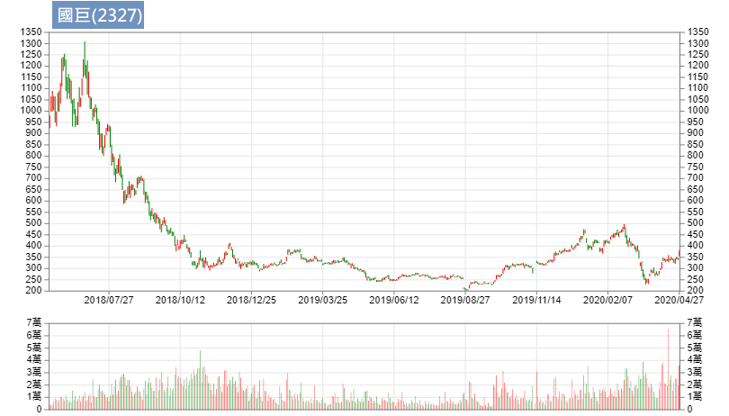

從1000多塊掉下來（第4階段）；在250-350之間震盪，之後又破底跌到200，這段就是所謂的第1階段。

4. 第4階段之後的數個月還有一種特徵是，成交量開始收縮，代表該賣的都賣了，沒人在玩了，但**沒人玩的股票才會上漲，因為會賣的都賣了**。
    尤其剛剛大跌後的股票，開始量縮整理之後，會有反彈或是新的一個波段，至於是何者就看公司之後的表現。（例如國巨後來又漲到400多）

200塊的時候沒人玩，3、400塊的時候大家搶著要，股票的生老病死就是這樣一直震盪。

在低檔區的時候，一定要沒有人賣，才不會持續性的下跌（賣壓減弱）。所以第1階段成交量一定要開始收縮。在這裡猜方向其實沒有必要，例如剛才提的國巨，300盤一盤又破底到200。所以**不要在這裡猜低點**。

**第2階段（承接）的特徵：**

1. 價跌量縮、價漲量增
2. 長期均線開始慢慢上揚，短期均線在長期均線之上

3. 漲的線型比跌的線型多（易漲難跌）
    適合承接；無論日線或週線都可見到往上漲時爆大量、往下跌時量縮；股價一格一格慢慢走，階梯式的上揚。

**第3階段（做頭）的特徵：**

1. 價格將從持續性的上漲，轉變為劇烈的震盪
    行情越來越大，而且高檔震盪會出大量，尤其是下跌的時候（因為要出貨）

2. 長期均線慢慢走平（平滑化）或反轉，開始跟短期均線交叉來交叉去（不一定誰在上）

**第4階段（做頭）的特徵：
**1. 股價會被長期均線壓住，例如下圖：

第4階段時，股價被長期均線壓制住，股價基本上都在年線下方運行，當股價**突破年線**，就是我們該注意的時候！表示年線即將往上彎（所以才會突破）。

股價從1000到800，再到600，又到400，所謂的低價買進是有問題的，不要去接刀。等刀子從天上掉下來，掉到地上而且不會抖動的時候，沒人在玩的時候你再去撿它，這才是正確的方式。

作者不是要在最好的價格買進，而是要**在最正確的價格買進**。

# CH 6 類型、產業類別與催化事件

△ 股票的六種類型
要贏得超級績效，股票的選擇很重要，作者將股票分為六大類：

1. 市場領導股 (Market leaders)
    表現非常傑出，營收、盈餘佔市場份額都能維持前三名，例如台積電(2330)、大立光(3008)、聯發科(2454)、國巨(2327)、環球晶(6488)這幾種，大概就是該產業不可動搖的地位。台塑(1301)、南亞(1303)也算該產業不可動搖的，但因為它們被歸類為後面的景氣循環股，所以不放在第1類。
    市場領導股除了前三大，更傾向它是創新的公司，盈餘可能有大幅成長的概念。譬如說金融的領導股國泰金(2882)，這種缺乏波動、落後大盤的股票，也不會歸在第1類。
    超級績效第一個就是要選擇這類股票。

2. 頂級競爭股 (Top competitors)
    足以跟領導股一爭高下。譬如與大立光競爭的玉晶光(3406)，未來技術上若有突破性的發展，股價將大幅成長，兩者的股價此消彼長。再例如華新科(2492)、禾伸堂(3026)可以跟國巨挑戰，它們有可能擴產，但當然不是一天兩天就能造成的，所以當有這種願景或這種跡象的時候，會顯示在每季的財報上，每個產業要注意的基本面眉角不大一樣，譬如玉晶光最重要的就是看它的毛利（因為它的良率很重要），它和大立光的毛利就差很多；國巨技術高、量產大、毛利也高，華新科如果有機會挑戰，雙方的毛利差不多，那就要看誰的量多（除了訂單，也要看廠房、機器夠不夠）。
    頂級競爭股也有可能是股價翻倍再翻倍的超級績效，所以我們也要注意，當它有機會成功挑戰龍頭的跡象。

3. 機構青睞股 (Institutional favorites)
    法人喜歡持有的，大部分屬於成熟產業/企業，摩根概念股(MSCI成分股)。
    被剔除或選入就是看市值的衰退或成長，每年2、5、8、11月底摩根會做調整，通常會造成強者更強（因為漲了一段市值增加才被選入，法人必須補貨，於是又推升股價，就是追高殺低 XD）弱者更弱，這個概念就是趨勢。

4. 轉機股 (Turnaround situations)
    例如旺宏(2337)、茂矽(2342)，阿魯米在去大陸之前(2011年)，它們都只是芭樂股（股價10元以下），曾幾何時～旺宏來到3、40塊，阿魯米也覺得很驚訝，以為會被三星打趴的DRAM產業，竟然浴火重生。
    再例如書中提到的蘋果電腦，2001開始衰退，之後推出iPod、手機等新品才展開轉機歷程。這種倍數成長也是超級績效會關注的股票類型。

5. 景氣循環股 (Cyclical stocks)
    例如汽車製造、鋼鐵、造紙、化工，台塑、中鋼(2002)等等。有人說要買在業績的谷底、賣在業績的高峰。大部分股票都有景氣循環，每年固定的某幾個月是業績高峰、某幾個月是低潮，以電子股為例，10、11、12月通常是業績高峰（因為美國聖誕節），下半年會比上半年好。這種是每一年度內的景氣循環，如果看長周期10年、20年的這種，像紙，以前賣廢紙的1公斤2、3塊，現在可能只剩1塊，這種就是長期的景氣循環；鋼鐵業也一樣，觀察鐵礦石期貨可以發現，每年的高低點可以差上一兩倍，用車價來舉例就是，今年100萬，明年變200萬，後年又變60萬；中鋼、台塑就是屬於這種長期的景氣循環，油價大跌時台塑就會虧損，例如負油價時，台塑本身原本的庫存、在途的石油，這些成本相對於現貨價格來得高，但之後石油也會有漲價的時候，這時庫存及在途石油又會有相對收益，所以整個把時間拉長來看，對公司其實沒有太大影響，但是有起有落。

6. 過氣領導股與落後股 (Past leaders and laggards)
    例如聯電(2303)，20年前還能與台積電較勁，之後就過氣了；再例如華邦電(2344)、系統電(5309)，做DRAM、Flash這些已經改朝換代了；落後股則例如金融股，相對的也比較穩定，大跌時跌幅也比較少。

△ 特定產業集團領導的新多頭市場
**「在空頭市場底部形成階段，市場某些產業或類股會先出現承接的現象。一般來說，新的多頭市場會由三、四個或甚至多到七、八個產業群或次集團領導發展。」**阿魯米特地唸出書中的這段文字，因為此乃重中之重。每個時代都有一個主流領導方向，當這個時代的空頭即將結束、要出現主流的時候，市場必須要有一些領導性的股票，大概會有幾個族群（產業群），譬如說前兩年是光學（大立光、玉晶光），2018年初大漲的被動元件，無論技術好壞，只要你媽媽叫做MLCC，都是大漲!!
整體族群的大漲，走的波段可能會久一點；如果單一個股，可能是很突兀的個體性的利多，而不是一個大多頭，除非它是前面提到的轉機股、或是要挑戰龍頭股的頂級競爭股。
所以我們在思考時，如果真的是多頭啟動了，那一定會有幾個主流，至於未來的主流在哪，阿魯米認為有5G、車用電子。每一個時代的產品都不一樣，下一個世代主要重點在5G，而5G的產品有哪些，我們就可以去找；還有電動車，Tesla是領導股，下面領導一大串的電動車改良，包括汽油車的電子零件也會被帶動增加，例如從前只有前後鏡頭（倒車鏡頭及前方路況鏡頭），現在側邊、上下可能都有鏡頭，以及倒車雷達等模組，這種車用電子是倍增的，從兩顆鏡頭到七顆鏡頭，翻了三倍，車子內部使用的元件也增加好幾倍，所以國巨、華新科這些被動元件也是受益股，以及車用電子模組化的部分。當然也會冒出一些我們沒想到的相關產業，我們就可以從中去思考。

△ 創新與機會
例如Netflix與百視達，或是像光碟的興起與衰敗，此消彼長。
當Netflix股價開始大漲，百視達就開始做頭，兩者是對稱的，有一個下去、就有另一個上來。
以台股為例，整個23開頭的族群（電子產業），你看那些老的，其實現在還能領導主流的不多，這些公司要嘛很大，例如華碩(2357)、宏碁(2353)這些大集團，仁寶(2324)、廣達(2382)這些，很少像台積電這樣技術一直保持領先的。當然集團性的大公司也很強，但股價就沒辦法一飛衝天，可以視為電子股的傳統產業，屬於存股的概念。
每個世代會出現創新與機會，同樣的會有另外一邊失去了創新與機會。我們要去思考找哪一個才是下個世代的飆股。

△ 類群循環動態發展
舉例來說，高油價的時候，可能有一些替代能源（例如玉米製成生質燃料或太陽能）就會上來；低油價的時候，就沒有必要使用這些成本較高的替代能源。接下來有電池，就可能影響做太陽能晶片的公司，所以它們可能會趁著高油價營收好，去轉投資做電池。
所以這些能源產品可能都是一個族群的東西，本身是環環相扣的結構，每種產業可能都有這樣環環相扣的結構，可以仔細去分析；例如高油價的時候，連電池也會漲，這種概念一定要有。

△ 領導股打噴嚏，整類群患感冒
例如台積電重創，底下靠它吃飯的也會遭殃，好比重創原因是不能再接華為的單，接下來華為概念股（例如神盾(6462)）就會倒一片。

△ 新科技變成舊科技
人人都會做的就是舊科技，例如光碟、DRAM、電腦，20幾年前利潤、毛利都很高，那個年代沒多少人會組電腦，所以利潤很高，也造就了DELL電腦曾經是全世界最大；當年的麥金塔電腦也能從車庫起家，現在這年代已經不可能租個車庫複製成功經驗了，光華商場都比你厲害。
每個世代都有每個世代新的科技，當新科技變成舊科技的時候，它的模式舊改變了。例如剛才舉例的光碟、DRAM、電腦，都已經是舊科技了，裡面的一些元件的高階製程才是新科技，新科技具有進入障礙，例如台積電除了技術，還擁有資本密集的優勢（晶圓廠不是人人蓋得起的）。

# CH 7 重要基本面

△ 超級強勢股的驅動力量
作者認為超級強勢股最重要的驅動力量就是成長，公布的營運績效如果都超過華爾街的預期，就是驅動多頭的力量。
阿魯米強調書中這句很重要，**千萬不要只因為「名氣」而買進大跌的股票。**譬如說假設有天台積電大跌了，你進去買，那是有問題的，它可能會變傳產，例如從前宏碁名氣很響亮，大跌之後就縮水了變10幾塊。
真正的贏家是不會大跌的，真正的飆股可能你從來沒有聽過的股票。因為**光榮的日子出現是在未來，而不是過去。**
阿魯米以此勉勵大家，做交易不順也別喪志，告訴自己，你的光榮是在未來、不是過去，輸錢就輸了，把它忘掉。

△ 為何強調盈餘？
房地產的名言是：地段、地段、地段；股票的名言是：盈餘、盈餘、盈餘。一間不會賺錢的公司，再怎麼炒作都是假的。
例如一間公司股票只有8塊，跟另一家X公司談好，請它開價50塊來併購，原本8塊的股票當然會漲，但這種都是假的，X公司可能是眼睛瞎了或刻意炒作，但它自身的股價就會掉下來，對母公司X來說，不會賺錢的公司，連併購都是個利空。

股票真正成長動力就是要會賺錢，就像我們做交易，一直強調自己很厲害，啊你到底會不會賺錢？不會賺錢都是假的。金融市場就是這樣現實/務實，**一間公司的獲利性、持續性、能見度，是驅動股價最重要的因素。**
我們做交易的人也是一樣，你有多少獲利？是只因為押對一檔行情大賺（例如2009年有人做選擇權從幾萬變到2千多萬）？之後2010-2018還有沒有賺錢？**誰沒有賺過錢？**你的獲利性能不能持續很重要，就像公司不能只接了一筆單子就沒了。

能見度的舉例，如果業績只依靠一兩個客戶，萬一當中有人轉單，公司就垮了。 能見度也是很重要，讓我們能看到股價未來多遠，公司的營收、產業技術的紀錄，這些東西都可以是能見度的概念。

△ 預期與意外
我們做交易時會強調，股票的價格跟基本面理論上是符合的，我們是在預期中符合，每次是在驗證它到底符不符合。所以當股票有預期以外的意外，股價就會往下大跌或往上大漲，作者認為意外引發的反應會持續飄移數個月之久，阿魯米解釋這很容易理解，像台灣雖然每個月會揭露營收，但真正的財報是一季才有，所以我們會等看看下個月營收是否轉好，但公布後仍舊不太確定，還要再等下一季財報是否符合預期才知道，因此後續的飄移會是3個月、6個月這種概念。

△ 蟑螂效應
符合預期為利空，譬如說我們看好某支股票，這季應該賺多少錢，財報公布後的確符合預期，也就是表現沒有特別突出，其實股價已經反映到該有的價位，雖然是成長，卻會變成利多出盡；相反的，一支股票如果常態都低於預期，財報公布後符合預期，則是利多。
舉例來說就像好學生都不能做壞事，做了壞事會被處罰，但壞學生做壞事沒差，有天突然做好事還會被大力稱讚。

△ 重大盈餘吸引重大注意
重大盈餘要大到某個程度才會驅動股價。譬如季成長40%、80%，營收成長超過100%，而且不是逐月而已，是連續兩季或三季都是顯著成長，這種就是重大盈餘，法人就會注意到。
例如你不打扮得妖嬌一點，走在西門町就沒人會注意到，除非你像台積電天生麗質。要引起人家注意，市場才會追逐，這種才叫飆股。

△ 鎖定營業收入所帶動的盈餘
例如地產，有今天沒明天，一個建案今年營收幾百億，過兩年沒建案，營收就是零，像這種就是不穩定的營收，它就會有炒作。
再例如有些轉投資持股的營收，處分股票的收益，這些非營業收入所帶動的盈餘是不穩定的，不可納入考慮，我們只考慮本業所做的營收。

△ 如何尋找轉機股
**轉機股必須非常明顯的大幅增長**，例如旺宏，DRAM價格大漲或營收大漲。
某些角度來看，轉機股是該產業惡性競爭之後留下來的，誰活得久，它就是轉機股。例如原油大跌，做頁岩油的都倒了，沒倒的那間就是轉機，當有天油價回升的時候，因為大家都倒了，也就只剩下它了，供需失衡就會造成價格上漲。例如之前國巨也用過這招，大家都在轉型做車用電子的被動元件，MLCC只有它最多，所以它就有價格制定權，人家都換新機台，國巨還是舊的，結果舊的大漲XD，日本做被動元件的趕快把機台再換回來。

△ 減速為警訊
**高速成長之後的減速就是警訊。**高速成長之後市場注意到了，競爭就開始多了。只要一減速，要嘛因為競爭者、要嘛這東西變成普遍性的，無法再成長，市場就維持在這邊，所以是很重要的警訊。

# CH 8 評估盈餘素質

所謂的盈餘素質，指的是公司的獲利從哪來？是否健康？賺錢結構、獲利模式是否正常？

△ 非營運收入（非經常性收入）
來自於轉投資、處分股票、處分資產等非經常性收入，如果佔比很大的時候，我們就要注意。
例如有些轉投資的公司不賺錢，而處分了子公司或轉投資的股票，從金融帳裡面去獲取盈餘利潤。或是像之前大同(2371)公司經營權之爭，來自其擁有的土地價值(甚至高於其淨值)。

△ 留意竄改數據
留意作假帳、不實的財務報表。

△ 非經常性費用、打消費用與營收轉嫁
譬如存貨可能做到下一期，或是銷售銷貨，下一期的銷貨在這期就列表了，這些都要特別留意，現金流是否異常等等。

財務報表很專門，我們只是要看個概略，每期財報都差不多正常的、差不了多少的，就不用太憂心，但還是要充分檢視。

△ 透過刪減成本提升的利潤：小心了！
如果一間公司**完全只靠** Cost down 來提升利潤，這背後一定有某種因素，如果公司營運很好，根本不須這麼做，甚至是一種麻煩，因為公司如果不養一些廢人做雜事，變成菁英得去做，這樣也是不對的，每一個員工都有他的價值，如果開除沒價值的員工，裁員或是關閉廠房、結束虧損業務，通常我們要小心注意，因為這些措施並不能持續發揮作用，同時代表公司營運出了狀況。
但如果結束虧損業務的方式，例如從前IBM將桌上型、筆記型電腦部門賣給聯想，IBM認為自己賺不到錢所以直接賣掉；或例如宏達電(2498)將手機部門賣給Google。同樣的員工，不一樣的公司品牌，會是完全不一樣的結果。

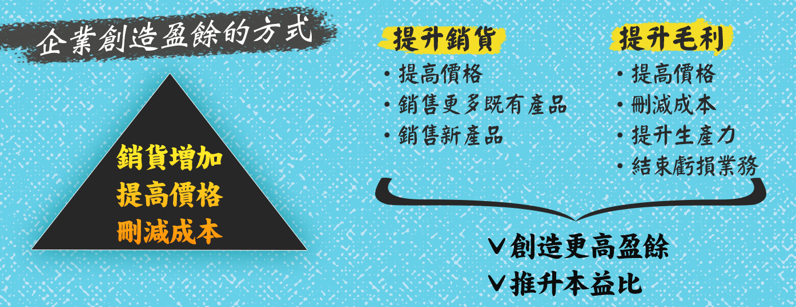

公司盈餘主要來自三方面：
**1. 提高銷貨單位
**提高總量（例如一年的生意從10億提升至20億，表示生意很好、營運暢旺）
**2. 提高產品價格
**毛利率增高（例如玉晶光(3406)毛利逐季增加）
這點很重要，有些銷貨雖然降低，但毛利增高可以抵銷
毛利增高代表著兩個大方向，第一個是產品單價提高依然銷售暢旺，表示有議價能力；第二個是技術水準增加，具競爭力，那麼競爭的風險因素就降低了。
**3. 降低成本**
降低成本的方式很重要，如果是用其他產品取代(原本用A，現在改用B)來達到 Cost down，那是好事。但如果是透過裁員、關閉廠房的方式，那就大不相同了。

這些財務報表的眉角稍微看過去就可以了，因為強勢股的交易，所謂的基本面只是在**檢驗**，檢驗這個股票是否異常。
通常超級強勢股在漲的時候，我們完全無法從基本面很清楚的看出來，因為通常漲上去我們才知道。
在台灣最快的數據就是每月10號公布的營收，但仍舊是落後的。舉例來說，現在是5月份，要公布4月營收，如果營收好，通常接單的時候就知道了，所以1、2月可能已經在漲了。如果看的是季報(如毛利率、EPS)，那又更延後了兩三個月，第1季的營收可能要到5月份才知道。營收真的好的時候，整個股價已經反映了，所以阿魯米認為，落後的財報只是用來檢驗的。

△ 衡量利潤
書中提到毛利率(gross margin)與 NPM 淨利率(net margin)，阿魯米認為差不了多少，總之就是產品的賺錢能力、平均單價的賺錢能力。
**毛利率的年增率**是我們很在乎的。例如台積電(2330)的毛利率不斷增加已達50%以上，大立光(3008)毛利率有70%，電子股能夠有毛利率這麼高，表示議價能力好，大家愛用他們的產品，就算賣貴還是得用；另外也代表技術水準高，進入門檻高，缺少競爭者，客戶不得不買。

淨利率也是差不多的概念，如果是一個技術性含量高的電子公司，對照它的毛利率，即可大概知道公司的營運狀況。

△ 財務報告付諸實際考驗
多頭市場對企業盈餘的反應，作者會觀察下列現象：
\1. 最初反應：上漲或下跌？
\2. 後續耐性：對獲利回吐賣壓是否抗跌？
\3. 韌性：有壓回時是否很快彈上來？

白話來說，逐季公布的營收，每季季末在公布之前，一定會有內線消息或研究報告，事先估算好大略的營收。若公布結果超乎預期，通常發生在一個成長中的公司。

從技術面來思考，季報逐季公布，所以股價通常三個月是一個小區間，如果營收沒有太大變化，成長性符合預期，那麼這個區間通常會持續性的往一個方向走，累積起來就成為一個趨勢。
阿魯米認為，其實做交易一通百通，將基本面與技術面的概念合在一起，就能得到結論。到底基本面還是技術面重要都無所謂，會漲的股票最重要。技術面絕對是領先基本面的，出現了買進訊號就是先買再說，至於基本面會怎樣以後再說，因為等它明朗後就會支持你買進的原因。

△ 存貨分析
書中舉例，銅價上漲形成趨勢時，本身有存貨的公司，其股價會有明顯上漲的反應。再例如油價大跌時，煉油廠台塑(1301)、中油(1328)、中國的中國石油(NYSE: PTR)等，無論庫存或在途的油，成本都變成偏高了，虧損就會增加，並反映在股價上面。存貨、原料、庫存都是相關的。

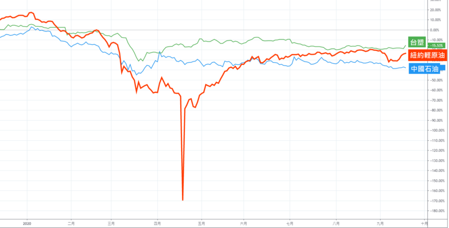

書中還有提到存貨、解決存貨的方法、應收帳款分析、差異性訊息，這些都是研究財務報表就能理解。

△ 全力衝刺：密碼三三 (Code 33)
盈餘、銷貨、營運利潤率等三項，連續三季加速成長，這就是成功的秘方。

基本面有人喜歡看、有人不喜歡，阿魯米認為是一個落後指標，只是一個檢驗的工具，並不是他用來做交易的主流。

# CH 9 追隨領導股

本章很精彩，多花點時間來講。
多頭市場賺的錢，大部分來自於行情剛發動最初的12到18個月。阿魯米認為多頭行情大概是1、2年以上（大部分的多頭行情是這麼走的），空頭行情大概3到6個月（理論上是這麼長）。
多頭做頭的時間其實很長，譬如2008年至今的這段大多頭行情，總共也有10年，其中會有調整，但沒有真正的空頭。真正在走的那段期間就是2009年初到2011年這一年半的時間，上漲得最激烈、幅度最大最強。

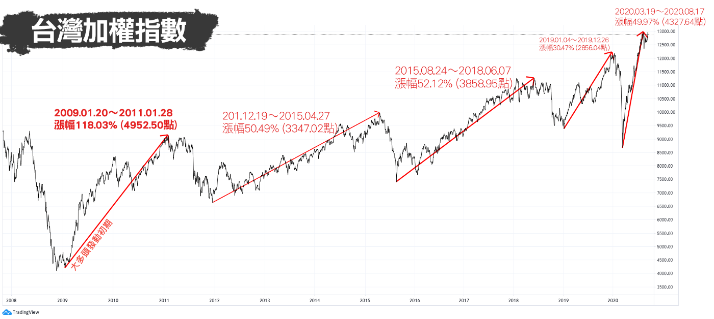

△ 融入行情發展脈動
如何避免在多頭行情發動時，忘塵興嘆來不及上車？**尋找領導股！**

領導股剛開始時會抗跌，多頭將啟動時會開始大漲。
每個多頭都會有一批突出的領導股族群，例如目前的5G概念、雲端伺服器、PCB等電子股的領導股。這陣子（5月上旬）兩三個月是防疫期間，防疫概念股非常強，也就是說，當防疫概念股走弱時，大盤可能才會真正轉多。必須去看每個階段、每個階段，都會有不一樣的表象。

空頭末期或多頭的大幅修正時，未來的領導股就會出現。
領導股會領先大盤，領先漲，當大盤修正時會抗跌。所以當大盤明顯起漲時，領導股早就噴出了。因此領導股其實很好找，當大盤震盪震盪離開底部區間時，最強、漲最多的就是領導股。

以這段肺炎疫情的走勢來說，這段V型反轉的大反彈，誰最先突破起跌的新高，那就是領導股，就是這麼簡單～買股票就是這麼容易～

書中提到，「90%以上的超級強勢股，是在空頭市場或大盤修正過程展開攻勢。所以，當行情不好的時候，投資人就應該做好準備，等到行情啟動，務必要讓自己能夠隨時進場。」阿魯米解釋，作者是做波段的，**做波段就是慎選標的，買進並持有 (Buy and Hold)**，買進對的時候就不斷持有，持有就是眼睛閉上或頭轉過去讓它跑，停損到了就認賠或減碼。最重要的時候就是**空頭末期**，當你在選股選標的是最重要的，所謂的波段行情，那個點就沒那麼重要，因為你不是當沖，可能放個兩三個月，讓它自己慢慢跑，這樣才能吃到一大段。舉例來說，一支超級強勢股從50塊漲到300塊，總共漲6倍，你可能80塊進場到150塊出場，吃到2倍，後面的或許沒辦法賺到。

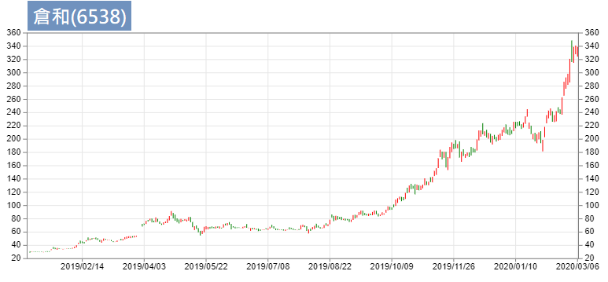

所謂的超級強勢股常常會漲到你驚訝到掉下巴。例如倉和(6538)從30塊漲到300塊，漲了10倍，你也很難全部吃到，但可以吃到主升段。當行情發動時，往往會讓你出乎意料。

△ 頂尖股票最早創新低
書中提到，「真正的大贏家，往往隸屬於表現最火紅的產業類股，但根據我個人的經驗觀察，等到一般人發現某個產業類股很熱門時，真正的領導股（其中表現最傑出者）價格已經飆漲了一大段了。」
例如近期(錄音時5月上旬)PCB漲一大段，散熱模組也漲一大段，最近流行的IC設計也都出頭了（中美貿易戰，台灣有機會接到中國轉單，某些產業可能就是大黑馬、大贏家）。

當多頭市場結束時，高α值股票(high alpha stocks)已開始做頭。
α意思是跟大盤比，比大盤優異叫做高α，超級強勢股一定是高α值，例如大盤漲10%，超級強勢股漲100%。漲幅比別人強，所以當大盤還在創高，這些最先領漲的股票已經開始震盪做頭，例如2018年10月份大跌的時候，其實那些高α值的股票，早就已經跌一段了。我們思考方向的時候，可用領導股作為先期指標。

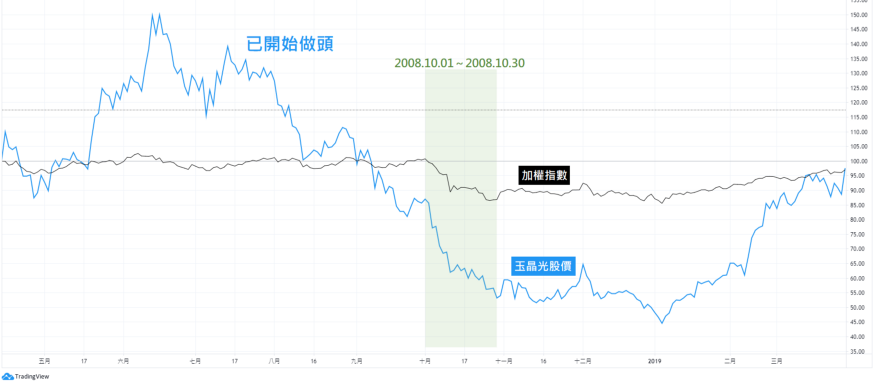

△ 你的機會視窗
「**空頭行情末期表現最抗跌、多頭市場最初4到8星期內領先創高**的股票，才是真正的市場領導股」
「**大盤下跌期間，凡是那些具有顯著正面發展、每股盈餘表現強勁的企業**，投資人務必要謹慎分析相關股票的價格行為。**最抗跌、反彈最強勁**的股票，最可能成為下一個循環的超級強勢股」
阿魯米解釋， 所謂超級強勢股，就是追高殺低，買最強的、賣最弱的。你如果看EPS、用存股的概念，永遠選不到這種超級強勢股。因為所謂EPS高、殖利率高，代表市場給予的定價是沒有成長性的，很穩定的。只要公司具有成長性，本益比一定非常高，若市場認為沒有成長性，本益比大概5到10倍（例如金融股），相對的殖利率就非常高。端看你想要選擇哪種股票。

在空頭市場底部發展過程中，作者期待看見的股價徵兆如下：

1. 市場領導股第一波漲勢出現，藉由**階梯狀**上攻。
    價格在做等待，另外就是主力在吸收籌碼，當噴出時市場上流通的籌碼就少了，大部分在大戶或主力手中，就造成階梯式的上漲。
2.  買進結構顯著增加。
    買進結構指的是紅K比較多、長紅棒多，回檔的結構不會跌破長紅K。不是完全都紅K（那是整個噴出時才會出現），而是上漲比例多，抗跌，上漲量增、下跌量縮。
3.  領導股大部分都能保住戰果。
    當它漲了一段，大盤可能會修正，修正的幅度不會破前面低點。
4.  留意出貨徵兆。
    若有長黑伴隨大量，表示可能進場太早；長黑伴隨大量，表示短期壓力到了，換手失敗，在這裡可能又會震盪一段時間。往下壓回，不一定會破前低，但是表示又陷於另一個盤整區間。

△ 尋找技術型態
當大盤在築底，強勢股感覺在做頭，好像要往下壓，但當大盤稍微漲的時候，強勢股這個頭就變成中繼，又開始往上走。也就是維持在一個比大盤更強勢的區域。大盤跌、強勢股不一定跌，大盤漲、強勢股漲更兇。

△ 哪支領導股是首選？
股池裡該選哪支？就是選**最強那支**！「讓市場力量告訴我們應該把資金擺在哪裡」，**讓市場幫你選擇**。
阿魯米補充，我們進場買進之後，**讓損益幫你選擇**，買對買錯，損益會告訴你，買對了就賺錢，買錯了會賠錢，這雖然是廢話，但其中蘊含著真理；如果你是對的，不可以急著出場，但如果你錯了，就要趕快認賠。
**讓市場告訴你資金該擺在何處，讓損益告訴你資金是不是安全。**

書中還提到賣權買權比率(Put/call ratio)，大家Google一下就懂，這是對於大盤做長線的參考。

△ 雙面開封的利刃
超級強勢股是場盛宴，**宴會過後杯盤狼藉**，強勢股漲幅驚人，獲利回吐也會很驚人，甚至可能吃掉所有漲幅。
以國巨(2327)為例，2017年從100多塊漲到1000多塊，10倍，當它真正符合超級強勢股的選股是在大概300塊左右，攻擊到1000多塊，再用半年回到300塊，獲利回吐驚人，吃掉原本大部分的漲幅。

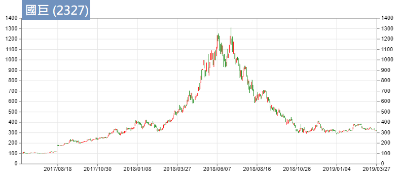

△ 領導股可以預示麻煩
領導股一旦熄火，表示市場處於出貨階段。也就是當我們在看這些領導股，都已經開始在震盪，在出貨或回檔的時候，表示大盤漲勢幾乎快結束，也處在出貨階段（出貨階段：意指高檔震盪做頭，不一定馬上跌下來）。此時會有許多的族群輪動，之前的弱勢股開始上漲，強勢股熄火。這種都是補漲，補漲完之後大盤做頭完成，開始下跌。
某段期間的領導股，幾乎不可能是下一階段的領導股。阿魯米解釋，主力已經做過一次，籌碼已經凌亂了，很難再成為下一階段的領導股；再次以國巨為例，多少慘戶還卡在5、600塊，等著有人來拉上800塊讓他們解套，雖然不是不可能，但這種事**很難**發生。

△ 學習買進領導股，避開落後股
阿魯米以台積電(2330)為例，想做強勢股，就不應該買台積電，（筆者註：錄音時的5月，台積電股價仍於300元內徘迴，一直未過崩跌高點；然而近期的半導體產業競爭，導致台積電好像也成為強勢股了XD）不是台積電不好，而是因為人多的地方不要去，台積電很難漲到500（筆者註：近期高點466元），往上漲幅可能僅2、30%，不符合超級強勢股的概念。

要做超級強勢股，避開權值股，它們會漲，但基本上不會大漲，一年漲個2、30%已經是相當大的幅度了，這並不符合超級強勢股的概念。要找領導股，應該去思考陌生的股票。因為過去的領導股，很難是未來的領導股，所以可能會碰到一些陌生的股票，聽都沒聽過的股票，可能連法人都還沒貨，所以主升段會是法人推動的，之前的主力、大股東正在吸籌，靠法人買進再度推升股價，股票就這樣莫名其妙大漲了，這就是超級強勢股。

△ 關掉媒體
不要相信所謂的專家，他們往往只會看圖說故事。例如原油負油價的新聞，有專家說負100元也是有可能的，阿魯米解釋，其實結算在負37元是制度的問題，而不是常態，所以基本上不可能出現負100元；當你還在看衰油價的時候，聰明人已經在默默買進。（阿魯米講這段話的時候，油價還在12、3塊，兩週後已經來到25塊以上，此時專家可能又會出來說，預估明年油價有機會上看100塊。）往上走的時候他們就往上看，聽這些爛咖不如別看。

牛頓外插法 XD 今天賺了1萬塊，就預估今年會賺250萬（250個交易日），我們常常陷入這種幻想，對行情也是一樣，當它漲到多少的時候，就往那個方向一看，隨便講，這個就是專家。這就是阿魯米要說書最重要的原因，教大家釣魚，不要聽那些專家拿給你的臭魚。

# CH 10 股價走勢圖

效率市場理論(Efficient Market Hypothesis)/隨機漫步理論，市場有沒有效率，這點見仁見智，阿魯米是認為沒有。像技術分析學派認為，價格代表一切，所有的訊息都隱藏在價格裡面消化掉了，可是這個價格到底定價對不對，那就見仁見智了。沒有單一人可以決定物品的價格，以橘子為例，不愛吃的人對價格毫不在乎，從供需理論來解釋，冬季盛產時就便宜，想在夏天買到的橘子就會很貴。

正常化可以用供需理論來解釋，賣不掉的東西自然會降價，可是股票是這樣子嗎？它是否能消化整個市場的效率？阿魯米覺得不能，所以才會有贏家跟輸家的出現，因為市場如果有效率的話，基本上輸贏應該是常態分布，也就是機率50、50，但通常很多贏家都維持在贏家狀態，每年都賺錢，代表市場並非真正有效率。

價格已包含了所有訊息，這是技術分析的信仰，當你堅持這種東西，你就不該相信市場是有效率的。

**金融市場是屬於人的遊戲**，「透過走勢圖的視覺觀察方式，對於人性的情緒與理性衝突，甚至包括人為操縱行為，提供了檢視買賣雙方的供需平衡，所做的集體決策」。價格是人做出來的，我們個人不代表群體、也不代表整個股市，有的群體喜歡做存股、有的群體喜歡價值投資、有的群體喜歡做強勢股、有的群體喜歡做短線，你會自然靠向思維相近的族群，這些不同的族群組合成整個市場當中的買賣雙方，整個價格行為就是買賣雙方、整個市場的供需平衡所導致的。**你的想法不代表整個市場的想法**。

「任何基本面看法或交易點子，如果沒有得到根本股票價格行為的確認，絕對不會付諸執行」，我們既然是技術分析學派的，就要以技術分析為王，任何東西只要跟技術分析有衝突，那就不做、或是仍以技術分析為主。以本書的交易方式為例，採用突破為主，如果樞紐點沒有突破，就不是正確的。你可以對基本面有好的看法、有很多交易點子，但是必須要有價格行為的確認(突破樞紐點)才是玩真的。

△ 運用走勢圖作為工具
作者將股市分為三個學派，技術分析學派、基本面學派、中間派。太過於偏向某個學派都是錯的。
例如基本面派，在武漢肺炎發生的這段期間，所有基本面的東西都是落後的，行情就是掉下去了，但當行情反彈上來的時候，可能就是肺炎最嚴重的時候，亦即市場領導著消息以及一些基本面的東西，這種基本面的延遲先前已有舉例，不再贅述。

阿魯米傾向中間學派。基本面的東西去驗證之後，如果我們還擁有一些基本面的思維，雖然並不一定會有實質效應，但在持股上會因為有所本而更有信心。
至於基本面是「因」還是「果」，阿魯米認為兩者皆非，因為股市在最好的時候掉下來，基本面自然會轉壞；股市壞到底時彈上來，基本面又落後，所有的數據都很爛，完全看不出股市為何而漲（例如肺炎疫情這一段）。
所以阿魯米傾向中間派，但最重要的中心思想一定要記得：我們**對於基本面，在意但不是作為決策**。我們的所有決策都是**以技術面為出發點**，技術面為尊、技術面為王。

△ 列車準時進站？
「我們並不需要明確知道某股票接下來準備幹什麼，只要知道它應該會幹什麼就可以了。」它會怎麼走，其實不重要，但是我們必須要知道它應該是走多頭還是走空頭。如果是多頭，我們就可以做多。
「剩餘的部分，就是判斷列車是否準時進站了！」這就是**選點**(方向)、**擇時**(進場時機)的概念。
擇時在本書是相當重要的概念，買了就一定得漲，如果買了不會漲就離場。舉負面的例子來看，如果進場還要等兩個月，而這段時間的走勢可能比較隨機，很容易讓你點到停損出場，或是沒什麼漲，資金效益就很低。

△ 當務之急
「關於股價走勢圖運用的第一步驟：大局」。要有大局觀，你要清楚知道目前是趨勢還是盤整。
「我們只能挑選那些法人機構介入明顯的股票。」台灣有很透明的資訊揭露。真正會大漲的股票很難靠個人買上去。法人介入的股票有兩個重點：一是量夠大，二是法人持股穩定，不會今天買明天賣（雖然法人也會做當沖，但量很小，因為制度原因，要出買賣交易報告，也不會吃飽閒著在那玩），使得籌碼乾淨。
當法人將籌碼吸收掉，市場上的流通籌碼就不多了。例如原本市場上流通籌碼有2萬張，一天被買賣3次，就有6萬張的成交量；可是當流通籌碼只剩1萬張的時候，就沒辦法這樣跑來跑去了，股價上漲之後想賣也沒貨，就造成所謂的軋空。
法人明顯介入，就會影響籌碼，這籌碼傾向於長期穩定，所以更會飆升。

「走勢圖所呈現的價格型態，必須放在較長期趨勢內做評估。」所謂價格型態，就是作者先前所說的承接、築底、做頭、下殺，而我們必須要搞清楚是什麼型態，例如它在築底，那是底還是頭？我們要去做確認。
型態學是屬於一種長期評估的東西，我們把它作為長期評估的一種依據。這些是作者選股的技巧之一。

△ 尋找整理期間(盤整區間)
趨勢走完就會盤整，盤整走完就會有趨勢。
公司的基本面財報三個月一次，理論上會有一兩個月的洗盤、盤整過程，盤完之後可能就有趨勢，所以作者要尋找盤整區間，確認有先盤過才會有趨勢。
如何尋找盤整區間？用看的、用股票箱、用程式化（例如金融怪傑APP當中的均線糾結）都是尋找盤整區間的概念。
均線糾結，就是短中長期均線互相交錯，之後如果價格往某一邊偏離，就是所謂的發動；同樣的概念也可以用保力加通道(布林通道、Bollinger Band、B-Band)，盤整時通道收斂，當價格往某一邊傾斜時就觸發它穿越通道。
所謂均線糾結，不一定馬上發動，可能走小格子緩漲緩漲，也可能高檔糾結後拉出去，過兩天往回殺（騙線意味，拉出去大家追的時候，主力趁出量倒貨），這些都很常見，所以任何一種選股模式，都要**設好停損機制**，謹防主力搞鬼，這是無法克服的，有人在的地方，就有機會遇到陷阱。

△ 價格波動收縮型態 (volatility contraction pattern，VCP)
VCP是本書最重要的概念。價格在盤整的過程中，會慢慢地收縮，盤整完之後就有方向。通常只要它是一個趨勢，夠強勁的趨勢，盤整完之後會延續之前的方向。也就是一個趨勢往上，如果夠強勁，當它盤完之後，下一個趨勢仍然會往上，這會變成一種趨勢的累積。所以為什麼作者第一段不會做，就是因為他必須確認趨勢是往上的，開始形成VCP，之後第二次突破拉出去的地方才進場，意即趨勢發動時，我不必第一個上車（不須成為宴會的第一個客人，但我要知道宴會會如期舉行），所以我們在火車站等待列車進站時，必須知道列車是否準點來，否則等待就沒有意義。

趨勢很重要，當它收斂完之後的方向，我們就克服了方向性(選點)的尋找，接下來就是擇時。價格開始上上下下收斂，成交量也明顯萎縮到一個區間，有時會成為一個箱型整理或橫向整理。

△ 技術面足跡
作者提供三個參考部分：

1. 時間。打底已經好幾天貨好幾週。
2.  價格。最大修正幅度如何？最右邊的拉回幅度是要最小的。
3. 對稱。底部排列發生了幾個收縮。

阿魯米舉了一個很適合本書的飆股例子：倉和(6538)

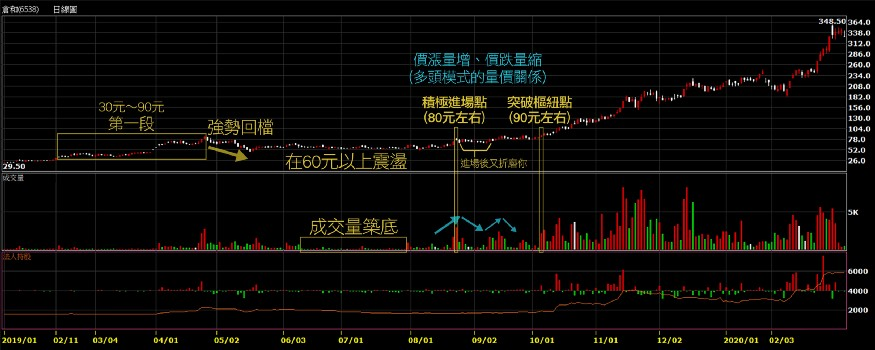

30元到90元漲了三倍，這就是所謂的第一段，引起市場注意。一支股票莫名其妙三個月漲了三倍，這是很瘋狂的，它力量夠大。
接下來一個回檔震盪（另外也可觀察到，後續的震盪都是在收縮），書中提到，成交量明顯萎縮，區間有時會變成達瓦斯(達華斯，Nicolas Darvas)箱型整理。
在倉和成交量築底的部分，幾乎已經出現窒息量，這點很重要，一個股票上升之後（尤其這麼大的漲幅），也回檔了三成幅度（30元飆到90元，之後在60元左右震盪，從黃金切割率的角度來看，是屬於強勢整理），開始量價同時都在收縮，這籌碼告訴我們，會賣的已經都賣完了。另外，此時的高檔震盪，也形成了VCP，這裡的量已經到了沒人理會的程度了。
當價格收縮，代表籌碼越來越乾淨。此時的60元，對比當初的30元仍算偏高的。在此段整理時沒有成交量，沒有積極的買盤介入，但重點是沒有賣盤（只有主力知道發生什麼事），流通的越來越少、沒人在玩的時候，輕輕一推股價就上去了，這就是所謂的「最小阻力通道」（傑西李佛摩也提過這個概念）。
「當股價挾著大量向上穿越樞紐買點，即是買進訊號。」看看倉和出大量的時候，首先是80元左右，但樞紐點是在約90元左右。如果積極的人可以在80元進場，但進場後它又開始折磨你。當股價往上走，量增加，當股價回檔，馬上量縮，這是多頭的量價關係模式，價漲量增、價跌量縮。
真正大漲之後（約90元以上），出量又有價往上走，基本上就屬於發動。
80幾、90元買的，大概三個月後會到達200多元，半年後跑到350元左右，這個4倍漲幅就是飆股，就是超級績效。買進之後至少要放超過8個禮拜。

接下來講快一點，基本上概念就是這樣。

△ 洗盤
使用停損單都是弱勢持股者。所謂弱勢持股者，就是沒有辦法主導股價的散戶，法人不需要用停損單。
法人會停損，但不需要停損單，他的紀律沒有我們強。而且法人會有基本持股，例如他有5萬張台積電，打到停損可能就賣個3、5千張做調節，不會一次把5萬張都賣掉。
而我們是要賺價差，但我們是散戶的王者 XD，在散戶裡面要表現優異，就是遠勝法人績效。我們資金小，比法人容易轉向、速度快。

因為我們會丟停損單，所以我們必須確認一點，買進之後，所有的弱勢持股者已經出場。意即進場後，不要有些亂七八糟的來亂，例如莫名其妙的停損，一個點一個變成多殺多。所以必須確定籌碼很乾淨（不在散戶手上），而且只買在方向最明確的地方，不會拉回洗盤。也就是這本書一直強調的：確認樞紐點。上車之後就是火車要開動了，不能退回來，如果再退回來就是有問題。買在最明確的地方，它是不會拉回的。

強勢股的操作原則，就是追高殺低。這也是為什麼作者寧可買在樞紐點，突破且確定長紅、甚至漲停，因為只有買在這裡才能確定列車已經啟動。股價修正最好在10%~35%內（就是剛才舉例倉和所講到的，黃金切割的強勢整理）。

△ 尋找買盤介入的證據
看看外資投信前百大的買超。

△ 樞紐點的成交量
「每個正確的樞紐點，成交量都會萎縮到明顯低於平均水準的程度，甚至出現整個底部期間的最低成交量。」

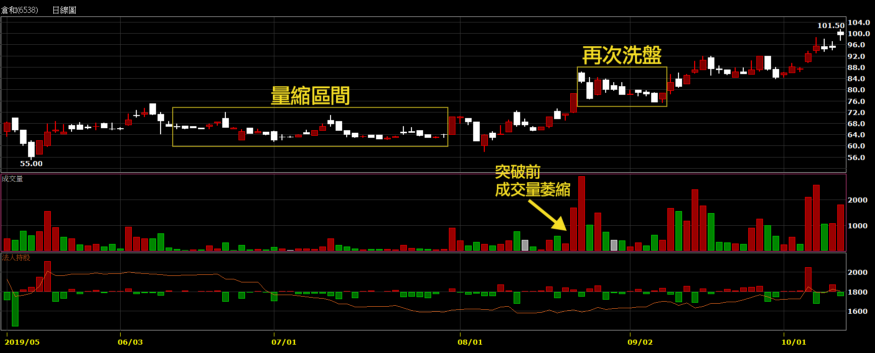

（筆者註：沒有影片觀看權限，不確定阿魯米指的是哪根K棒）
積極的樞紐點在69.5、70元左右，若要再等一下的樞紐點大概到75元附近。
量縮縮得很厲害，樞紐點的區間內必須要極致的窒息量。
更確認是要往上走的，沒有賣壓。
樞紐點的突破跟底部的排列有關。倉和從前面看來以為是要做頭，但其實是新一階段的底。在底部的排列，自高點到低點的震盪必須不斷收斂（即VCP）。

△ 蹲下——反轉回升
書中提到，突破樞紐點後，有時會重新拉回樞紐區間，「只要價格不跌破停損，我就會試著讓股票擁有夠大的彈性空間。」
例如倉和買在80元，不一定馬上噴出去，可能繼續震盪洗盤（從86元又洗到75元才發動），讓低檔區買進的人獲利了結，所以必須給它一個彈性空間。
一個真正的飆股，會把籌碼洗得乾乾淨淨，當你擁有的時候，它就會洗你 XD 當它飆的時候，你是追不到的，你也不敢追，因為你已經被洗怕了。

突破之後要追蹤停損，方式有很多，例如20日均線、季線、SAR等等，看個人。股價不應該再跌回區間，也就是列車開了，不能突然間停下來（停下來就是撞到東西了），否則就有問題，所以要監控追蹤停損。

△突破樞紐點之後的價格行為：價漲量增、價跌量縮。

△ 正常折返與網球性質
VCP完成後的股票，留意以下現象：
‧ 行情啟動的最初幾天，成交量應該擴增。
‧ 價格往上拉出去，連續上漲好幾天。簡單來說就是長紅小黑，上方沒有太多壓力，上漲的過程中散戶的籌碼會被洗出來，慢慢的就沒有阻力了，因此一開始啟動的漲勢較緩，接著越來越強，直到後面整個拉出去，多頭都是這樣形成的。
‧ 拉回屬於正常現象，拉回的成交量要小於上升階段（價漲量增、價跌量縮）。
‧ 正常拉回通常在兩個星期內整理完成，價格一旦重新回升，成交量必須再放大（基本上是廢話，走多頭當然成交量必須放大）。

△ 碟狀帶柄型態 (saucer-with-platform pattern)
或稱杯狀帶柄型態 (cup-with-handle pattern)
作者強調利用VCP概念及量價關係，來辨識有效的碟狀/杯狀排列。

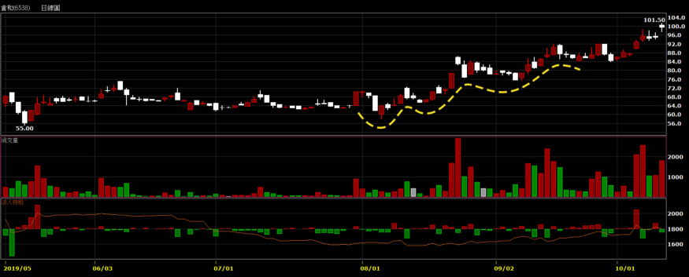

圖中黃色虛線是倉和的杯狀帶柄型態
（筆者註：沒有影片觀看權限，不確定是否這樣畫）

△ 強勢表現
強勁表現型態必須具備下列條件：

1. 挾著大量的爆發性漲勢，八個星期之內的漲幅至少必須達100%。這通常是發生在相對沉寂的整理階段之後。
    例如倉和從30元漲到90元的第一段漲勢，在它發動前根本沒人玩。盤整完之後就有方向，同時具有強大動能。

2. 經過前述爆發性漲勢之後，股價展現橫向整理，價格波動明顯收縮，三到六個星期（可以短到十二天）的價格修正幅度不超過20%至25%。
    例如倉和第一段是300%的漲幅，因此橫向整理的期間也稍微拉長久一點，相對的，再次啟動時將更強，因為籌碼更穩定。

3. 有一段修正的價格波動非常緊密，不超過10%，或必須呈現VCP性質。
    例如倉和的量縮區(最後的收斂)，就呈現了VCP型態。

△ 基本面健全 vs. 價格面準備妥當
「一般投資人對於某支股票的看法如何，一點也不重要。真正重要的，是大型法人機構的看法，因為只有他們才有力量驅動股價。」這雖然是廢話，但廢話裡面有真理。你聽到的馬路消息、親朋好友的觀點都不重要，有實力買這個盤的才重要，如果你遇到夠實力的人，可以多參酌他的看法；至於親戚五十喇滴賽的，倒是可以當反向參考，不是我們心腸壞，而是這個市場就是永遠欺負弱小的人。

哪怕你不是為了做飆股或超級績效，書中的很多概念、與其他書籍仍是相通的。會賺錢的方式、架構都是差不多的。

# CH 11 不要只買你知道的股票

從最近流行的飆股來看看 — 過完農曆年大跌後到現在（5/26左右）短短三個月之間—第11章這個標題準不準。

合一(4743)、恆大(1325)、瑞基(4171)（是不是沒聽過？做蝦類病毒試劑的）、榮群(8034)、熱映(3373)、泰博(4736)、營邦(3693)、國光生(4142)、瑞耘(6532)、金像電(2368)（老牌公司）、智冠(5478)（有玩遊戲的應該知道）、揚博(2493)、大學光(3218)、愛普(6531)、譜瑞-KY(4966)（有名的新公司）、禾瑞亞(3556)（禾伸堂(3026)子公司）、祥碩(5269)、高端疫苗(6547)、聯陽(3014)（稍微老一點的公司）、順達(3211)（也是比較老一點的公司，但也不會太老）、松翰(5471)（老公司）、太極(4934)、聯強(2347)（23系列的，真的老）、海韻電(6203)、富邦媒(8454)、中天(4128)、捷泰(6165)、嘉威(3557)、康那香(9919)（也是老公司，這波剛好流行防疫股）、亞諾法(4133)（做生技的，之前也是不會聽過的股票，每天成交量只一兩百張）、敦陽科(2480)（老公司）、台汽電(8926)（可能很多人以為是公共汽車XD）、嘉澤(3533)、系統電(5309)、久元(6261)、矽統(2363)（也是老公司，重生，跌到5塊多，過兩個月又漲上來快三倍）

上面有幾支是你認識的？所以強勢股驗證了標題所說的「不要只買你認識的股票」。
作者認為，「進場架構的關鍵條件之一是年輕」、「多數超級強勢股爆發強勁走勢的時間，多半是在上市的八~十年內」。他主張的理論是，主升段乃是法人買進所推升，法人因為沒貨所以瘋狂補貨，不計代價買入，常常導致溢價超漲。法人圈別人有、我也要有，但法人又比較周延、謹慎，所以不是起漲時他們就會去研究、買進，譬如說，法人A先買了，這時法人B開始考慮是否也該買，考慮老半天常常追在最高點；相對的，這就是資金來源的動力，**股票會漲，錢堆出來的、金子疊上去的，股票會下跌，是票子**（賣股票的力量）**打下去的**；**資金是金融市場最大的動力來源**，股價的動能來自於資金。

作者的概念要的是年輕的公司、法人沒有貨、籌碼乾淨，才容易成為飆股。

△ 初選底部
接著作者再提出幾個選股條件（之前的章節也提過其他的條件，例如VCP價格收縮）。
新股上市的時候，例如增資、發行（競標、競拍、抽籤等），這些活動完成後，市場上就會有一定的籌碼，這些活動通常是折價賣出（例如抽籤，100塊的股票只賣你60塊），會造成獲利了解的賣壓，之後便形成一個可供參考的底部。如果它是一個底部，基本上就有可能有法人介入，或是拉上去之後就有法人進來追價。之後股價如果有創新高，或是在新高附近盤整，這就是第一個初選底部的概念。

基本上一間企業最強勁的成長，通常發生在初期，等大家都知道的時候，它就很穩定、不太會成長了。所以80%的飆股，都是發生在掛牌的八年之內。當然有些老公司也有飆的機會，例如國巨(2327)幾十年的老公司，2018從1、2百塊狂飆到1千多，每一個行業都有它的週期，風水十年輪流轉，剛好轉到它，老公司也有機會飆，再例如一開始提到的矽統，從5塊多漲了兩三倍。只是80%的飆股，仍是發生在公司成長期的時候，才是飆股的最首選。

所以從新掛牌之後，形成一個初選底部，才能看出是否健全的架構，「指出股價未來可能的發展方向」，意即我們不用去猜測是不是飆股，它如果要往上，就要漲給我們看，我們才知道。
新公司要上市前，通常會把報表做得很好看，例如今年要上市，就將去年的營收弄少一點，把帳掛到今年做，或是下半年、明年預計有多少訂單，就把帳提早做，做帳是門藝術，我們可能也看不清楚。所以股票你要漲給我們看，我們才知道你會漲，這也是以技術分析為基準的交易原則，不是用猜的，是股票要漲給我看，設好停損之後可以追高，但列車一定要來 ，否則我跳出去就死在鐵軌上。

我們在做超級強勢股的時候，必須要檢視它從掛牌之後到我們想進場的時候，初選底部的狀態。我們可以追高，它可能是一個起漲的波段行情浮現的時刻。

△ 從創新產業到加護病房
「對於那些名聲響亮而經過『官方認證的成長型股票』，千萬要小心。」尤其曾經是法人最愛、成長加速期已過、籌碼已經氾濫的股票，等到出現問題的時候，將是個悲劇。
這告訴我們的是，大家都知道的「成長型股票」，其實可能就不成長了。因為大家都預估成長，所以再多的利多都是應該的，萬一不符合預期，就成了利空。成長型股票名聲響亮、大家都已經知道了，也就是這支股票已經炒過了，官方都認證是成長型股票，每個人手上都有、法人也有，一旦成長不如預期就會下跌。**對於大家都知道的股票，不要有過多的期待**。例如台積電(2330)，每個人都知道，但不可能有倍數的成長，因為已經佔了全市場超過一半的份額，50%以上的代工都是找它做，技術再好，了不起就到60%，已經不是成長型的股票了，所以這是定存族的股票，至於會不會掉下來， 阿魯米覺得台積電不會永遠這麼好，因為前方有很多未知的問號，中美貿易戰要選邊站、赴美設廠是否符合成本、日後的變數都不知道，買入台積電股票，可以有穩定的收益，大概每年3-4%殖利率，可是很難有超額利潤，並非台積電不好、不要買，而是不符合本書超級強勢股的概念，好的股票這麼多，何必單戀它。如果是存股概念的話，台積電當然是最完美的存在。

（筆者註：阿魯米這段錄音的時間是5/26，當時台積電股價一直在29X元徘徊，後來才有6月份蘋果採用自家晶片、7月份Intel製程延遲、AMD搶攻市占等等的利多新聞，截至目前的最高點是466元。而在9月的時候，本書作者Mark在推特上表示買入台積電 XDDDD）

# CH 12 風險管理(上)— — 風險的性質

上次說第10章是本書精髓，本章也是，只是每個人對風險管理的想法都不一樣。

股票跟德州撲克的玩法很相似，風險也很類似。
德州撲克先發兩支，牌底發三支，你要看牌就要給錢；我們做交易，要看我能不能賺錢，第一把停損設好（原始停損），如果錯了就是損失原始停損的錢，也就是海底的錢不見了；當對的時候，我的牌跟海底的牌有成對，就可以繼續加碼或減碼，跟股票很像（只是撲克牌沒有減碼）。
風險也很像，初期就是海底的錢，接下來賭大的，加碼越來越大。可是股票不同的地方是，我們加碼的時候可以採取損益兩平的點(break even)，例如100元時買入1張，股價來到120元時再買1張，此時停損就設在損益兩平的110元，如果我錯了，還可以拿回本金，但德州撲克可不行，如果中途放棄，那已投入的錢就是別人的了。
所以股票跟德州撲克相似，但風險比較小，因為輸贏基本上看我們自己，只要停損設好，其實大家都一樣。

△ 冠軍的通性
本章主要講述作者自身的故事，參加比賽獲得冠軍。成為冠軍很不容易，阿魯米提到好友行雲流水，在大陸參加實盤交易比賽，在2015年十萬參賽者中得到中國冠軍，獲利趴數是第二名的好多倍，能參加比賽得名的都很不容易。但台灣的比賽很多是唬爛騙人的XD，規則是為某些人量身打造的，例如算勝率、絕對金額等等，為期只有三個月，不夠真實，台灣得獎的出國還是可能被宰。

重點就在於**穩定性**，這就是業餘跟專業的分別。所以阿魯米一直強調穩定性，要制定交易的SOP，將交易規則、手法、思維定下來，然後去學習。如此一來，不僅可以統計出期望值，也能慢慢增加穩定性。

△ 唯有懂得保護，那才是你的錢
阿魯米聊天時也聽過別人吹噓，哪場戰役大賺了多少錢，好像很厲害，講到最後才知道，他是來借錢的。
在金融市場上，每一個人都贏過錢，散戶也贏過錢，但是守得住的才是最後的贏家。因此為什麼要求穩定性，就是這個道理。

△ 健全原理才能釐清思考
只有健全的理論才能釐清思考，迅速的認賠才能讓你的獲利持續的發展。意即賠錢要盡量賠少，這種想法大家都有，但大家都不願意賠錢，所以你賠錢就不會迅速。

成功者的理由都很相似。金融市場的長期贏家，想法都很類似，**「唯有透過許多平凡的練習，才能創造不平凡的結果。」
**這種平凡的練習是什麼？**砍停損**。

△ 失敗讓你更認真工作
所以阿魯米以前常常講，自己最近在練習虧損，為什麼要練習它？因為要賺錢。唯有練習虧損，才有能力賺錢。因為獲利跟虧損所需的比例是不同的，所以我們要盡可能減少虧損的幅度，怎麼說比例不同呢？舉例來說，100萬賠了30%，剩70萬，要再賺回30萬，須達到約45%的績效；如果虧損50%剩50萬，則必須達到100%績效才能回到100萬。

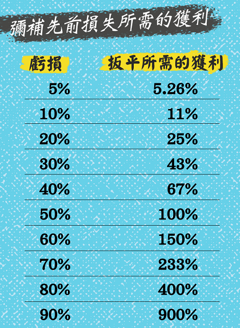

這個下來上去的幅度，有點像選擇權Delta(δ)值一樣，有一個Gamma(γ)，它會加速。資金也是一樣的概念，上去並非線性的，而是等比級數的概念。所以要盡可能減少虧損的幅度，大概的做法就是分散風險，或是縮短單一的停損。

分散風險，例如有十檔股票；阿魯米舉自己為例，每次買進單一檔，都不會超過資金池的5%，停損就是固定的5到10%區間內，如果虧損的話，就是總資金5%*5到10% ，最多虧損總資金的0.5%，當然虧損的時候也很不爽，0.5%感覺也是很多錢，但至少不會傷到自己的本。

縮短單一停損，例如只做一支股票，把所有的錢都投入，那麼就2、3%的停損。要豪賭的時候就要縮小停損。

大家可以考慮自己的交易手法，適合哪一種方式。

△ 知道自己什麼時候錯了
優秀的交易者懂得如何在秉持自己的想法和承認自己犯錯之間，找到巧妙的平衡。 — — Michael Steinhardt

因為我們有一些想法，這些想法在交易的時候應該堅持，還是承認錯誤？其實就在一線之間，但當你恐懼的時候，常常會做出承認錯誤的決策，而這是錯的！所以當你越沒有人性的時候，賺得越多。事實上你要秉持自己的想法，該停損就停損（承認犯錯），沒有掙扎。

阿魯米還有補充幾點看法：
**如果不執著，自然不會受到拖累。
勿聽信他人。
世間沒有神。**

意即不要很堅持某個想法，就不會受到拖累，譬如說阿魯米自己老爸的例子，生前很愛打電話給阿魯米一位姓高的好友（在上海做20億規模的私募基金），阿魯米會建議爸爸賣出某支股票，爸爸拒絕，因為「高仔說會到多少多少元」，但其實也才差1、2塊，可是爸爸堅持高仔說的價格會來，非常執著。阿魯米覺得爸爸很奇怪，高仔都是阿魯米教的，為什麼聽高仔的不聽自己兒子的，高仔回了一句台灣俗語「近廟欺神」XD

再例如電視上說某支股票會炒到250，現在股價在120，你想說那我到220就走；但沒有人那麼厲害知道股價會到哪，除非他是主力，就算是主力也不一定控制得了，有時也可能跑過頭到500。但基本上沒有人知道確切的高低點在哪，所以不要相信別人。

當你心中有執念股價會到哪裡，就會受到拖累，所以不要太執著於自己的思維，因為有可能是錯的。做交易就是用市場來驗證自己的交易思維。

△ 避免犯大錯
只要走勢不符合預期，就馬上離場。阿魯米認為這就是漂亮停損。
作者則是三天不漲，或是應該要漲而不漲（列車遲到），就會離場，這也是漂亮停損。

當走勢跟我心中所想不一樣的時候，就算沒有賠錢，我也會毫不猶豫地離場。我可以追高，但是在這裡我很明顯地感覺到風險。

**「投機者如果想賺大錢，避免發生重大虧損是不二法門。」**
看看剛才提過的「彌補先前損失所需獲利」圖，虧損50%必須再賺100%才能扳回，所以絕不容許重大虧損發生，但我們可以小額虧損。
**「我們不能控制股價漲跌，但通常可以控制虧損程度。」**這點務必牢記。

△ 賭場之旅
**「對於大多數賭徒與投機客來說，最致命的痛處就是每把牌都想玩，缺乏耐心凌駕理性判斷之上。」**
本書是做長波段的，而我們交易模式有很多種，例如做短線、極短線、當沖的，就像上班族一樣，每天都要上工。但超級績效不是每天都見得到的，也許三個月到半年，Mark做了30年交易，經歷過8次多頭與8次空頭，超級績效要多頭才能真正賺錢，大概3到4年左右才會出現一個他所謂的多頭，但只要一出現多頭，持股就是2個月到半年，當然會換股，但不是每把都玩，而是經過這段期間，精選出一批股票。Mark每天努力工作15個小時，大部分時間都是在做研究，不是研究基本面，而是研究技術面的東西。

每個領域都有很專精的人。想要有超級績效，就要有耐性，不能每一把都玩，只有拿到最好牌的時候，才能跟它賭。

△ 百萬分之一
**「我們如果把每筆交易都當作整輩子一百萬筆交易之中的一筆，或許就比較容易認賠。」
**阿魯米自己是做過百萬筆交易沒錯XD，一般人雖然很難達到，但這個思維是很重要的，這可能是你五萬筆、十萬筆交易中的一筆，現在認賠又有何妨? 

# CH 13 風險管理(下) — — 如何控管風險

關於金融交易與人生，我奉行兩個基本法則：(一)如果不下賭注，就不可能贏。(二)如果輸光籌碼，就再也不能下注。 — — Larry Hite

關於第一點，你如果想中威力彩，當然得先去買張彩券；你如果沒有真正去做交易，說得多厲害都是唬爛的，因為股票漲跌跟你毫無關係。
關於第二點，這在市場上經常發生，一個大行情就會有人輸光籌碼，在期貨很常見，或是融資斷頭。

△ 防範意外的計畫
**「每個交易日開盤之前，我們應該針對當天最可能發生的狀況預做演練。如此一來，等到市場開盤，通常就不會有意外；無論如何，我們都已經知道如何因應。」**
這就是情境分析，新手起頭的時候應該是每天都會做，當你做久了，對於每天的行情，大概心裡都有底，老手心中已有很多Database。

作者有四種防範計畫：
一、起始停損：要知道自己起始的停損點在哪

二、重新進場：萬一被掃出去了，是否有重新進場的計畫？停損不可怕，怕的是停損後股價又往你要的方向走，而你不敢追。

阿魯米舉恆大(1325)為例，我們做交易的時候可能會說，「吼～當初15塊的時候，我就知道要飆了」到18塊的時候買進、然後在20塊被掃出去（震盪一下小額獲利出場），結果股價來到200塊，才5個月就漲了10幾倍。
當你被掃出去之後，你會追回來嗎？在2、30塊被掃掉的時候，你有沒有能力在5、60塊繼續買回來？如果可以，那代表你很厲害。

每次當你被掃出去，不一定表示你是錯的，或許是進出場點不好，或是大盤在當下盤勢不好而拖累個股。例如3月中大盤大跌的時候，恆大也是從40塊回檔到30幾塊（10幾%），整個大盤在跌的時候對它還是有影響，會ㄍㄧㄣ住它。

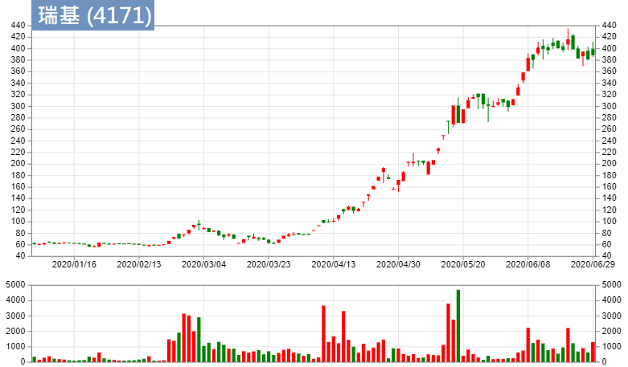

被大盤拖累的個股，再舉個例子瑞基，3月時從105塊跌回60幾塊，跌幅4成不輸大盤，但它是被拖累的，後來從3月25號的60幾塊到(錄音時的)5月26號來到300多塊，2個月漲幅5倍，這種就是超級強勢股。但是它有洗掉，你敢不敢追回來，又是另外一回事。所以一旦你做的是超級強勢股，把它追回來是另外一種技能。

三、獲利了結
超級強勢股，何時該獲利了結？
專業玩家會趁著強勢賣出，一般投資人趁著轉弱的時候賣出。
專業玩家可能部位比較多，所以必須趁著強勢的時候賣個好價格。一般投資人可以等做頭跌破頸線，或是開始大盤整的時候找機會出場。

四、防災計畫
例如911事件當年，紐約交易所停止交易一段時間。
或是網路斷線、踢到電腦電源斷線、施工停電，連報價都看不到，手上還有部位，真的是欲哭無淚。所以阿魯米的設備也有這塊，包括筆電、桌電、備用上網方式(有線斷線時改用無線上網)。

△ 損失是期望獲利的函數
什麼叫函數？就是一個方程式，獲利的方程式。這個函數的方程式怎麼來，就是跟你的SOP相關。
例如你的SOP是做長線，表示你的震盪是比較激烈，一檔行情下來你可能賺30、50%，同樣的虧損可能是10、20%；做短線的可能一天賺個3、5%，虧損2、3%。意即你的交易方式、交易手法，包括穩定度，就是你函數裡的式子，而你的損失就是期望獲利的函數。
f(x)，x就是你的損失，你可以接受更大的損失，你得到的函數答案就會不同。

△ 處理連損虧損
處理連損虧損，是一個重要的學問。
在做程式交易計畫的時候，都會面臨到連續虧損的問題。有些程式不是不好，但連續虧損實在過大。我們用程式交易進場時，都是隨機的，但程式用的是過去的東西做回測，這些回測結果是可以賺錢，但實際運用時可能很倒楣，一開始3、4筆單就出現連續最大虧損，可能20、30%，我們就沒有信心，覺得這個程式是錯的，但也許連續虧損5次、8次之後，接下來會連續賺20幾次，那我們就錯失了這段行情。
人在做交易也是一樣，可能最近很不順，天天進場天天賠錢，行情簡直跟我有仇。表示你的交易手法/方式跟最近行情沒有共鳴，無法產生一個節奏；當我們在做交易的時候，跟行情的節奏相吻合，是很重要的。
阿魯米2006–2010年未曾連續兩天虧損過，偶發性的虧損來自於做極短線，無法cover稅金，每天要繳10、20萬以上，如果賺不到20萬，當天就虧損了。直到2010年才開始會有連續虧損兩三天的狀況。有時候會不順，有的人不順2天，有的人不順2個月，有的人不順2年（那就掛了）。
所以處理連續虧損的心態很重要，不順的期間到底會有多長？何時要退出休息？休息與工作的搭配，就是我們在做交易，內心掙扎的一種學問。大家可以思考一下，如果發生了連續虧損，要警惕一下自己。

△ 比率並非一律平等
**「交易如果變得不順利而勝率下降到百分之五十以下，最不該做的事情，就是放寬停損。以上陳述不是看法，而是數學事實。」**
有些人死豬不怕滾水燙，勝率跌下來，覺得一直在輸錢，那把停損放大就不會輸了，但這風險非常高，因為你在不順當中，勝率低還放寬停損，那麼期望值的虧損額度會越來越大。所以這是最不應該做的事。

△ 多樣化投資不能保護你
當我覺得某個產業或某家企業很不錯時，我通常都會集中火力做投資。因此，很多評論者認為我的作法風險過高。我從來不認為這涉及風險問題，我認為這是機會。— — Kenneth Heebner

**「如果過份多樣化投資，就絕對不可能創造出超級績效。」**

最近（錄音期間5/27左右）的台股就可以驗證，如果不集中在防疫概念股、IC設計類股，就很難找到超級績效。後者雖然強，但還沒有前者強，防疫概念股一漲都是倍數，IC設計可能50%、1倍左右。不然你就去買ETF，長期下來不會賠錢，但也不會有額外利潤。我們在講的是超級績效，當機會來了，你沒有集中火力在防疫概念股，卻分散風險到食品股之類的，其實你做的是喪失機會的動作。

你可以發現這段期間，如果你沒有集中火力去投資防疫概念股（當然錄音的此時現在已經快走完了），分散風險去投資其他類股，反而是增加風險，因為很多股票沒有漲，漲的就是那些族群。所以集中火力投資在某些產業，並不一定是增加風險，反而是一種機會。

本書的說書就到這裡，謝謝大家~
你如果有讀到這本書，可能會有些想法，如果真的按照書中內容執行，會賺到很多錢。可是要先認清楚自己一點，這是阿魯米最後要給大家的建議：**你適不適合做這樣的投資**。例如說你每天都在看盤，你做這種投資就很難，因為你每把都想玩，就無法做到超級績效內容所提示的東西。你如果是上班族、業餘交易者，不是每把都能玩，就適合好好研究本書，反而能賺更多錢。

要做超級績效，**不要太急，慎選股票**。不是每天都能創造超級績效，因為股票會動的，每天就那些東西，大家都要分食利潤，就有一批人會輸錢。

祝福各位能像本書一樣～超級績效！