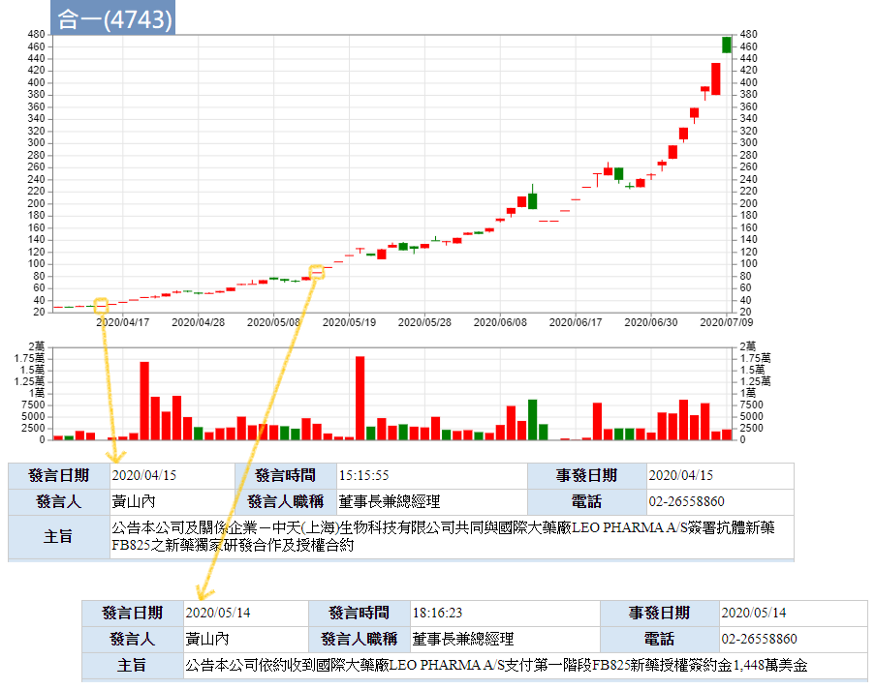

## [超級績效2 

出處 https://riowu.medium.com/%E9%98%BF%E9%AD%AF%E7%B1%B3%E8%AA%AA%E6%9B%B8%E7%AD%86%E8%A8%98-%E8%B6%85%E7%B4%9A%E7%B8%BE%E6%95%882-ch7-10-a8c619208205

《超級績效》系列總共有三本，但每個作者寫書時最精華（或主要大綱、結構）的部分，通常都在第一本書就會出現，這系列也不例外。《超級績效2》屬於《超級績效1》的補述、加強版的內容，第一本我們花了很長時間講解，這本大概只要分兩三集就可以了。

贏家的心法大概都是大同小異，六七成都是相似的。譬如說，贏家的聚集地在北方，我們想到達那個目標，就是往北方走，每個人的走法可能偏東或偏西，細節不同，但主軸都是相同的，心法都是不變的。

# 導論：學習冠軍思維的第一步

「你會成為自己朝思暮想的人。──愛默生」

阿魯米覺得導論是一本書最重要的內容。這句引言，主要意思就是要設定自己的目標。

[《金融怪傑》](https://www.books.com.tw/exep/assp.php/rio35rio/products/0010874116?sloc=main&utm_source=rio35rio&utm_medium=ap-books&utm_content=recommend&utm_campaign=ap-202010)(見筆者註)書中訪談了很多人，每個人都學有專長，有的做外匯、有的做期貨、有的做股票、有的做債券，或其他衍生性金融商品，每個人各有他專精的領域。

筆者註：《金融怪傑》也是相當好看的入門書，每個人都有不同的手法、不同的商品、不同的交易模式，但也看得出他們的共通之處，曾經慘敗的經歷、努力的決心、致富的成果（很像廢話但我的心得就是這樣...）

舊版分上下兩集，最近換了新封面持續再版啦！

你想要成為怎樣的人，你要去尋找一個目標（不是偶像），例如你要當科學家，你的目標可以是愛因斯坦；你要當股票操盤手，目標可以是成為巴菲特。但世界上只有一個巴菲特，就像首富永遠只有一個；要出類拔萃很難，但你一定要立定一個目標。

你的目標可以是巴菲特、索羅斯或其他任何一個人，而你要學習的就是他們的心法跟內容。而現在我們假設要學習的對象就是作者Mark。

△ 交易者的決心
下定決心，堅持夢想。

阿老大也在YT上講過，我們一定要堅持夢想。
因為只有下定決心，我們才會去做很多應該要做的事情，而且很有效率的去做；堅持夢想則是，人生難免有些困境，交易遇到的困境更多，人生也許會有幾次求學過程不順、戀愛失敗，但頻率不高，交易卻很可能今天有錢、明天破產，很多事情大家都不知道、說不準（例如跌到負值的原油），做交易的人就像走鋼索一樣，變化是相當大的。所以做交易的金融人，必須首要的就是**注意風險**，留意手上部位的風險。

所以我們要下定決心，選擇想要成為的目標，尋找他們成功的典範，設計成功藍圖。每一條路要出類拔萃都很不容易，把折磨、挫折、磨練視為應有的行動計劃；無論是工程師、業務員，甚至清水溝的清潔員，都是有其技巧，不能亂做的，所以每一種事業，我們都要付出心力、下定決心去做，往該領域最優秀的方向去走，才會成功。

「賭博不是你的問題所在，問題是你需要藉由搞砸來感受某種東西，讓你相信自己還存在！這才是問題的所在」

△ 校準內在的羅盤
尋找屬於你自己的系統，信任你的系統。

每個人的個性不同，有的急躁、有的慵懶，分別適合不同的系統，去尋找合適自己個性的東西。

接下來就是要信任自己找到的東西。假設你不信任你找到的系統，那你找它幹什麼？所以找到之後，要嚴格執行它。亦即找到自己的聖杯，建立完整的交易系統。

如何建立完整的交易系統？我們稍後再提。

△ 擁抱程序
建立先後次序，矯正人性。

交易有很多法則，這些法則有輕重緩急，譬如說我所依循的中心思想；阿魯米以前寫過，交易系統會有主副的概念，亦即主要原則及次要原則，那些後面加進來的附屬原則，不能牴觸最之前最主要的原則（阿魯米稱之為中心思想）；例如做長線的人，去尋找的參數就不能太短，反之亦然，做當沖的人去看月線，就沒什麼意義。

主要的跟次要的，必須要分得很清楚。

我們通常都具有人性，不喜歡虧損、風險厭惡等等，如果依照我們一般的思維，那就會變成散戶，這樣是不會賺到錢的。

最重要的是**「深度練習」**，愛因斯坦說「專家只是訓練有素的狗」，所以我們要訓練自己成為專家，就需要深度練習，把每一種做到極致，就像李小龍說的：「我不怕會一萬種招式的人，我怕把一種招式練一萬遍的對手。」同時這也是「一萬小時定律」的概念，一件事情做了一萬小時之後，你就會莫名其妙成為一個專家。

△ 界定自己
尋找並專精適合自己的策略。
策略有很多種，長線、短線、套利、單邊風險承受者等等，當你選擇某一種之後，必須犧牲放棄其他的策略，避免風格轉移。例如做長線的，就不應該去關注當沖的面向，覺得好像要上去了也來做一下，賺點小錢也開心，這樣是錯的，因為當你原本是做長線，卻去做不同風格的操作，這會影響你對於長線的思維。
我們做交易，只能選擇做一種，想要混合打，很難很難。當然也有方法可以去組合它，但就跟前面提到的主副原則一樣概念，中心思想是不能變的。例如說我專做長線，短線只是附屬的，那它也許就只是一個進出場的原則，或是我在短線上具有好的價格優勢，用短線來保護長線。
一般是用長線保護短線，但這是準備被套牢的概念，而我們是用短線保護長線，稍後再舉一些例子說明。

△ 安排先後順序
按輕重緩急擬定計畫，按部就班。
舉例來說，我們要做超級績效，按計畫找出強勢股，專注在某些股票上。至於其他偏弱的股票，也許會有短線反彈，但事有輕重緩急，應該專注在自己的主軸上。

△ 採取行動
這世界上沒有完美的狀態，不用想說「等我準備好的時候」，例如程式寫好以後、某本書看完之後，就可以怎樣怎樣...沒有的事！所有的事都是在做中學、學中做，**拖延是達成目標最大的障礙**。你想明天在戒菸，那是永遠都戒不了的。

阿魯米覺得最好的方式，就是尋找一群可以互相砥礪的朋友，一起前行，一起跨越舒適圈。阿魯米很感謝自己的好朋友們，因為他們會逼著自己往前走，彼此互相影響、互相砥礪琢磨。

# CH 1 永遠備妥計畫

△ 明確程序
「買低賣高」是很多人初入市場的策略，但這其實有參考點的邏輯錯誤。

要怎麼樣才能賺錢，就是買在100塊、賣在200塊，「買低賣高」是絕對的真理，不可能你買在100塊、賣在50塊還能賺錢的。
但什麼叫「買低賣高」？一般人會認為，股價從100塊掉到30塊，此時進場去買就是買低，這是錯的。當你的參考點是過去的時候，就是錯的，買低賣高的概念，必須是**跟未來比**，正確概念是我買在30塊，未來希望它漲過30塊，如果它未來掉到15塊，那麼就算它以前曾經高達10000塊，也跟你沒有關係。所以參考點很重要，它是一個轉折點，或說是相對性的低點，是相對於**未來**而言，永遠都不是跟過去相比。

所以過去的價格，我們可以拿來當參考，但不能用來當作買賣交易的基準。我們需要的是未來。

明確的程序告訴我們要「買低賣高」，而在「買低賣高」的計畫當中，包含了買什麼（標的）、什麼時候買進、停損架構為何、出場架構為何、何時需要加減碼。最重要的是萬一有突發事件發生，該怎麼應對。

阿魯米要提醒大家，「不懂的不要碰」，就像原油，很少人想過會到負值。喜歡做金融股的，就不要碰電子股，做你最專心的，賺你應該賺的錢，這是最好的。例如巴菲特喜歡做傳產、做有紀錄的產業，有紀錄的意思是有多年財報可參考，包括人事組成、領導人人品，1999年網路泡沫前流行的科技股屬於新興產業，巴菲特不碰，所以績效遠遠落後大盤，雖沒賺到這一波，但也沒被泡沫波及，績效在那之後又名列前茅。很多東西不只是成敗論英雄，而且是事後論英雄。
你專精什麼領域，就去做什麼事情，例如擅長期貨短線，就不要去玩長線，或是擅長股票，就別去玩期貨選擇權，只有在你專精之後，行有餘力再去接觸。阿魯米覺得，廣泛性的接觸很好，但一定要有一個天塌下來，你都還會賺錢的東西。

△ 觀察跟進買盤
進場後觀察有沒有跟進的買盤，在台灣就是指法人的買盤。

△ 持有網球，拋掉雞蛋
價格行為會出現類似網球的反應。
一顆網球打到網球拍會反彈，而一顆雞蛋打到網球拍會碎裂（而且砸在自己臉上），所以我們要尋找網球而非雞蛋。
若股票有法人買盤支撐，當股價掉下來打到網球拍（也就是所謂的支撐壓力）的時候，會非常迅速的往上彈，而非像雞蛋那樣往下墜。

書中有附圖解說，讀者可自行參考。

△ 什麼時候不該賣掉「延伸性」股票
「MVP指標」指的是：動能(momentum)、成交量(volume)、價格(price)
我們做交易，所有的東西都是從這三者衍伸出來的。
要有超級績效，最在乎的就是動能，阿魯米做交易也很在乎動能，也就是上漲的速度。
成交量與價格，是所有商品在交易上最原始的數據，均線、MACD、RSI、法人買賣超等等，都是從這衍伸出來，所以最基礎的東西最重要。

△ 交易如果沒有按照計畫發展
我們做交易看的圖表，縱軸是價格、橫軸是時間，所以將時間因素考慮進去，就會形成所謂的動能。
作者認為，一個有效突破會沿著20日均線走，不至於大幅跌破。意即當跌破20日均線時，就表示短期動能減少。

△ 小量上漲、大量拉回，代表警訊
大衛·萊恩（David Ryan，三屆美國投資冠軍）說：「我希望部位能夠立即獲利。買進股票之後，如果不能看到部位馬上賺錢，我通常就會傾向於出脫股票。」阿魯米的操盤法也是如此。
阿魯米以自己為例，在短線上，當他進場之後，如果當天是虧損的，就會出脫這個部位或是減少部位；如果當天的虧損在容許範圍之內，觀察個兩三天後，若沒有馬上（以長線而言，就是觀察兩三天）獲利，就砍掉，不會再多給時間，之後若噴出再追。
因為阿魯米認為，列車應該來了卻遲到，無論理由，就是走人，去換坐其他不會遲到的列車。所以手上的選股名單很重要，當這個不行就選下一個。

# CH 2 首先考慮風險

△ 缺乏紀律，法則毫無意義
缺乏紀律，無論你用什麼原則都沒有用。例如你有五項進場條件，看了某支覺得好像會漲，稍微檢視一下好像符合三項進場條件，但如果沒有明確的寫下進場要件（例如均線黃金交叉、有法人進場、主力也買進等等），我們就很容易依靠感覺去抓這些條件，來支撐我們的思維，這種東西就變得沒有意義，因為缺乏紀律。

停損也是一樣，假設你設定5%停損，當遇到一個缺口來到10%（隔天開盤跌停），直接超過停損設定，你就會再看一看，而不是馬上砍掉，像這種法則沒有執行、沒有紀律，都是枉然。

△ 避免情緒性停損
行情總有瘋狂的時候，假設你在做逆勢交易，你覺得這裡已經跌無可跌、該反彈了，已經量縮到極致，結果還是繼續跌下去。即便還沒到達你的停損設定，但因為很恐慌（例如新聞都在報負面消息），買進了還在跌，這時很容易因為恐慌而砍出。
當一個全世界都知道要下跌的東西，結果不跌了，這種東西就很奇怪，就像疫情以來這波走勢，全世界都還在疫情當中，結果V轉不跌了。這就告訴我們，背後一定有很大的原因，例如各國的刺激方案，遠勝過疫情傷害。現在怕通縮，而未來可能變成怕通膨，這都很難講。
有些東西我們是用現在的眼睛去看、耳朵去聽，影響到我們情緒，所以我們會不小心受到影響而隨意停損。原則上就是要有紀律，在還沒到達計畫的停損前，不要自作主張。

△ 不要成為「非自願性投資人」
非自願性投資人，意思就是套牢了，你就去當股東了。舉例來說，100塊買的股票跌到80塊，有的人想說還會再回來，大不了當股東，再跌到60塊，發現殖利率已經高達5點多%，那就當存股族。**股票跌下來，殖利率自然會上升**，因為數學算法就是這樣，例如100塊錢股票，殖利率3%，明天跌到50塊，理論上殖利率會變6%，如果我們進場後，用這種東西來安慰自己變成存股，無可厚非，但不要這樣，因為這樣是非自願性投資人。
在前一本說書當中提過殖利率的算法，當公司的成長會追過殖利率的增長，表示股價在往上走；反過來說，當殖利率升高，公司的衰退會趕過殖利率增長的幅度，股價就會告訴你，雖然價格掉下來（可能剩下二分之一、三分之一），但殖利率也回復到之前的水平，因為公司賺的錢更少了。

我們不要當一個非自願性的投資人。雖然也是廢話，都是因為被套牢了才會這樣。但是一定要停損，避免套牢，不要跟股票談戀愛。

△ 多少才是太多？
上一本說書有提過，100萬虧損到50萬時，虧損幅度是50%，但要重回100萬，需要的幅度是100%，這個增長幅度與風險承受是不對等的，不是線性的，而是類似指數型的。所以我們每一次的虧損都不要太大，盡量在10%以內。
如果覺得10%還是太大，可以採用分散風險，就像阿魯米的作法，每一筆交易最多不會虧損8%（原則上是這樣，如果萬一遇到缺口也沒辦法），盡量控制在這個範圍之內。但是每一筆交易原始倉位，絕對不超過總資金10%，也就是說，即便單筆交易虧損10%，但只有用到總資金的10%，所以每筆交易的虧損不會超過總資金1%。不要小看這1%，譬如持股有五六檔，損益如果都到10%，那也占了總資金有6%。

（筆者註：最近看到阿魯米上節目，有解說類似的作法，供讀者參考）

https://youtu.be/t1kaiJqSTNA

所以，當你用什麼策略，損失程度要控制在什麼地方，這種都要很精算的去計劃。不能一次遇到重傷害，就沒救了。賠錢容易賺錢難，就是這個意思。

△ 交易儘量接近危險點
超級績效是屬於右側交易，也就是當我們進場時，看得到的東西就是風險，其實看不到獲利在哪裡（沒有所謂的獲利區間）。
依照超級績效的作法所選的股票，獲利通常要有50%、100%以上，所以停損幅度採用10%內，是合理的作法。而要如何運用10%內停損，選點就很重要，也就是越接近危險點越好，可以失敗停損，但幅度不能太大。
所謂的危險點，就是你設定支撐壓力的地方，而越接近所謂的危險點，意即壓力支撐可能跌破的地方（也就是停損點），越接近越好，因為停損好設定且幅度不會太大。舉例來說，如果危險點距離我現在的進場點有20%，那麼當股價回測危險點，我單筆交易就會損失超過20%，所以要越接近越好。

△ 交易啟示
**「永遠備妥計畫，每筆交易都優先考慮風險。」**

屬於閒聊的廢話 XD 觀念就是這樣，但能做到的人不多。大家進場都會思考能賺多少，開始幻想賺到了要買什麼，卻永遠不會考慮到風險的問題。

# CH 3 風險絕對不可超過期望獲利

△ 平均打擊率
拿出自己的交易數據來檢視，所謂的打擊率就是計算自己的勝率，並計算每一筆平均獲利及虧損，就可以得到期望值，意即拿出1塊錢的風險承受度，期望能有超過1塊以上的獲利，之前已有提過期望值的概念，在此不多說。

△ 價格波動率與期望報酬
波動越大，停損不應跟著放大，勝率並非一成不變。
所謂波動越大，例如台股之前在12000點時，大盤每天震幅大概100點上下，接近1%的震盪，可是當往下崩到9000點的過程，每天都4、500點震盪，接近4~5%，大盤會有這種震盪幅度，你可以想像個股幾乎有一半漲停、一半跌停的狀況。而像金融股再怎麼跌，一天大概就是跌1、2%，意即很多其他類股是跌5%以上的，大盤跌幅才會有這種平均值。

當波動越大，我們是否該放大停損？作者認為不對，因為當波動越大，再大的停損都容易被打到，反而是應該縮小停損，但這樣一來就很容易被點到，所以勝率就會被改變；但勝率改變之後，相對的，期望值會增高，因為平均每筆獲利會增加。
用台指期來舉例，在12000點時，假設每天高低點相差有100點，我用30點買進，來賭100點（到達100點或90點獲利就出場），虧損30點就砍倉，這樣的風暴比大約1:3，當勝率在0.33以下就無法賺錢。同樣的作法，當指數跌到9000點時，停損一樣30點，變成很容易被點到，但一賺可能就是300點。獲利會放大，勝率會減小。作者認為這樣的作法才是對的。

△ 運用錯列的停損
錯列停損(staggered stops)
進場的停損減碼技巧：固定平均值，分批停損（分兩批、三批都可以，看個人的紀律及風險承受度）。

舉例來說，買100萬的股票，停損設6%，當跌到6%就全部停損出場，作者認為這樣做不對，應該是分批減碼。也就是當跌到4%時，停損一半，另一半在跌到8%時停損，如此一來平均值仍是6%，但如果是被掃出去之後反轉，還能保有一半的部位。

基本上這跟進場點也有關，也就是剛才說的越接近危險點，假如這個支撐壓力也在6%，那我們設定6%的停損是有問題的，應該是一半3%一半9%，分批停損，這樣平均下來停損仍是6%。

△ 加碼而不增加風險
加減碼的停損，不可危及整個部位變成虧損。之前也提過類似概念，加碼後不應該再虧損。譬如100塊買入X張，120塊時加碼X張，那麼停損就不可低於110塊。

# CH 4 瞭解交易的真實面

△ 交易日誌
製作屬於自己的交易日誌。
很多人問阿魯米要怎麼寫，阿魯米認為，交易日誌最重要的，是寫給自己看，「你要自己看得懂」就是最重要的事，如果自己都看不懂，那寫了也沒用；如果寫到很煩很雜，像要給別人看的，自己都無法一目了然，那也沒有用。
那要怎麼寫呢？就是像寫日記一樣，想寫什麼、怎麼寫，自己高興就好。就像我們小學一年級寫日記，可能就寫一句：「今天過得很開心。」就這樣，寫一句「今天要買台積電。」就這樣，都可以。
當你寫久了，像來到小學三四年級，開始會寫：「今天很開心，因為爸爸帶我出去玩，我們去了兒童樂園，玩了雲霄飛車，我覺得很刺激。」寫出一篇日記。到了五六年級，就會寫更多內心戲的東西：「我今天去了兒童樂園，我很開心，但是我在門口看到一個六歲的小女孩在那邊賣氣球，我覺得...」會開始抒發自己的想法。寫交易日誌也一樣，當你寫久了，就會有很多論述，把自己的想法補述得更完整。

記得，交易日誌是寫給自己看的，不是要寫給別人交差的。不會寫沒有關係，慢慢嘗試寫，以後就會寫出屬於自己的交易日誌。

△ 交易三要素
◆成功交易的平均獲利
◆失敗交易的平均虧損
◆交易成功與交易失敗的比率，或者是成功交易佔總交易的百分率（交易勝率，平均打擊率）

這三點就是在尋找自己交易系統時，用來除錯的東西。
例如勝率不夠，要如何從交易規則中，增加自己的勝率；平均獲利不足，要如何去增加自己的平均獲利；平均虧損很大，去思考哪裡虧損特別多、原因為何，是否該改變規則。

△ 月份追蹤紀錄
屬於自己的報表，每個月都要追蹤，就像管理公司一樣，每個人都該製作自己的報表。
例如上個月賺很多，這個月賺很少，到底是什麼原因，是因為行情小？還是不好做？還是最近心情不好？跟女友分手影響到交易？
一定要把報表弄出來，管理自己、管理自己的心態，讓自己在當下都是屬於最佳狀態，如果不是狀態最好的，那就不要做，或是縮小部位。

△ 個人的機率分配
繪製自己的交易機率分布圖。最主要是在找極端值，就虧損而言，就是想辦法刪去它。
譬如交易有時一次賺5萬，有時一次賺2萬，也有一次賺1千的，這些獲利平均起來，就會得到一個分布圖，假設每筆交易平均賺1萬，那應該大部分會集中在1萬左右，超過5萬的部分就比較少，也就是希望去找「為什麼可以賺到5萬」的原因；反之虧損也是，假設平均虧損8千，大部分虧損都是3千、5千，但有一筆虧損5萬，那就去找為什麼會有這筆虧損，到底發生什麼原因，有沒有辦法把它刪掉。

刪掉的方法有很多，譬如設一個絕對值停損，假如平均虧損是8千，我可以接受的最大虧損不超過2倍，也就是1萬6，那麼當虧損來到1萬6，我就砍掉，這是用絕對金額來算，也可以用絕對比例來計算。如此一來就可以回過頭來思考，自己的交易規則是否哪裡有問題，如果都沒有問題，那是否應該再多加上一個絕對值停損的要件。這樣就可以逐漸找到更屬於自己的東西。

△ 周轉與機會成本
也就是換股。假設一支股票，我買進後賺了10%，接下來開始大盤整，有可能會往上走，但是這個機會成本感覺太高了，因為我認為盤整沒有突破，就不是在發動中，相對我的機會成本很高，那我就應該去換股。
這點是因人而異，像存股族一年的周轉率不該超過一次（因為通常一年發一次股利，除了台積電），否則也稱不上存股。

我們在做周轉率的考量時，主要還是換股，也就是機會成本如何。考量最近流行的類股，資金應該擺在哪。

△ 是否將資金投入複利
成長到一定的程度，以不傷害本金為原則。
市場上有很多廣告，告訴你每個月交易賺10%，1年之後可以到達多少多少錢，就用複利來計算，例如本金1萬，這個月賺10%賺了1千，下個月本金變1萬1，再賺10%變成12100，如此複利下去，1年後就成為百萬富翁，3年後就有幾億了......
市場沒有那麼美好，當你投入1萬塊時，承受的風險是1萬，但成長到1萬5時，依然全部投入，風險就成長到1萬5，所以上例的複利計算是有問題的。

那我們要用什麼原則呢？假設我的風險程度，每個月最大風險是15%，也就是當我要加碼去買進部位時，獲利必須超過15%，才可以進行加碼，如此一來，即便這加碼部位虧損了，至少還保有原來的本金，不至於傷害到本金。
以台指期為例，假設用10萬做一口大台（筆者註：此處10萬只是舉例好算，目前大台原始保證金是148000元），我有本金50萬，滿倉做5口，當賺到帳戶有80萬時，滿倉變成做8口，此時如果回檔，就是8口在輸錢。
那我們應該怎麼做？假設一開始滿倉5口，當成長到80萬時，也就是賺了30萬，我再多加1口，用平均勝率、平均虧損的概念去推估，多這1口萬一虧損，也不至於回到50萬以下，也就是**不要傷害本金**，這個原則要把握住，否則複利計算對你是一種傷害，而非有益於你。

△ 做多數交易者不做的事情
別做大家一致認為對的事。例如大家都會去買台積電，那我們就不要買，因為就算有利潤，利潤也不多了，那是屬於存股族的世界，不適合超級績效的做法。

當你要出類拔萃，你一定要跟人家不一樣、不同凡響，也就是不能跟大眾一樣，否則就是屬於散戶那群的了。所以別人做的事情，我們不要做，也就是不要去看電視（57金錢爆、非凡），那些東西都是假的，不會增加你的獲利，反而會影響你。那些介紹出來的股票，基本上你就把它認為是錯的。
我們不要受外在因素的影響，用我們的方法自己去研究，這樣才是對的。

看新聞是需要，但要看的是突發性的新聞，譬如說財報公布、或是誰誰誰怎麼樣了，而不是去聽信明牌，聽信明牌這些東西到最後只會傷害你，讓你虧損或破產。

# CH 5 複利資金，不要複利錯誤

「你買進的東西，價格將下跌至零；而賣出的東西，價格會漲到無限。
──保羅‧都鐸‧瓊斯」

這東西就是順勢交易，也就是當你在下跌的時候買進，最低有可能就是跌到零，而你所有的錢就不見了，剩下一個沒有價格的股票；而賣出的部分，當你放空的時候，價格是沒有上限的。在台灣，股票的票面價值是10元，有沒有可能漲到1000元？漲到10000元？搞不好大立光(3008)過個5年8年，真的漲到10000元，誰也說不準，因此沒有所謂的價格上限。

再例如國巨(2327)，以前都是幾十塊錢，減資後變成1、200塊，誰會想到半年後來到1000多塊？所以沒有所謂的價格高點，這就告訴我們，沒有支撐壓力，當方向出來的時候，股價會一直跑一直跑。

所謂的複利資金，就是加碼，我們不斷的去加碼，讓我們的部位越來越大，賺的錢越來越多。
而複利錯誤，就是當你做錯的時候去攤平，越跌越買，當你不斷進場卻不斷虧損的時候，就是在複利你的錯誤。
控制風險的第一要素，就是紀律，意即不要逆勢攤平。要賠，賠一次就好，不要不斷加碼進去賠。

簡而言之，永遠不要去攤平你的虧損，但是獲利可以加碼。也就是賺錢時，資金是複利在成長，可是虧損時是種錯誤，不要去複利這種錯誤。

△ 五Ｏ／八Ｏ法則
市場領導股一旦出現頭部，會有50%的機率下跌80%，也有80%的機率下跌50%。
舉國巨為例，2017開始走一個大多頭，直到2018年年中，當頭部出現的時候它在下跌，掉下去之後一直掉一直掉，從1300塊跌到大概300塊，剩下20%左右（筆者註：這部分阿魯米用還原日線圖解說，但我用一般日線圖，因此數值略有不同），這就符合作者所說的「50%的機率下跌80%」。

這種炒過的股票，其下跌的幅度，可能遠比你想像中的深。各位可以去參照很多被炒作後的股票，籌碼凌亂的時候，下跌50%剛剛好而已。

△ 「廉價陷阱」
價格定義落後，過去不等於未來。
何謂價格定義落後？價格指的是股票的價格，你能定義嗎？一般我們用的定義就是它的EPS或殖利率。我們先用本益比來看，一樣用國巨為例，國巨在2017、2018年初，價格在3、400塊，直到飆漲至1000塊時，本益比來到4、50倍，此時價格很高很高很高，因為它獲利越來越強，但我們此刻並不知道它到底賺多少錢，只是推估它生意很好。
市場會有很多預測方式，如果我們用連續四季(2017~2018Q1)來做評估，這種評估就是線性評估（假設今年跟去年一樣，則其股價應該在哪個區塊），但這種方式較適合用在穩定性高、獲利差異性不大（例如去年賺2元，今年賺2.2元）的產業，例如金融業或一些傳統產業。
對於這種上下震盪激烈的電子產業，其接單模式，有時有大單、急單，或新產品，或整個市場的景氣循環，突然間非常需要它的產品（例如車用電子，在特斯拉出現之前，其實沒什麼搞頭。後來5G出來了，車用電子突然間大爆發，就很有搞頭了）。
用從前的故事來勾勒你的未來，這是有問題的，也就是說，你用以前的EPS來計算現在的本益比，是有問題的。當它在漲的時候一定有原因，至於是什麼原因，基本面是落後看不出來的。

當股價在1000元的時候，本益比來到了3、40倍以上，甚至更高，在漲的時候可能有5、60倍。可是隨著它業績越來越好，連續4季EPS也就增加了，所以本益比就慢慢掉下來。當它的獲利實現了、在報表上呈現出來之後，到2018Q2、Q3出來時，它一年賺80幾塊，亦即本益比不到4倍，但當股價掉到200多元時，本益比只剩3倍多。後來在2019年除息發了44.8元的現金。

這個故事告訴我們什麼？在漲的過程，本益比是3、40倍以上，跌下來時，本益比都是個位數。當股價掉下來時，本益比變小，顯得很便宜很便宜，但股價繼續掉，跌到600塊，本益比剩5倍，你進去買，股價再腰斬。

這告訴我們一個很重要的事實，價格定義它是落後的，過去不等於未來，所以當你認為很便宜的時候，尤其是已經大漲了一段之後掉下來，你覺得很便宜進去買，結果死定了，後面再腰斬。所謂的價格陷阱就是，你認為便宜，其實還有更便宜；沒有最便宜，只有更便宜，就像去百貨公司拍賣會，價格很便宜，但換季的時候可能更便宜。

便宜與貴，是種相對性。阿魯米又舉自己老爸為例XD，朋友股票在50元買了一拖拉庫，老爸認為：「現在掉到20元，我為什麼不敢買，當朋友解套的時候，我可是賺一倍呢！」但他沒有想過，可能會有第三個人心想：「別人在20元買一拖拉庫，現在剩下8元，我為什麼不敢買。」最後股票下市。阿魯米這個例子指的是翁大銘的華隆(1407)。

所謂的「廉價陷阱」就是像這樣，是相對的還是絕對的，所謂的便宜跟貴就不一樣。一杯咖啡在星巴克或路易莎，定價就不同，口感、服務、品牌價值也不同，在星巴克喝感覺就比較高檔，對於價值每個人感受不同，但千萬不要用「相對的」方式來看待股價，想說別人買多少錢、或一個月前股價在哪，畢竟此一時彼一時，這點要注意。

△ 價格大跌的理由
有很多成分是因為「差別披露(differential disclosure)」，指的是你所不知道的事情。有時我們聽人講「利多出盡」，意思就是沒有更好的消息，大概就是這種情況；譬如股價漲了一段時間之後，有個消息說業績成長200%，但其實已經漲完了，你進去就是最後一隻老鼠。
營收大賺、盈餘大爆發，我們是最後知道的，新聞出來，大家都知道就不叫新聞了。所以永遠要買在懷疑（不知道為什麼漲）、賣在確認的時候（大家都知道，就沒戲唱了）。
如果大家都知道了，還再漲一段，表示後續的力道很強。譬如說最近（錄音時約2020/06/10左右）的合一，4月中有消息出來（台幣150億左右的授權金），股價連漲4、5根，但只是從30幾塊漲到50幾塊。因為醫藥類股很多都是芭樂票（空頭支票）隨便說說，但當5/14確認收到美金1400萬左右的訂金，確認不是芭樂票之後又大漲，稍微掉下來，接著又漲一大段。

每個人都知道，但是我們沒辦法定價，因為我們不知道這影響它股價後續到哪裡，只有內行人知道。當你知道的消息是突發的，它會漲，但之後影響的後續如何評估（例如授權金、銷售分潤等等），後續效應如果遠比我們想像中的大，就會呈現出這種股價走勢。之前提過的價格飄移，就是這個樣子。

回到國巨，前妻在高點賣了100多億股票，當時老闆陳泰銘在記者會上說，公司前景沒有烏雲，而且只有一個前妻。講完之後股價直直落，為什麼？因為國巨最好大概就是這個樣子，不可能全世界都用它家產品，還是有個上限。

所以我們做交易時，對於這種差別披露，我們是分不清楚的，只能看價格。有時利多出盡，價格大跌，當下我們不知道為什麼，可能一時找不到理由，就像大漲時一樣，也沒有任何理由。可是有些人會關注聰明錢，或研究機構、業內人士的看法（知道行情在哪、產業未來發展），這些聰明錢會有搶先一步的動作。
很多東西我們當下沒有辦法知道，聰明的錢永遠走在最前面。所以阿魯米希望大家不要相信消息面，要相信的是背後的資金如何流動，這也是「金融怪傑APP」開發的概念。

△ 絕不要以大博小
這告訴我們，不要拿100塊的錢，去賭50塊的東西。有些雞肋行情，我們能不吃就不要吃。例如知道還會上漲，但漲大概也沒有多少了，尤其像做期貨的，我預期會漲150點，今天漲了100點而且漲很多天了，最後的50點不一定吃得到，而且可能跑個20點就反轉向下；目標區就50點，但風險可能是100點，不要玩這種遊戲，不要以大博小。
你的目標價格與風險相比，希望是能夠以小博大，而非以大博小。

△ 關鍵是活得夠久
這是阿魯米在市場上滿驕傲的地方，做股票可以很長（做其他主業、股票當副業），但專業投資人能夠活得久的其實不多，尤其早期做期貨為主，能活下來的都是鳳毛麟角。
所以要當一個活得久的人，要怎麼活得久？就是讓風險在控制之內，不要冒太大的風險，或是說在冒風險的時候，能夠注意到你的風險並控制它。

△ 絕不允許重大獲利演變為虧損
這告訴我們要移動停利，不要從"重大"獲利變為虧損，注意這句話，並不是說「不允許獲利變為虧損」。獲利變為虧損，這很常見，尤其是在建倉的時候，當你要做長線，剛進場一定是先架好停損，容忍價格在一定的範圍內震盪，譬如100塊買入，股價來到108塊，賺了8%，結果又掉下來97、98塊，此時要不要砍？如果是做長線，其實不一定要砍掉，因為它可能還在你的停損區間裡面。但如果100塊買入，股價來到150、180塊，後來跌回來，你還抱到虧損，這就有問題了，表示趨勢可能大反轉了。

千萬不要”重大”(重點!)獲利後演變為虧損，這對資金和信心，都是很嚴重的傷害與打擊，那要怎麼解決？就是採用移動停利，當行情有往你預期的方向跑一段之後，形成另外一個支撐壓力，或是你應該移動停利的地方，或是一個區間（在這個區間以下你就停損/停利）。移動停利每個人有自己的設定，久了就知道，或是阿魯米的YT也有講過，可以找來看看。

△ 避免臨時改變戰術
這點很多人常犯，例如我們常常在交易時，看到在漲的就進去買、看到在跌的就進去賣，這就有問題，因為這在你的戰略、戰術之外。
舉例來說，原本規劃要買某支股票，結果大盤開高走低，變成下賣單。或是原本在賣，結果拉上來，震一震之後突然間發現自己手上是買單?!各位有沒有這種經驗，原本是看空的，結果被洗一洗之後變成買單，最後賠錢賠更多。
這就是沒有一個中心思想，沒有一個戰術策略，臨時的去改變它，結果發現自己原本看的對，手上有的竟然是逆勢單，很奇怪哦～

△ 聆聽自己的鼓聲
不要聽太多的雜訊（例如新聞、網路）。阿魯米在YT看到有人教怎麼做當沖，第一點是看新聞來抓個股標的，阿魯米認為這穩死的，請大家千萬不要亂學。看新聞穩死的，因為當它是大利多的時候，你也做不到（因為漲停）；當它是小利多的時候，你無法分辨開盤後的價格是否已反映。
看新聞只會死，不會讓你活著；看新聞去做當沖，就是一個錯誤。

阿魯米看到這種人只想罵幹，這種人真的會做交易嗎，不會做交易還出來亂教。

△ 不要「勉強」交易
也不要過度交易，要等待股票找上門來。
有時很多情況都是雞肋行情，我們沒辦法等到好機會。例如最近大盤連續漲了好幾天，從11000突破之後連漲8天，上面好像還有空間沒錯，但隨時可能拉回，在現在12000這個關卡價，做多跟做空，沒有哪邊較具優勢，（11000突破時可以做多，但連漲8天之後，隨時可能回檔）在這裡持續大力做多是有問題的，所以不要勉強交易。

△ 培養場外觀望的能力
我們有時輸錢退出來，卻又不甘心，想進場再賭一把，把今天輸的賺回來，這種想法是有問題的，心態不正確。
要學習**抗拒誘惑，嚴守紀律**。
阿魯米常常比喻，這個市場就像個美女，在街邊對你眨眼，勾引你「來~來~來~」，你一定要練習抗拒這個誘惑，為什麼？因為我們常常不是照著計劃進場交易，而是被行情的波動吸引進去。例如做期貨，當波動大的時候就想進場，以為看到的都會是自己的，實際上一個行情走了500點，你只賺到20點，這就是你的能力。可是當一個500點的行情，你都沒有做的時候，你會覺得很可惜，因為你會覺得這500點應該是你的，怎麼會沒有做。所以我們要學習抗拒誘惑的能力，要嚴守紀律。

△ 運氣只適用於賭場
△ 贏家隨時要有周全準備
以上兩段小標，雖然是廢話，但是是很重要的心態

# CH 6 如何與何時買進股票(上)

永遠順勢而為，而且只能在一個時期買，就是買在上升期的股票。
並且要有大局觀，何謂大局觀？大盤很重要，它背後的決定因素可能是利率、可能是資金，例如無限QE，就有活水不斷注入，造成股票跟實體經濟是脫鉤的（借錢利率低，當然借來玩股票；存款利率低，資金當然寧可拿來活用），價格與通膨便是這樣引起的，而跟實體經濟卻沒有太多關係。
所謂的大局觀就是，當大盤不好的時候，覆巢之下無完卵，你要專注在你的股票，同時也要關心整個大盤的格局，如果是高檔震盪做頭，那麼你的持倉部位應該減少；而當股票上漲時，大盤也是正在起漲或處於上升期，那麼會有倍增的效益，意即有大盤加持，賠也賠不到哪裡去，停損也好設。

△ 只有第二階段
作者認為股價有四個階段：盤整(築底)、承接(上升)、出貨(做頭)、認輸(下跌)。其中盤整突破的時候，就是最好的承接期，只吃最好吃的一段，頭部不要，所以會有很長的一段時間是屬於觀察期，這就是上一章所提的，耐心等候股票上門，而不是像一般人跑去找股票；讓股票來找你，這樣才會贏錢。

△ 趨勢模板準則
意即作者選股的條件：

1. 股價必須高於150天(30週)與200天(40週)移動平均。
    也就是順勢的原則。

2. 150天移動平均位在200天移動平均上方。
    為什麼是150和200這麼近的數字？它們的差異就在150天之前的前面那50天，也就是必須脫離一定的價格（最開始、150天以前的價格區間），這就是設計這個條件的概念。所以有些人不懂為什麼不用50和200，或是100和200，而是150和200，作者的概念就是，這個大區間移動必須確定是順勢且已離開早前區間。

3. 200天移動平均的趨勢向上至少已滿一個月（最好是四至五個月或以上）。
    意即不可以是底部盤很久、有可能破底的情況。用扣抵的概念來說，200天移動平均線向上，表示價格已經突破200天前的高點。至於四至五個月以上的概念，就是所有條件都能確定是一個順勢，而且是上漲的勢，作者寧可買在高點，也不買在可能往下跌的地方。

4. 50天(10週)移動平均必須位在150天與200天移動平均之上。
    這其實就是一種多頭排列，用動能來解釋就是短期>中期>長期。

5. 當前股價至少較52週低價高出25%。（許多最佳選擇由盤整期間展開重大漲勢之前，股價較52週低價高出100%、300%或甚至更多。）
    也就是150天移動平均必須超過200天移動平均的概念。意即1年前的平均價格是在相對低點，也就是整個價格區間是往上移動的。

6. 目前股價至少落在52週高價的25%範圍內（股價愈接近新高價愈好）。
    要成為飆股，就要不斷的創新高，要成為超級強勢股，上面的價格就必須不斷突破。如果離得太遠，就不一定突破得了。這個概念就是，必須在高檔震盪盤整，價格收縮的區間必須在高檔，才有可能往上突破。52週就是1年，大概是250個交易日，股價必須處在250日當中偏高的地方，如果處在50%以下，就算往上突破，力道也快沒有了，因此必須在高檔做VCP。

7. 相對強度排序(relative strength ranking，簡稱RS排序，如同《投資人經濟日報(Investor’s Business Daily)》顯示者)不低於70，最好位在90幾，後者通常代表較佳選擇。（作者註：RS線不得處於顯著的下降趨勢。我希望看到RS線處於上升趨勢至少6週，最好達13週或以上。）
    RS是一種相對強度。你要找最強勢的，相對的強度要非常強，例如大盤漲10%，那我要找20%，才算得上是相對強勢的股票。金融怪傑APP裡也有類似功能：「相對大盤強10%或20%」，這些都是飆股股池中該有的運用，或者應該說，所有的飆股都會在這裡面出現，但這裡面出現的不一定就是飆股，所以還是需要過濾。

8. 當前股價向上突破底部時，位在50天移動平均之上。
    當行情發動的時候，如果是很強的行情發動，必須在20天的移動平均上（以表示其強勢）。如果正處於強勢發動中，甚至可以用10天或5天的移動平均，都可以作為追蹤停損。如果剛開始突破之後，可能突破完又開始盤，做階梯式的上漲，那我們必須把移動平均線拉長，也就是時間周期拉長，所以作者選擇用50天移動平均。

△ 留意連續跳空的股票
基本上，所謂跳空缺口，背後一定有原因。如果是連續有跳空缺口的股票，背後可能都是傾向於利空消息。
如果跌下去缺口又回補，然後又盤，然後又跌下去，又回補，又盤。像這種表示這支股票可能主力在護盤，或是自家人在買。這個缺口就是它長期趨勢的一個方向，如果跳空一個還無所謂，補過來就好，可是如果連續的話，表示這支股票背後可能有某種因素，那就不要碰它。

△ 價格波動率收縮型態
所謂的「價格波動率收縮型態」(volatility contraction pattern，簡稱VCP)，價格震盪的收斂/收縮，作者認為這是整個大波段要起漲的最基本條件，並且也是用這種條件來尋找，可能成為超級強勢股的股票。

△ 收縮計數
價格震盪收斂、成交量萎縮，最主要的原因是籌碼的概念。價格震盪收斂，震盪的幅度越震越小、越震越小，而在震的過程中，成交量是萎縮的，最好萎縮到窒息量（沒人想玩、沒人敢玩），當它發動的時候就是啟動點。

△ 技術足跡
作者提到三個要素：
1.時間：整個底部排列涵蓋的天數或週數。
震盪時間不可太短，拖太久的震盪也不行，應該要適中。例如收縮整理的過程，收縮計數一數數個半年多、一年，這種是有問題的；收縮太短，三五天、六七天就結束，也不行。

2.價格：價格向下修正的最深與最淺幅度。幅度最深的修正波段，通常是發生在盤整期間的最左端，而最淺者通常是發生在最右端。
意即慢慢收縮，回檔最深的地方通常在左邊；如果最淺的發生在左邊，那就有問題，因為可能在上漲過程中，是屬於一個大區間反彈而已。

3.對稱性：整個底部排列的修正波段次數。
其震盪的收縮計數是有格局的，可能修正兩、三次，甚至五次也有可能發生，但原則上書中的舉例都是三次左右，算是滿常見的收縮次數。

△ 上檔供給
上檔供給就是一種籌碼的概念。要往上突破，之前的高點會有許多套牢賣壓，還有一些買在相對低點、沒有套牢的， 當接近前高可能會獲利了結的左側交易者。

△ VCP代表什麼意義？
阿魯米認為就是一種籌碼。為什麼要收縮、收縮、再收縮？

△ 樞紐點
就是「採取行動」的價位，指股價創新高或創新低的位置。
如果你不會玩股票，當一支股票買在創1年或2年新高的時候，這時這支股票就值得你長期擁有。也就是當一支股票往上漲，突破了1年或2年新高，此時你就要關注它，你如果買進，停損設個8%、10%（不用太遠），只要沒被點到停損，三支、五支只要中一支，都可能翻倍。
能夠突破1年或2年新高的股票，背後肯定有某種因素，你只要設好停損即可。有這麼簡單嗎？沒有，還要看突破前是否有出現VCP，以及樞紐點出現前（創新高前）是否有成交量萎縮。金融怪傑APP當中的「量能激增」功能就是這種概念，一檔股票的成交量在之前是收縮的，突然間往上爆發性的走勢，然後量能激增，這是飆股最基本的架構，但量能激增就一定會成為飆股嗎？這倒不是，量能激增只是必要條件之一，換句話說，只要是飆股，都會出現量能激增的現象，但出現量能激增的股票，不一定會形成飆股。各位可以去驗證看看飆股是否都有這種現象。

# CH 7 如何與何時買進股票(下)

△ 大贏家必須創新高
所謂的贏家，就是會大漲的股票，它必須不斷的創新高，意即強勢股就是必須不斷創新高。在金融怪傑APP中有「創47日高點」的選股，就是在選這種（47日是2個月左右）；當大盤創新高的時候，很多股票也會創新高，但這些選股並不是用在這種時候，而是當大盤在下跌的時候，例如武漢肺炎造成大盤重挫之後，當大盤彈上來、但還沒創新高，有些股票會率先創新高，這個時候才是使用這種選股的時機。

每種選股用法、每種策略，都有一定的時機、一定的行情架構時才會去使用。所以以上例的選股法來說，平常看是沒有用，有用的時機是在當大盤築底、還沒拉上來或正要拉的時候，我們去尋找可能創新高的股票，比大盤率先往上走，那就是強勢股。大家要學會如何使用每一個策略做出來的程式選股，不是每一種東西都可以隨時用。

△ 如何正確運用相對強度
相對強度(relative strength，RS)。金融怪傑APP內也有相同概念的選股方式，短期相對強度「3日強於大盤10%」，還有「10日強於大盤20%」。
「3日強於大盤10%」，意指這3天，大盤如果漲3%，則該個股必須漲13%；這代表短期動能非常強，很可能是短期的一個焦點。
「10日強於大盤20%」，這比較中長期，這不限於大盤上漲的狀況，有時抗跌也是一種；例如大盤跌了20幾%，但個股沒有跌或者小跌2%，那就是強於大盤20%。
所以相對強度，我們可以在大盤築底或上漲過程中，清楚知道最近流行什麼、焦點在哪裡、資金流入哪一個板塊/類股，我們可以做相對性的一種思考。譬如說最近（錄音時間約2020年6月中）5G一開始很強，接下來是IC設計，一下子又跑到防疫概念股、又跑回IC設計，類股輪動非常快是顯而易見的。我們可以透過相對強度去思考，例如「10日強於大盤20%」，這10天內哪一些類股出現的機率最高，譬如最近很多支都是防疫概念股特別強，合一(4743)帶領著中天(4128)、國光生(4142)，一大堆就跑出來了。

用相對強度來過濾掉，到底資金在哪一個區塊內。

△ 個案研究
書中提到很多個案研究，各位自行閱讀。

△ 領導股首先見底
領導股是短期而言，可能是這半年、一年，它不會永遠領導。就算是台積電(2330)，也只能說它是龍頭股，但它是不是領導股？並不是，領導股要特別強勢，市場的焦點所在。

https://youtu.be/hcfo-UfQZZQ

（筆者註：最近看到阿魯米講解這個概念的影片，在此附上）

也就是當這個時段，譬如說新冠肺炎開始，領導股就是防疫概念股，它抗跌，但是在3月初到中旬這段，當大盤在大殺的時候，防疫概念股雖然跟大盤比較逆相關，可是一樣會被殺下來，所以並不是所有領導股都不會受到大盤影響，但是它會比較提早見底。

△ 3-C 型態
杯狀完成作弊型態(cup completion cheat)。
作者通常尋找的最佳買點，是在突破的時候，但這個早期階段的進場時機，比最佳買點更早，所以用「作弊」來稱呼，也就是提早買，賭它會往上走。

阿魯米認為這很常見，譬如大盤在走一段漲勢之後，拉回做整理，然後又往上走，像最近很多股票也是這樣子，以大學光(3218)為例：
筆者註：杯狀帶柄型態的畫法，純屬個人推測，僅供參考（因為我實在看不出來杯在哪 XD）

可以看出這支股票是走多頭，但是3月中受大盤拖累而下跌（黃色區塊），後來又漲上來。5/7的突破是作者標準的最佳買點，大約會買在92元；但因為它是受大盤影響才下跌，彈上來時也會很快，它要重拾多頭走勢，所以在80元左右就可以進場了。在還沒突破前就可以找到一個短期的買點。

△ 「夢幻型態」
杯狀帶柄的延伸現象，會一直跑一直跑，走一個比較長期的杯狀帶柄。例如上例的大學光。（筆者註：再次提醒，上圖所畫型態，僅供參考）

目前（錄音時6月中）壓回整理，盤一盤之後也不見得會直接掉下來，可能就在高檔震盪，或是再往上走，現在的漲幅3倍已經相當大，長期下來這支應該就是走多頭，看回檔回到哪裡，再決定要不要買。
（筆者註：後來狂飆在9月時碰到300元...）

這種醫藥股，或類似光學儀器、做醫院的，未來長期都是大多頭走勢，因為老年化社會，這些東西越來越有用，像阿魯米自己要開白內障，應該買大學光，從這股票賺到的錢拿來開刀XD，感覺是公司贈送股東免費的。

△ 雙重底型態
雙重底(double bottom)，是一個很常見的型態；在一個高檔震盪，沒有掉下去，形成一個類似頭部，結果又往上攻，這就有點類似雙重底。
其實什麼叫底？底跟頭都是事後來論斷的。高檔震盪、頭部成形，結果沒有往下走，反而往上彎了，直接再突破然後走另外一段，這就是所謂的頭變成底；頭跟底就是看它有沒有再往上走。
所以不是說高檔震盪就覺得它是一個頭，當然它是頭部的機會可能相當大，可是在遇到一個長期趨勢盤的時候，可能是中繼而已，中繼整理之後它又往上走，這個地方就會成為一個高檔的底部。後面會提到的底部計數，也是在講這個論點。

△ 強勁攻勢
強勁攻勢(power play)也稱為高聳旗形(high tight flag)。剛才舉例的大學光就是強勁攻勢，從40幾塊漲到150幾塊，幾乎不會回檔，在高檔震盪形成一個旗形。
再舉一檔有回檔的玉晶光(3406)為例。
（筆者註：因為只有聽錄音檔，不知道阿魯米指的是何處，下圖畫的旗形是我個人推測，僅供參考）

短線的旗形，往上突破後就特別強勢，像這種高檔震盪的高聳旗形，一旦突破之後，會沿著原來的趨勢走一個很強勢的、類似末升段的東西，是相當強勢的走勢。

# CH 8 最佳部位規模

大家自己看一看就好了，因為大部分的人都沒有所謂的「部位」，也沒有所謂的「規模」。
做當沖的就是一進一出、一進一出，沒有加碼、沒有減碼，不對砍掉。
做波段的時候也不會有什麼部位規模，一般人都是All in，全部買下去，不然就是有多少買多少，或是可用資金分成兩三部分而已。
一講到部位規模，就會牽涉到加減碼，有加減碼這種動作，才有所謂的部位規模，不然就是一進一出而已，大部分的人也只有一進一出，要嘛就買、要嘛就賣，沒有所謂買完獲利會加碼。如果你會加碼，那恭喜你，你是相當厲害的人物、相當厲害的操盤人。
也就是說，一般人100塊買，150塊賣掉就很開心，接下來如果走到300塊，那跟你沒有關係；可是如果你100塊買，在130塊時加碼一次、180塊加碼一次，那很恭喜你，你是很厲害的人物，一般人都做不到，有獲利就想趕快出場，怕被咬回去，哭著回家找媽媽都沒用。

所謂的「風險倒推」，用自己交易的模式，來回推承受的風險。例如我一次每一筆交易，只能虧損總資金1%；在剛進場時投入總資金的10%，停損設10%，也就是佔總資金的1%（投入10%*停損10%）。所以部位規模就是從風險承受度，倒推回來應該投入多少資金、下幾張單子，這跟每個人的風險承受度有關；另外也跟資金分配有關，例如有些人持股不超過三檔或五檔，每一檔最高可能分配到20%或25%，也有的人會買十檔，也有人為了股東會禮品買了幾百支零股，變成模擬大盤XD，或是用家人人頭戶、每人買一張，多領幾個贈品。阿魯米說不要瞧不起這些人，他曾經認識一位很厲害的人物，是數學雙博士，每次股東會都去領好多好多禮品，交易也做很大，在市場赫赫有名，不過已經破產了，就不提名字了。

所以最佳部位是因人而異，不是制式的東西。

△ 不要過早出脫領導股
既然選到了飆股，還沒飆完就走了，一支股票100塊會飆到500塊，你100塊進場，150塊賣掉，之後你就不開心了。
其實這每個人都會遇到，沒有人會賣在最漂亮的位置，因為最漂亮的位置可能只有幾張，所以我們每一次賣的時候都會很懊惱，要嘛賣太晚、要嘛賣太早，書本後面會提到「趁著強勢時出脫」，既然是強勢要出脫，可見還沒漲完，就開始在賣了，上面少一段沒賺到，你就很悶，賣得太早；那如果「趁著弱勢時出脫」，就等行情轉弱時再賣，這時可能就是頭部的形成，頭部可能很大，例如50塊漲到300塊，頭部可能是從300塊到200塊這段，結果你賣在200塊，而高點在300塊，你賺了4倍，但你會想「為什麼我不是賣在最高點賺6倍」，高點已經過了，覺得賣得太晚。

所以賣股票永遠都在懊惱，比買股票還要難，所以人家說「會買的是徒弟，會賣的是師傅」，阿魯米覺得這是屁話，卻被大家奉為圭臬。你如果買點不好，你的停損很容易被掃出去（除非你沒有停損，是要做長期持有Buy & Hold的操作），買得不好，有停損架在那，頂多就是停損出場，所以會買的是徒弟嗎？不盡然，會賣的就是師父嗎？也不一定，因為要「賣」一定是先有「買」這個動作，如果買得不好，怎麼會有賣呢？
有網友留言喜歡看阿魯米講幹話，「會買的是徒弟，會賣的是師傅」像這種就是標準的幹話XD

我們賣股票永遠都不會賣在最高點，要嘛賣得過早、要嘛賣得過晚，永遠都在懊惱當中，這個心態你要把持住。一個股票50塊漲到150塊，你賣掉之後看它又漲到400塊，原本可以賺8倍，自己只賺到3倍，這要怎麼處理？再買回來就好，不用太難過。一旦出脫領導股，當你發現賣錯了，把它買回來就好，不用想太多。

△ 投資不要過度分散
本書叫大家要注意風險，又說不要過度分散，這其實是沒有違背的，因為本書強調超級強勢股，你如果要過度分散的話，買大盤(0050)就好了。所謂的超級績效，這種強勢股本來就很少見，不然幹嘛選那麼辛苦，既然是很少見的超級績效，你就要集中在那些精挑細選出來的好股票，不要過度分散。

# CH 9 何時獲利了結

△ 獲利了結涉及的情緒
就跟剛才前面講到的賣股票一樣，「賣得不好」比「買得不好」，更令人不爽，為什麼？因為買不好，虧損就是5%、10%，如果100萬就是賠個5萬、10萬，這沒什麼，可是賣不好，差距就不只是這樣。
也就是說，我們去買一檔股票，假設100塊買進，停損可能在95塊、90塊（看個人比例），當我在180塊賣掉，賺了80塊很開心，可是後面高點在250塊，這個差距遠比停損來得大很多；原本應該賺500萬，卻只有賺150萬，氣死了。
買得不好，停損就是5萬、10萬，賣得不好，一差就是幾百萬。所以「賣得不好」比「買得不好」，更令人不爽。

賣出有兩種思路，一種是「強勢賣出」，趁著股票大家搶著要的時候，賣給他們，這是專業投資人的做法，主力也是這種做法，因為他們不可能在沒有流動性的時候才賣，這裡衍伸出來再講一個，這就是為什麼當高檔不出量的時候，就不容易下跌，因為高檔不出量，那主力也出不掉，就會把股價ㄍㄧㄣ在那邊，籌碼都在他手上，你怕什麼。
另一種「轉弱賣出」，這就是一般人的做法，看看看...看到掉下來，轉弱了該賣了。

所謂的「趁著強勢賣出」，應該是走到末升段的時候，連續噴出行情時賣出。而「轉弱賣出」，有紀律的人會設最終停損/停利，轉弱了賣出。
但散戶怎麼做？散戶要嘛趁著強勢賣出，但他們所謂的強勢就是今天大漲的強勢，漲停板了快點賣，或者半個月前買的，遇到下殺套牢，今天看到漲停板趕快賣掉。
而散戶的轉弱賣出，100塊買的，抱到200塊，又掉到160塊，每天就等著再回到200塊，心想「200塊我都沒賣了，160塊幹嘛賣」，但這時就是轉弱的時候，也就是最終停損實際上應該到了，應該趁著轉弱時賣出。

如果你是發現賣錯會買回來的人，可以選擇「趁著強勢賣出」的做法；但如果你沒有買回來的勇氣，那就選擇「轉弱賣出」，因為常常一個波段中間會有震盪期，震盪期越往上，它走一段一段、一波一波的，一個區間、一個區間往上走，這時你要完全等到它轉弱的時候再賣出，才能吃到整個波段。

很多外面的老師會從左邊畫一條線，從這裡到這裡，恭喜會員，你有沒有想過，他在哪裡喊買喊賣？這種東西沒有人知道高低點，連主力也不知道。主力常常會遇到失控的情況，譬如主力原本要買，建立了一堆部位，卻剛好遇到大盤不好，主力可能會趁機殺出，把價格壓更低，等大盤止跌後，他再勇敢用力的買回來，此時浮額清洗得更乾淨，籌碼大部分都在他手上。但也有對籌碼評估比較弱的主力，他就是錢多，跟公司派也沒有密切關係，他建了部位很容易出不掉，主力也會常常套牢，那可能會延後發動很長的一段時間，靜待適當的時機（例如公司轉機或成長的利多）。
要做主力，除了口袋要夠深之外，還有很多條件，並不是有錢就可以當主力，這種有錢就當主力的常常會死很慘，因為大部位不好出，不然就是非常有經驗，做個短期主力，倒是可以的。

△ 底部計數
就是一個頭部、一個密集區、或是一個震盪的盤區，應該形成頭部，卻沒有形成頭部，反而又往上拉，像這區塊震盪之後，就是所謂的「換手」，換了幾次？作者認為不會超過5次，最多4次、5次。一旦等到噴出，就是趁著強勢賣出的時機。

△ 回測停損(回測停利)
這個就是移動停損，不用怎麼講，各位自己看。
移動停損就是當你有獲利的時候，不管是原始倉位或加碼部位，就移到至少損益平衡點，意即之前強調過的，加碼之後，損失就已經控制好了（除非遇到缺口），損益平衡點至少要在兩邊加起來除以2的位置，也就是
(原始倉位+加碼部位)÷2 ，就是整體成本價的位置。
阿魯米之前寫過一篇文章提到「每次加碼，彷如初建」，就是這個意思，就是說每次加碼的停損點，至少要維持在跟原始倉位的損益平衡點上，一旦認賠，這一波雖然失敗了，但是並沒有虧損，最大的風險來自於底倉，這就能夠以小博大，請各位好好琢磨這句話。

（筆者註：在此附上阿魯米所說的相關文章截圖，原文發布於臉書社團內）

# CH 10 創造超級績效的八個要點

本書的總結。

△ 要點一：時效
書中教的VCP選股、買點在哪裡、突破在什麼價位可以買進、停損在哪裡。
所謂時效，不是叫你沖來沖去，也不是大漲趕快衝進去那種時效，而是有時間跟點位的限制，什麼時候進場最好。你用VCP選股之後，股價發生什麼走勢，你就勇敢進場，沒有發生的話，就是等待。

△ 要點二：不可分散投資
前面已經提過，分散投資就沒有超級績效。

△ 要點三：高周轉率並非禁忌
其實強勢股都是一段一段的，第一本書作者說持有8週以上，也就是2個月到3、4個月，並不是真正的長線交易，也會有持有到1年，但很少見。
所謂的高周轉率，就是不斷的在留強汰弱，把轉弱的或比較不會漲的股票賣掉，再選入近期的強勢股，加上不分散投資的原則，而且資金規模有限，必須高效利用，所以會造成高周轉率，其實也沒有很高，遠低於當沖。阿魯米認為台灣的交易者，除了存股的，買進強勢股的幾乎很少會放到2個月以上的啦，可能2天就走了，周轉率根本更高（相對於作者的做法而言）。

△ 要點四：隨時維繫風險／報酬關係
所謂的「風報比」是因人而異，要看你的交易風格、交易商品、風險承受度、勝率等等，你要把自己的數據列出來，而不是看別人的數據。有的人告訴你，報酬除以風險至少要4倍以上他才會進場，這種是屁話，你又不知道行情怎麼走，怎麼知道它一定會來到4倍？譬如100塊買進，停損10元，也就是跌到90塊就砍掉，這是風險，那目標看到150、200塊，報酬有5倍、10倍，你怎麼知道股價能漲到那？

風險跟報酬是相對的，當你風報比一拉高，勝率就會降低。也就是說，想用10元的停損，賺到50元的獲利，這個風報比很好，但是點到停損的機率更高。所以一旦風報比拉高，勝率就會下降，這個是很對稱、很合理的概念。

那風報比要怎麼算？就是把你所有的交易數據攤開來看，依照你的手法、你技術分析的能力、你每一筆的平均報酬大概多少，例如你最多都沒賺過20%，你去追求一次賺個200%的超級績效，那不是唬爛嗎？騙別人也騙自己嗎？你都沒有做過一筆單子賺了30%還能留倉抱住，這種你去看什麼風報比也沒有用，看什麼超級績效漲3倍才要賣掉出脫，也沒有用，所有的東西都要看自己的東西。
如果你有能力賺30%，風險可能是5%、10%，風報比3，那麼你也可以做出屬於你自己的風險控管模式。

△ 要點五：趁著強勢賣出
前面已提過，主力為什麼要趁著強勢賣出。
另外，很多主力如果50塊想炒到150塊，3倍，他真的做得到，但常常炒過頭，主力在100到150塊之間慢慢出脫，結果股票漲到500塊，這種現象很多，可能外在因素(例如大盤上漲)或公司基本面因素導致，結果漲到150塊之後，主力手上一張都沒有，也就是換手成功，主力被人家換手成功XD

所以主力很難很難控制一支股票的高低點，這個市場可能會推到他無法想像的價格。

△ 要點六：由小而大
我們一開始的時候風險要小，要有加減碼的概念，前面已講過很多。

△ 要點七：永遠從事順向交易
幹話XD
這本書就是在講順勢交易，買點就是確認之後再確認，「突破」就是順勢交易一個最基礎的買點。

△ 要點八：一旦取得合理利潤，保護損益兩平點
這前面也有提到，無論你有沒有加碼，一旦得到一定的利潤。舉例來說，停損設10%，如果已經獲利10%，那就用當下往回推10%，移動停損就會來到進場成本。也就是每獲利一定的距離之後，必須要保護原始倉位，不能從賺錢抱到變賠錢，短線很多人會有這種情況，例如期貨賺了50點沒跑，結果現在變賠80點，雖然這是當沖的例子，但還是要盡量避免這種情況，如果已經賺了50點，就必須cover你的風險，至少要損益平衡點出場。
做股票更是常見，因為缺口更多，常常一個跳空缺口，原本賺10%，今天跌停開，那到底要不要賣掉？一定要賣掉，因為會跌停，表示背後一定有某些因素，除非你的進場點很差，例如已經漲一大段了你才衝進去買，跌停那是應該的，自己活該。

所以保護損益平衡點，這個東西很重要。
如果有一天你去加碼了，你的技術已經好到可以加減碼的時候，也千萬記得，一旦取得利潤，你所有的加減碼都跟損益無關，當你加碼出現的時候，只有賺多賺少，不能變賠錢。

下一本要講的書《笑傲股市》，這四個字也是阿魯米對大家的祝福，作者是William J. O’Neil（威廉‧歐尼爾），杯狀帶柄就是他首先提出的，這本書跟《超級績效》有點類似。