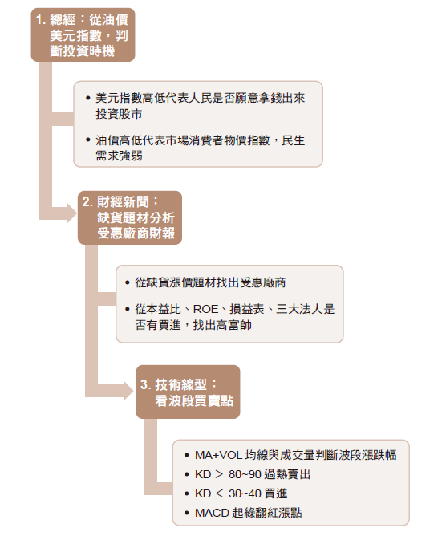

## 陳詩慧的天龍八步投資心法

在我人生的關鍵階段，讓我有想改變自己、完成夢想的動機，最主要的核心是「脫貧」。

 

1998年，第一次投資30萬元買基金。2000年贖回時，只剩下14萬元。2000年，第一次買股票，結果買到了地雷股。當時對我來說，一定很厲害才會成為理專，所以我就聽信理專和財經新聞的推薦，反而讓我第一次投資繳了不少學費。

 

投資失利的痛苦歷程，讓我再也不要相信任何人報的明牌，深刻體會到，投資理財只有靠自己學，才有辦法真正累積財富。於是，我決定要認真學習投資後，第一件事就是多看財經雜誌和書籍，只要有空檔，我會到超商翻閱每本財經雜誌，不懂的就上網找資料，從中學習財務知識。

 

漸漸地，我懂得看新聞挑選基金，比較各國基金的績效，當哪些國家的石油、礦產、能源、黃金等原物料看漲時，我就買進。我從基金開始練習投資基本功，讓我對世界總體經濟有更深的了解，也養成了我每次買股票前，會先確定現在全球經濟如何，比如最近各國疫情趨緩，逐漸解封，石油價格破70 美元新高，往80 美元漲，我會仔細觀察會不會出現嚴重的通貨膨脹。

 

2017年以前的我，只要每個月安穩地繳房貸，沒想到2016年底我創業失敗，傷心欲絕，背負更龐大的經濟壓力，讓我思考如何利用投資錢滾錢，全心全意的在投資股票上下功夫，領悟出「天龍八步投資心法」。沒想到，投資2年後，我竟然有能力把1,800萬元的房貸還掉，解開身上層層的枷鎖。

 

過去10年，我不斷認真研究投資，是在為自己打下基礎，原來投資可以讓我們的夢想無限延伸。我樂意分享我的方法給那些正在投資路上的朋友，希望他們也跟我一樣投資獲利，成就自己的夢想，活出自己，讓人生更精采。

 

因此，2018年底，我開始寫部落格分享投資心得和「天龍八步投資心法」。我以巴菲特價值投資法的概念加上波段操作。過去10年邊工作、邊小額投資股市，很少虧損。於是，我將過去的投資方法，彙整成天龍八步，於2017年∼ 2018年，驗證此心法，5倍獲利。

1. 從石油價格與美元指數，判斷總體經濟的好壞，是否為投入股市的好時機。

2. 從熱門財經消息，挑出潛力產業。

3. 如何從基本面財報，挑出高富帥公司。

4. 如何從本益比設定合理股價區間。

5. 從技術線型切入買點賣點。

6. 經驗與次數操作，是提高獲勝機率的方法，進而設定自己投資的SOP。

7. 記得勿貪，根據我的多年經驗，KD 值大於80，遇到漲停就賣出的勝率最大。

8. 好股票不會只有漲一次，股票回檔，KD 值小於30∼40再買進。

## 陳詩慧的天龍八步投資心法

 

### 第1 步 研究全球總體經濟

###  

### 第2 步 分析台股產業基本面、看財經新聞選熱門產業龍頭前兩大

###  

### 第3 步 看近5 年股價變化現行圖的最高與最低點

###  

### 第4 步 看損益表、月營收挑出高富帥

###  

### 第5 步 看外資是否悄悄買進

###  

### 第6 步 看KD值，高於80過熱，低於30∼40之間買進

###  

### 第7步 看MACD 是否快起漲

###  

### 第8 步 股市買跌、股市漲賣，切記勿貪

 

2020年，我投資虧損，讓我重新審視「天龍八步投資心法」，2021年，我把原本的投資法精簡成「波段三步驟」，經過不到半年的時間，讓我獲利再次翻倍。

 

### **1. 總經：從油價與美元指數，確定現在是不是對的投資時機**

###  

### **2. 缺貨：找出缺貨的財經新聞，再根據新聞上列出受惠的公司觀察財報與基本面。挑出最好的公司來投資，從本益比挑出合理股價**

###  

### **3. 技術線型看買賣點：KD+MACD 找出起漲點＋看成交量找出大波段，抱住股票**

 

波段123 選股操作心法，經過三步驟選股後，將開始提高選股的精準度，並享受波段獲利的甜蜜點。很多朋友問我，股票投資，是一件很投機的事嗎？

若投資股票是一種賭博，那為什麼政府要護盤？為什麼很多老闆、有錢人休閒吃飯聊天時，都在談論股票？就連我在星巴克寫部落格時，會發現周圍的人喝咖啡聊的話題大部分都是股票。

投資股票獲利，是很多人希望能擁有的能力，與貧賤富貴無關。然而，我只是一般的市井小民，沒有內線消息，如何從股票獲利，跨越富人門檻？其實，靠股票賺錢的祕訣，沒有你想的那麼難，重點在用心學習，觀察與執行紀律，還有很重要一點，那就是投資心態。

投資心態跟每個人與生俱來的性格有關，有人先天樂觀，有人先天悲觀。但樂觀或悲觀都沒有對錯，重點在於，面對問題，我們如何面對，如何解決，用什麼心態來解決遇到的問題，這會表現在我們個人的投資風格上。我們順著自己的天生性格加上好的方法進行投資，會找到一條適合自己的路。

 

首先，先沉澱自我，說出自己想要變有錢的3個夢想，真的變有錢後就去實現。2017年1月1日，我說出自己的3個夢想，2年後，都實現了。

 

第一個夢想：還房貸

第二個夢想： 帶全家去澳洲自助旅行，坐熱氣球飛越山谷

第三個夢想：再度創業，打造幸福企業

我相信，很多人都跟我一樣，想還清房貸或完成夢想，那就大聲說出吧！

轉

https://www.businesstoday.com.tw/article/category/183008/post/202107300038/%E5%BE%9E%E5%9F%BA%E9%87%9130%E8%90%AC%E8%B3%A016%E8%90%AC%EF%BC%8C%E5%88%B0%E5%81%9A%E8%82%A1%E7%A5%A82%E5%B9%B4%E9%82%84%E6%B8%851800%E8%90%AC%E6%88%BF%E8%B2%B8%EF%BC%81%E5%A5%B9%E6%82%9F%E5%87%BA%E3%80%8C%E6%B3%A2%E6%AE%B53%E6%AD%A5%E9%A9%9F%E3%80%8D4%E5%B9%B4%E8%B3%BA4%E5%8D%83%E8%90%AC