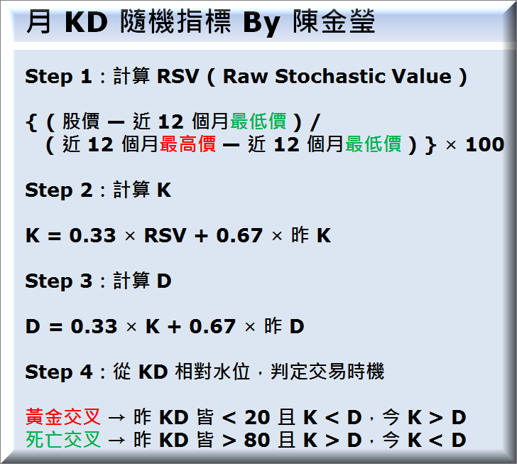
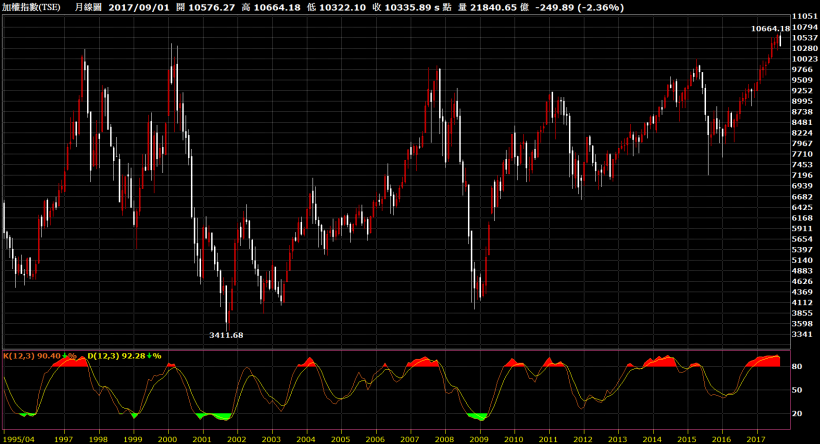
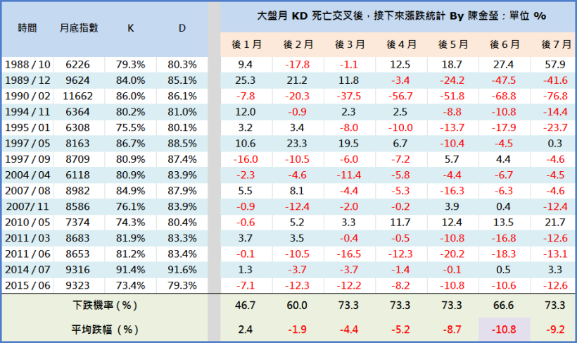

# 要研判盤勢是否會發生大反轉

要研判盤勢是否會發生大反轉

我一直有在用一個好方法 

 

這個方法，

是大盤的「月 KD 指標」 ( Stochastic Oscillator，KD )

 

KD 是一個叫 George 的美國人 

於 1950 年發明的

為市場最廣為人知的技術分析指標之一

也是眾多技術分析指標中

唯一一個我有在用的指標

使用它的理由，是因為它的公式比較嚴謹

別的技術分析指標，只會叫你追高殺低

KD，則能幫助我們有效確認反轉點

 

隨著交易週期的不同

根據日 K 線算出來的 KD 指標，叫做 日 KD

根據週 K 線算出來的 KD 指標，叫做 週 KD

根據月 K 線算出來的 KD 指標，叫做 月 KD

 

其實上述三者的公式，以及指標使用涵義

都是相同的

只是資料週期與參數，要稍微調整一下

 

先來看一下，我整理的 月 KD 公式 ...

使用 KD 來制定交易決策，有 4 個步驟

雖然公式看起來有點繁複

但它的概念其實很簡單：

 

〝先計算目前股價相對過去價格區間，比較接近高價區還是低價區，

再藉由比較敏感的 K 與不敏感的 D 兩條線之相對位置，研判股價是否發生反轉〞

 

舉例來說

如果大盤過去 12 個月，

最高價是 10664，最低價是 8880

目前收在 10336

那麼根據 KD 的公式

原始隨機值 ( RSV ) = ( 10336 – 8880 )  /  (10664 – 8880 ) = 81.6%

表示相對過去價格區間，

目前指數比最低價高了 81.6%

 

有了 RSV 之後

K D 指標在做的事情

只是把 RSV 依據 Lambda = 1 / 3 的原則

進行兩次平滑

 

其中，

K = 0.33 × RSV + 0.67 × 昨 K，是 RSV 的第一次平滑

D = 0.33 × K + 0.67 × 昨 D，是 RSV 的第二次平滑 ( K 的第一次平滑 )

 

舉例來說

如果你只有 今天 以及 明天 兩筆資料

而明日大盤指數續跌 100 點，收在 10236

那麼 ...，

 

新 RSV = ( 10236 – 8880 )  /  (10664 – 8880 ) = 76% ( 下降 5.6 )

K = 0.33 × 76 + 0.67 × 50 = 58.58

( 註：由於 KD 介於 0 ~ 100 間，所以第一筆資料的起始值，通常設為 50 )

D = 0.33 × 58.58 + 0.67 × 50 = 52.83

 

看懂了嗎？

這就是 KD 的原始定義

之後隨著每天新資料進來

就能依據上述公式，計算新的 K 與 D ( 而且可以做成即時的 )

 

舉例來說，

如果後天大盤續跌 100 點

由於 RSV 會繼續往下降

因此 K 與 D 也會往下降

而且比較敏感的 K，會降得比 D 還快

如果大後天，甚至後天的後天

大盤每天都跌 100 點，一路往區間最低價 8880 靠攏

依據 RSV 所算出來的 KD，也會一直往下降

講極端一點，

如果大盤跌到接近 8880

此時 RSV = 0，K 與 D 也會很接近 0

但若某一天，大盤突然從低檔彈起來

由於 K 比 D 還敏感，會上升比較多

就有機會形成 KD 在低檔區 ( 小於 20 )

形成黃金交叉 ( K 由下向上穿越 D ) 的買進訊號！

## 大盤月 KD 走勢圖

由於 KD 公式設計得很巧妙

用於抓大盤長線轉折，在過去，發生了巨大的功效

我們可以從券商軟體，

在上圖按右鍵 → 輸出到 EXCEL

把整串資料抓下來

進行一些更精緻的計算

 

以下是我的計算結果 ...

過去 30 年

大盤曾發生過 15 次月 KD 死亡交叉 ( 平均每兩年發生一次 )

而這個訊號出現後，根據上表

雖然下個月不見得會馬上大跌

但不管是在接下來 2 個月、接下來 3 個月 ...，

甚至是接下來 6 個月

累積起來，都是下跌的！

例如以接下來 6 個月來看

大盤的下跌機率達 66.6%

平均會大跌 10.8%！

顯示在月 KD 出現死亡交叉後

盤勢有很高的機率，出現「長空」走勢

例如最近一次：2015 年 6 月

KD 死亡交叉後，下個月大盤狂跌 7.1%

再過一個月，累積跌了 12.3%

真是有夠恐怖！

## `大盤月 KD，為何會那麼準？`

其實若您讀懂了 KD 的公式

甚至勤奮一點，自己親手算算看的話

自然會發現：KD 抓轉折很準 → 這件事，

只是一件必然的事情。

 

〝由於股市總是漲漲跌跌的，

過熱了 ( KD 超過 80 )，就可能會回檔；

跌到太恐慌 ( KD 小於 20 )，就可能會反彈〞

 

因此 KD 出現死亡交叉後

盤勢出現長空走勢，只是因為先前已經漲太多

回檔一些，也是一件很正常的事！

 

只不過呢，

KD 對於我們而言，最重要的一件事情

是可以把盤勢的變化〝數量化〞

進而〝更客觀〞

藉由 K 與 D 是否真的在高檔過熱區 ( 80 以上 )

出現 K 由上向下穿越 D 的死亡訊號

來幫助我們，提升抓盤勢轉折的準確度！
