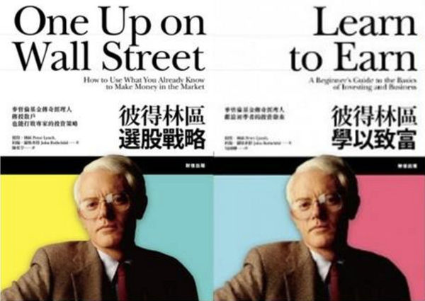

# 彼得‧林區的暴跌應對之道

                
<strong>彼得‧林區的暴跌應對之道</strong> 

	
北京新浪網 (2007-03-01 09:22)
	

	
 
	

	
2007年2月27日，中國股市上演『黑色星期二』，深成指大跌9.29%，上証指數跌 幅也高達8.84%，分別創下兩市近10年來的最大單日跌幅，滬深300指數下跌9.24%，接近跌停，一個交易日兩市市值損失超過了1萬億。面對如此暴跌，每個人都首先會問一個問題：為什麼？
	

	

	

	
其實有無數人早已無數次問過這個問題，而且其中一些人經歷的股市大跌比我們 更慘。
	

	

	

	
1929年10月29日，星期二，美國道瓊斯指數單日跌幅達11.5%。這是紐約交易所 112年歷史上『最糟糕的一天』，這是歷史上第一個『黑色星期二』。
	

	

	

	
1987年10月19日，星期一，又是十月，道瓊斯指數一天之內便重挫508.32點，跌幅達22.6%，成為第一次世界大戰以來美國股市歷史上最大跌幅。遠遠超過了1929年10月28日那天11.5％的跌幅。僅這一天內，美國股票市值損失5000億美元，相當于美國當年全年國民生產總值的1／8。這是一個最黑的『黑色星期一』，一個『華爾街歷上最壞的日子』。很多人由百萬富翁淪為赤貧，精神崩潰甚至自殺。
	

	

	

	
無數美國投資人在暴跌後也在問：為什麼？甚至美國國會事後為此專門成立調查小組。可至今沒有一個人能夠回答出為什麼。但是不管為什麼，<strong>所有投資人在暴跌後都得面臨第二個問題：怎麼辦？</strong>最需要解決這個問題的，是那麼管理巨額資金的基金經理們。
	

	

	

	
1987年美國股市大崩盤時，彼得‧林區管理著100多億美元的麥哲倫基金，一天之內基金資產淨值損失了18%，損失高達20億美元。林區是如何應對的呢？ 　
	

	

	

	
林區和國內幾乎所有開放式基金經理一樣，只有一個選擇：拋售股票。為了應付非比尋常的巨額基金贖回，林區把不得不賣的股票都賣了。 　　
	

	

	

	
過了一年多，他回憶起來仍然感到後怕：『在那一時刻，我真的不能確定，到底是到了世界末日，還是我們即將陷入一場嚴重的經濟大蕭條，又或者是事情變得那麼糟糕，僅僅只是華爾街即將完蛋？』&nbsp;
	

	

	

	
林區是掌握巨額資金的基金經理，為了應對巨額贖回，只能拋售股票。<strong>那麼那些用自己的錢進行投資的中小投資者應該怎麼辦？</strong>林區經歷過很多次股市大跌，但仍然取得了非常成功的業績。也許他的以下三個建議值得借鑒： 　
	

	

	

	
<strong>第一，不要恐慌而全部市價拋出。</strong>
	

	
林區談到，『如果你在股市暴跌中絕望地賣出股票，那麼你的賣出價格往往會非常之低。即使1987年10月19日的行情讓你對股市的走勢感到驚恐不安，你也不必要這一天甚至也不必在第二天把股票拋出。你可以逐步減持你的股票投資組合，從而最終能夠取得比那些由於恐慌全部拋出的投資人更高的投資回報。因為從11月份開始股市就穩步上揚。到1988年6月，市場已經從反彈了400多點，也就是說漲幅超過了23%。』 　　
	

	
有意思的是，滬深股市經過前天的暴跌後，昨天收盤時上証指數反彈接近4%，許多前天跌停的股票，昨天又漲停了，那些前天恐慌性全部拋出的投資人會如何感想 呢？&nbsp;
	

	

	

	
<strong>第二，對持有的好公司股票要有堅定的勇氣。</strong>
	

	
『投資股票要賺錢，關鍵是不要被嚇跑。這一點怎麼強調都不過分。』林區最推崇巴菲特面對股市暴跌時的勇氣。沃倫‧巴菲特曾經告誡投資者，那些無法做到自己的股票大跌市值損失50%仍堅決持股不動的投資者，就不要投資股票。 　　
	

	

	

	
<strong>第三、要敢于趁低買入好公司股票。</strong>
	

	
林區認為暴跌是賺大錢的最好機會：『股價大跌而被嚴重低估，才是一個真正的選股者的最佳投資機會。股市大跌時人們紛紛低價拋出，就算我們的投資組合市值可能會損失30%，這也沒什麼大不了的。我們不要把這種股市大跌看做一場災難，而要把股市大跌看做是一個趁機低價買入股票的機會。巨大的財富往往就是在這種股市大跌中才有機會賺到的。』
	

	

	

	
也許有很多投資人在暴跌後會問另一個問題：能不能預測出股市暴跌？回答這個問題，我們首先要看看歷史事實，是否有人曾經准確預測到股市暴跌？
	

	

	

	
林區發現，在1987年10月美國華爾街股市暴跌1000點之前，沒有任何一位投資專家或者經濟學家預測到這次股市暴跌，也沒有一個人事前發出警告。有許多人聲稱自己早已事先預測到這次大跌，但是如果這些家伙真的預測到的話，他們早就會提前把他們的股票全部拋出了，那麼由於這些人大規模拋售，市場可能早在幾周甚至幾個月前就暴跌1000點了。
	

	

	

	
證券分析之父班傑明‧葛拉漢(Benjamin Graham)曾說：『如果說華爾街60多年的經驗中發現過什麼的 話，那就是沒有人能成功地預測股市變化。』巴菲特也說：『我從來沒有見過能夠預測市場走勢的人。』而彼得‧林區也不得不遺憾地感嘆：『不要妄想預測一年或兩年後的股市走勢，那是根本不可能的。』 　　
	

	
也許投資者會傷心地問：既然股市根本無法預測，萬一再發生暴跌，我們應該怎麼辦呢？林區的回答是根本沒有必要擔心這個問題：『很顯然，投資者並不需要具備預測市場的能力照樣可以在股市上賺錢，如果不是這樣的話，那麼我就應該一分錢也賺不到。在幾次最嚴重的股市大跌期間，我只能坐在股票行情機前面呆呆看著我的股票也跟著大跌。』 　
	

	

	

	
連林區也不能預測股市，但他照樣取得年均29%的投資報酬率，13年增值29倍，成為美國有史以來最成功的基金經理。 　
	

	

	

	
既然我們無法預測股市，那麼最好的辦法是不要預測股市。正如巴菲特所 說：『對於未來一年後的股市走勢、利率以及經濟動態，我們不做任何預測。我們過去不會、現在不會、將來也不會預測。』&nbsp;
	

	

	

	
投資者投資的是公司，而不是股市，因此投資者應該關注的也應該是公司，而不是股市，不管股市暴跌還是暴漲，都是如此。也許這就是最成功的基金經理林區告訴我們應對股市暴跌的唯一辦法。
	

	

	

	
（作者：中投證券 劉建位）
	

	
<a href="http://finance.sina.com.cn/stock/t/20070301/05041237136.shtml" target="_blank" rel="nofollow"></a><a href="http://finance.sina.com.cn/stock/t/20070301/05041237136.shtml">http://finance.sina.com.cn/stock/t/20070301/050412...</a>
	

            
